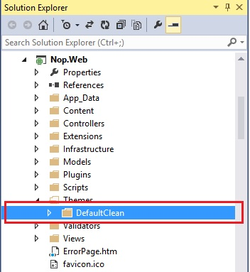
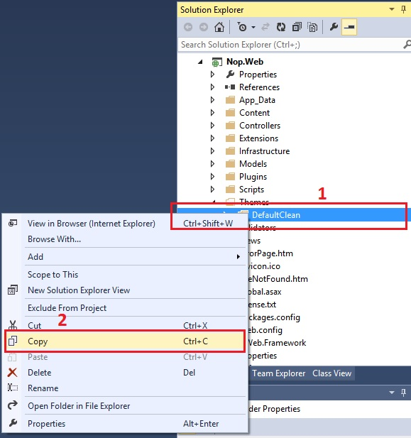
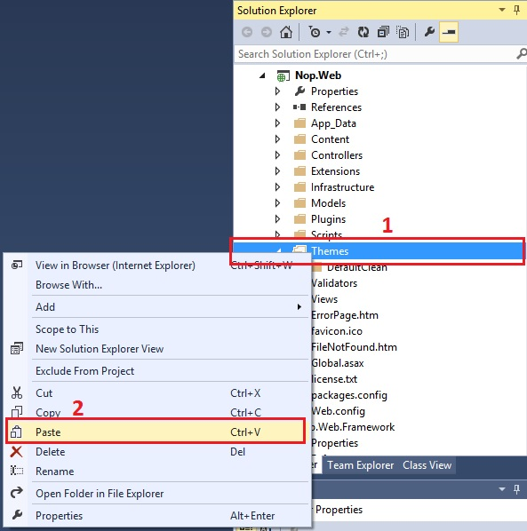
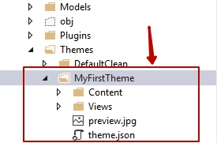
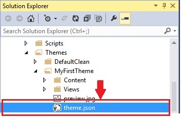
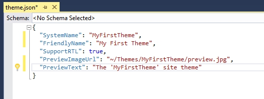
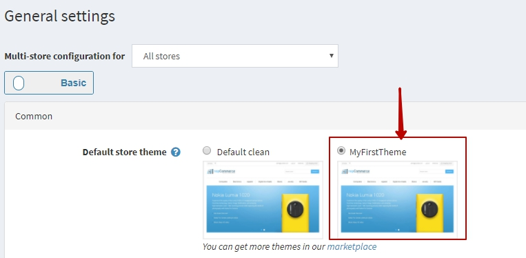

# Crear/escribir su propio tema (usando el tema actual/predeterminado)
Abra su solución o sitio web nopCommerce (versión web) en Visual Studio - Vaya a esta ubicación:

* Si usa código fuente: `\Nop.Web\Themes\`
* Si usa código fuente: `\[Project Root]\Themes\`

1. Seleccione cualquier tema predeterminado / actual
    

1. Ahora, haga clic derecho en el tema → seleccione COPIA

    

1. Ahora seleccione lacarpeta "Tema" → haga clic derecho → PEGAR

    

1. Obtendrá algo como "Copia del tema predeterminado/actual"

    

1. Cambie el nombre, como quiera que sea el nombre de su nuevo tema. Por ejemplo, digamos: MyFirstTheme

    

1. Ahora dentro de la carpeta de temas nuevos "MyFirstTheme" → abra `theme.json`

    

1. Cambie el nombre del tema actual/existente con su nuevo nombre de tema "MyFirstTheme"

    

1. Ahora, dentro de su nueva carpeta de temas "MyFirstTheme" → Contenido → Imágenes, agregue sus nuevas imágenes en el directorio "images" y comience a actualizar/personalizar su `style.css` de acuerdo con sus requisitos.

    Si desea probar los cambios → Vaya a la sección Administración → Aplique su nuevo tema → Guarde el cambio y obtenga una vista previa de su tienda pública.

    