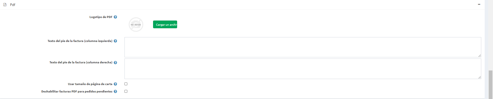

# Configuración de PDF

Al administrar una tienda, es posible que necesite archivos PDF generados automáticamente, como facturas y términos del contrato.

Para definir la configuración de PDF, vaya a **Configuración → Configuración → Configuración general** y busque el panel *PDF*:

* En el **área del logotipo PDF**, arrastre y suelte el archivo del logotipo que desea cargar. Este archivo de imagen se mostrará en las facturas de pedido en PDF. Se recomienda utilizar una imagen pequeña.
* En el campo **Texto de pie de página de la factura (columna izquierda)**, ingrese el texto que aparecerá en la parte inferior de las facturas generadas (columna izquierda).
* En el campo **Texto de pie de página de la factura (columna derecha)**, ingrese el texto que aparecerá en la parte inferior de las facturas generadas (columna derecha).
* Marque **Usar tamaño de página Carta** si desea que sus documentos PDF tengan el tamaño de página Carta. Cuando esta casilla de verificación no está marcada, el tamaño de página A4 se utiliza de forma predeterminada.
* Marque **Desactivar facturas en PDF para pedidos pendientes** si no desea que sus clientes puedan imprimir facturas en PDF para pedidos pendientes.

## Tutoriales

* [Agregar información comercial (marca) en la factura en PDF](https://youtu.be/TeXmuNWsdD4)
