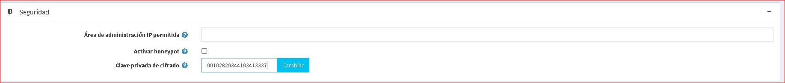
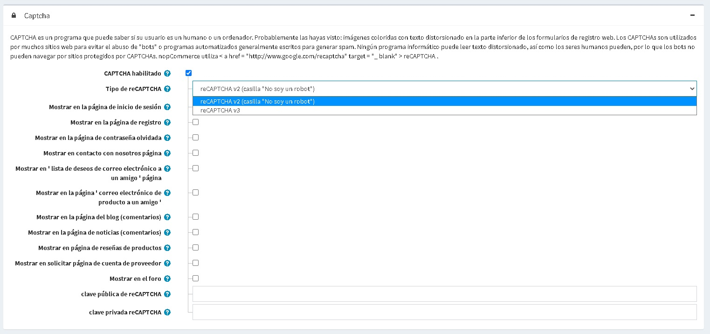

# Configuraciones de seguridad

Para administrar la configuración de seguridad, vaya a **Configuración → Configuración → Configuración general**.

Esta página permite la configuración de varias tiendas, lo que significa que se pueden definir las mismas configuraciones para todas las tiendas o diferir de una tienda a otra. Si desea administrar la configuración de una determinada tienda, elija su nombre en la lista desplegable de configuración de varias tiendas y marque todas las casillas de verificación necesarias en el lado izquierdo para establecer un valor personalizado para ellas. Para obtener más detalles, consulte [Multi-store](xref:en/Getting-started/advanced-configuration/multi-store).

## Seguridad

Defina la configuración de *Seguridad* de la siguiente manera:

* En el campo **IP permitida del área de administración**, ingrese las direcciones IP que pueden acceder al backend. Deje este campo vacío si no desea restringir el acceso al backend. Utilice comas entre las direcciones IP (por ejemplo, 127.0.0.10, 232.18.204.16).
* Marque **Habilitar honeypot** para habilitar [honeypot](https://en.wikipedia.org/wiki/Honeypot_(informática)). En terminología informática, un honeypot es una trampa tendida para detectar, desviar o, de alguna manera, contrarrestar los intentos de uso no autorizado de los sistemas de información.
* En el campo **Clave privada de cifrado**, ingrese la clave privada de cifrado que se utiliza para almacenar datos confidenciales. Haga clic en **Cambiar** en cualquier momento para cambiar esta clave. Todos los datos confidenciales se cifran con esta clave privada.

> [!NOTE]
>
> Se recomienda hacer una copia de seguridad de su base de datos antes de cambiar la clave de cifrado. Los datos confidenciales incluyen toda la información de la tarjeta de crédito (solo cuando esta información de la tarjeta de crédito se almacena en la base de datos de la tienda).

## CAPTCHA

CAPTCHA es un programa que puede indicar si un humano o una computadora está intentando acceder a su sitio web. nopCommerce utiliza reCAPTCHA de Google. reCAPTCHA es un servicio gratuito que protege su sitio web del spam y el abuso. reCAPTCHA utiliza un motor de análisis de riesgo avanzado y desafíos adaptativos para evitar que el software automatizado participe en actividades abusivas en su sitio. Hace esto mientras deja que sus usuarios válidos pasen con facilidad.

Defina la configuración de *CAPTCHA* de la siguiente manera:

Este panel revelará las siguientes configuraciones cuando **CAPTCHA habilitado** está marcado:
* **Tipo de reCAPTCHA**: elija reCAPTCHA v2 o reCAPTCHA v3. La diferencia entre ellos es que reCAPTCHA v2 muestra la casilla de verificación "No soy un robot", pero reCAPTCHA v3 es invisible para los clientes. Obtenga más información sobre [reCAPTCHA v2](https://developers.google.com/recaptcha/docs/display) y [reCAPTCHA v3](https://developers.google.com/recaptcha/docs/v3).
* **El umbral de puntuación de reCAPTCHA v3** está habilitado cuando se selecciona reCAPTCHA v3. Obtenga más información sobre el umbral de puntuación [aquí](https://developers.google.com/recaptcha/docs/v3).
* Muestra CAPTCHA en la página de **inicio de sesión**.
* Muestre CAPTCHA en la página de **registro**.
* Muestra CAPTCHA en la página **contraseña olvidada**.
* Muestra CAPTCHA en la página **contáctanos**.
* Muestre CAPTCHA en la página **lista de deseos por correo electrónico a un amigo**.
* Muestre CAPTCHA en la página de **correo electrónico del producto a un amigo**.
* Muestre CAPTCHA en la **página del blog (comentarios)**.
* Muestre CAPTCHA en la **página de noticias (comentarios)**.
* Muestre CAPTCHA en la página de **reseñas de productos**.
* Muestre CAPTCHA en la página **solicitar cuenta de proveedor**.
* Muestra CAPTCHA en la página **foro**.
* Ingrese la clave pública **reCAPTCHA**.
* Ingrese la clave privada **reCAPTCHA**.

> [!NOTE]
>
> Soporte eliminado para Recaptcha v1.
