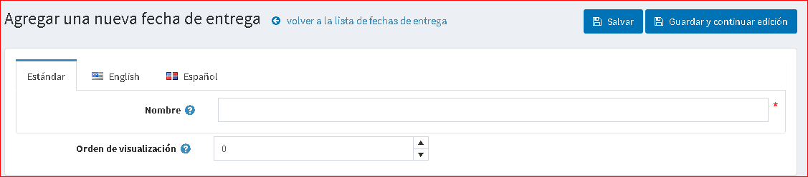
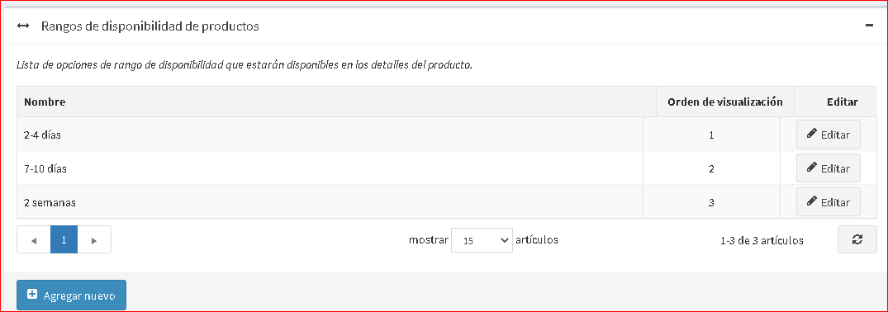

# Fechas y rangos

## Fechas de entrega

Las fechas de entrega son rangos de tiempo que muestran el tiempo de entrega aproximado a un cliente. Las fechas de entrega se pueden aplicar a los productos y mostrarse en las páginas de detalles del producto.

* Vaya a **Configuración → Envío → Fechas y rangos**. Los dos paneles siguientes se mostrarán en la ventana *Fechas y rangos*:

### Panel de fechas de entrega

Haga clic en **Agregar nuevo**. Se muestra la ventana *Agregar una nueva fecha de entrega*:

* En el campo **Nombre**, ingrese el nombre de la nueva fecha de entrega, por lo general, es un rango de fechas.
* En el campo **Mostrar pedido**, ingrese el orden de visualización de esta fecha de entrega. 1 representa la parte superior de la lista.

Haga clic en el botón **Guardar**.

### Panel de rangos de disponibilidad de productos

Aquí puede configurar rangos de disponibilidad de productos. Estas opciones se mostrarán en la página de edición del producto.

Haga clic en **Agregar nuevo** para agregar su propio rango. Se muestra la ventana *Agregar un nuevo rango de disponibilidad de producto *:

* En el campo **Nombre** ingrese el nombre del nuevo rango, por ejemplo, 2 meses.
* En el campo **Orden de visualización**, ingrese el orden de visualización de este rango de disponibilidad. 1 representa la parte superior de la lista.

Haga clic en el botón **Guardar**.