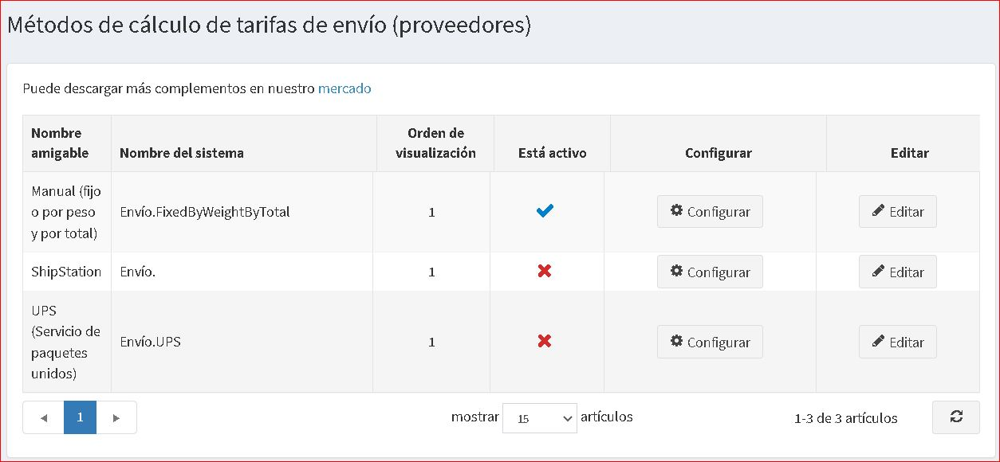

# ShipStation

Para utilizar el complemento de integración **ShipStation**, siga estos pasos:

1. Regístrese o inicie sesión en el sitio [ShipStation](https://www.shipstation.com/?ref=partner-nopcommerce&utm_campaign=partner-referrals&utm_source=nopcommerce&utm_medium=partner-referral).
1. En el área de administración de nopCommerce, vaya a **Configuración → Envío → Proveedores de envío**.

    * Habilite este método, de la siguiente manera:
    * En la fila ShipStation, haga clic en el botón **Editar**.
    * En la columna **Está activo**, marque la casilla de verificación.
    * Haga clic en el botón **Actualizar**. La opción falsa se convierte en **verdadera**.
    * Haga clic en el botón **Configurar** junto a la opción ShipStation en la lista. Se muestra la ventana *Configure - ShipStation*, como sigue:
1. Ingrese la siguiente información obtenida del proveedor de ShipStation:
    * La **API Key** y el **API Secret**: estos datos se utilizan para obtener una lista de operadores disponibles. Puede obtenerlos en la página *Configuración - Configuración de API* en el sitio de ShipStation.
    > [!NOTE]
    > Si no planea utilizar la determinación automática del costo de envío, entonces no es necesario ingresar estos datos.
    > Pero en este caso, el complemento dejará de funcionar como proveedor de métodos de envío y deberá asegurarse de que haya otro complemento activo del mismo tipo.

    * Cree un **Nombre de usuario** y **Contraseña**, ingréselos en el formulario de configuración (el formulario ShipStation y el formulario nopCommerce). Estos datos son necesarios para la transferencia segura de datos entre su servidor y el servidor de ShipStation. Mantenlos siempre en secreto.

    > [!Important]
    > No utilice las credenciales de usuario de ShipStation o nopCommerce para estos campos.

    * Marque la casilla de verificación **Pasar dimensiones** si es necesario enviar dimensiones al servidor de ShipStation. Cuando este parámetro está activado, aparece el parámetro adicional **Tipo de embalaje**. Este parámetro es responsable del tipo de datos enviados.   