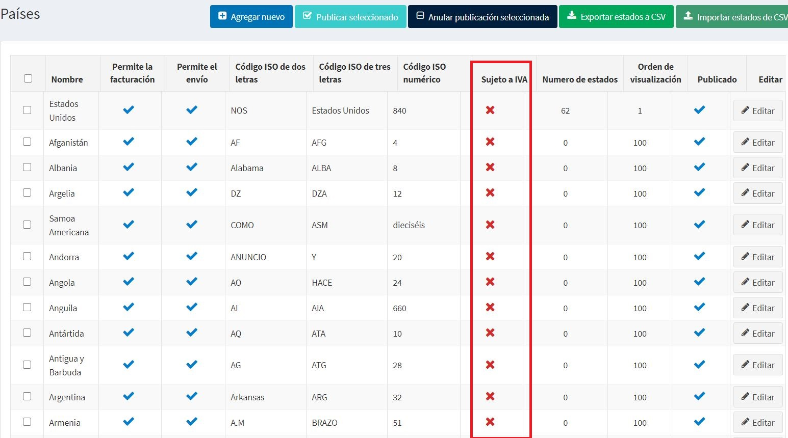
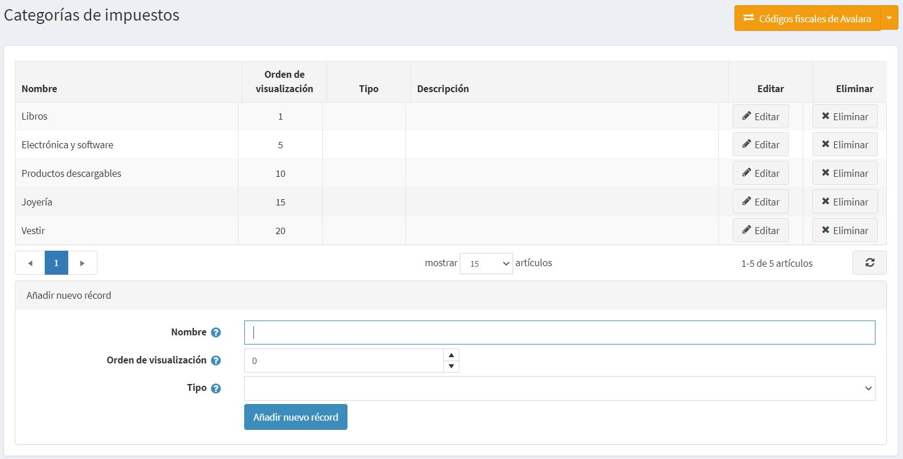
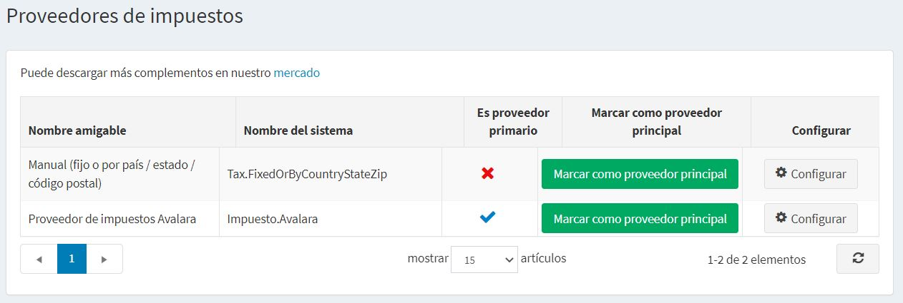
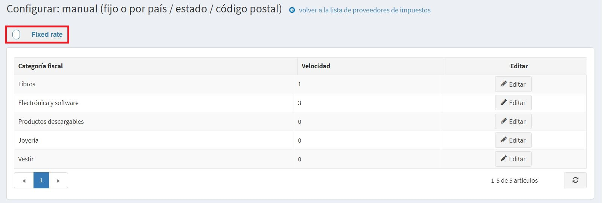

    ---
title: Configure taxes
uid: en/getting-started/configure-taxes/index
author: git.AndreiMaz
contributors: git.DmitriyKulagin, git.exileDev, git.mariannk
---

# Configurar impuestos

Este capítulo cubre la configuración de las herramientas de impuestos nopCommerce.

> [!NOTE]
>
> Este capítulo incluye instrumentos tributarios incorporados de nopCommerce, no servicios tributarios de terceros.

nopCommerce también admite servicios externos, pero requieren la instalación de complementos de un [mercado](http://www.nopcommerce.com/marketplace). El proceso de instalación de dichos módulos se describe en el capítulo [Complementos](xref:en/developer/plugins/index).

## Guía de configuración del IVA de la UE

Para configurar el soporte de IVA nopCommerce para tiendas en la UE, vaya a **Configuración → Configuración → Configuración de impuestos**.

En el panel *Común*:
* Establezca **Impuestos basados ​en** **Dirección de envío**.

En el panel *IVA*:
* Marque **IVA de la UE habilitado**. Esto garantizará que se cobren impuestos solo para los envíos dentro de la UE.
* Seleccione el **País** en el que se encuentra su tienda.
* Si corresponde, marque *Permitir exención de IVA*. Esto garantizará que a sus clientes registrados con IVA que realicen envíos dentro de la UE pero fuera del país en el que se encuentra la tienda no se les cobrará el IVA.
* Marque la casilla de verificación **Asumir que el IVA siempre es válido** para omitir la validación del IVA. Los números de IVA ingresados ​​siempre serán válidos. Será responsabilidad del cliente proporcionar el número de IVA correcto.
* Si marcó **Permitir exención de IVA**, entonces puede marcar las casillas de verificación "**Usar servicio web**" y "**Notificar al administrador cuando se envíe un nuevo número de IVA**".

Haga clic en el botón **Guardar**.

Vaya a **Configuración → Países**. Asegúrese de que todos los países incluidos en el ámbito del IVA tengan **Sujeto al IVA** establecido en *verdadero*.

> [!NOTE]
>
> Jersey, Guernsey y las demás Islas del Canal no forman parte del Reino Unido y no están incluidas en el ámbito del IVA. Si vende en esos lugares, es posible que deba cambiar eso.

Vaya a **Configuración → Categorías de impuestos**.

Configure una categoría de impuestos para cada tipo de IVA en su país. Por ejemplo, "Tarifa estándar", "Tarifa cero", "Tarifa con descuento". Elimine las clases predeterminadas que ya están allí y no son aplicables.

Vaya a **Configuración → Proveedores de impuestos**. Haga que **Manual (fijoo por país/estado/código postal)** sea el predeterminado utilizando el botón **Marcar como proveedor principal**.

Haga clic en **Configurar** en la línea del proveedor **Manual (fijo o por país/estado/código postal)** para editar las tasas de impuestos. En la parte superior de la página verá el interruptor. Elija **Tarifa fija** allí.

En esta página puede ver sus categorías de tipos de IVA. Haga clic en **Editar** junto a cada categoría e ingrese las tasas de porcentaje. Luego haga clic en el botón **Actualizar**.

Asegúrese de que todos los productos tengan asignada una categoría de impuestos en sus [running-your-store/catalog/products/add-products).

### Ver también

* [Configuración de impuestos](xref:en/getting-started/configure-taxes/tax-settings)
* [Proveedores de impuestos](xref:en/getting-started/configure-taxes/tax-providers/index)

