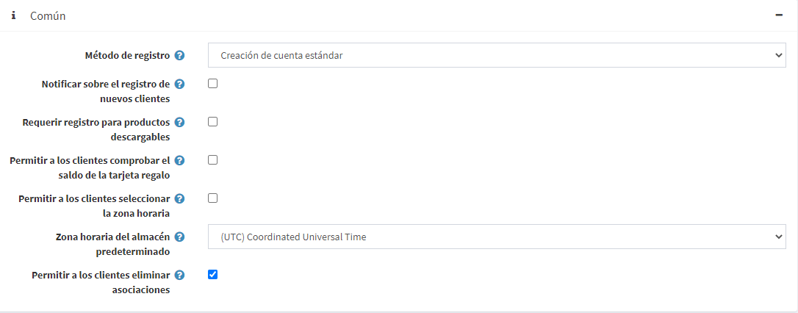
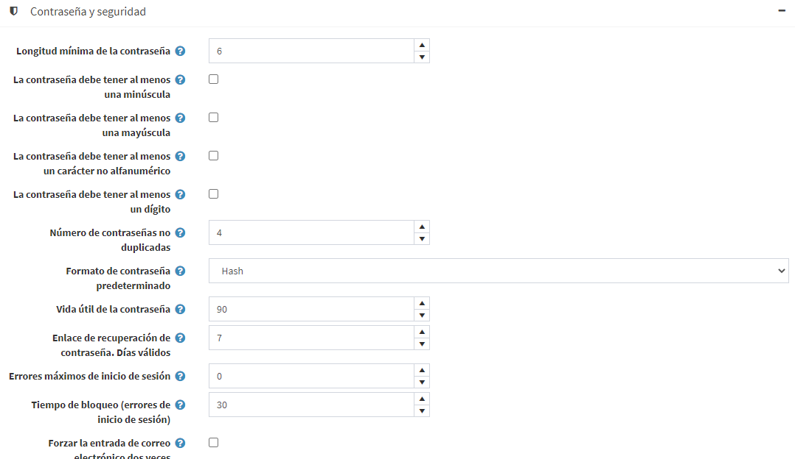
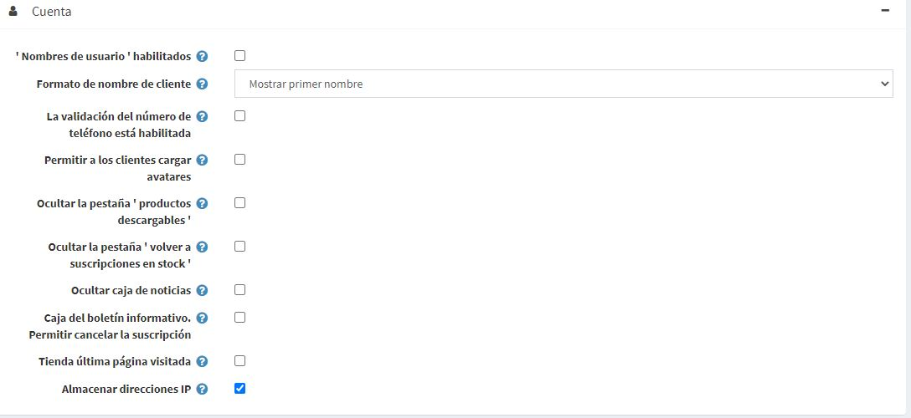
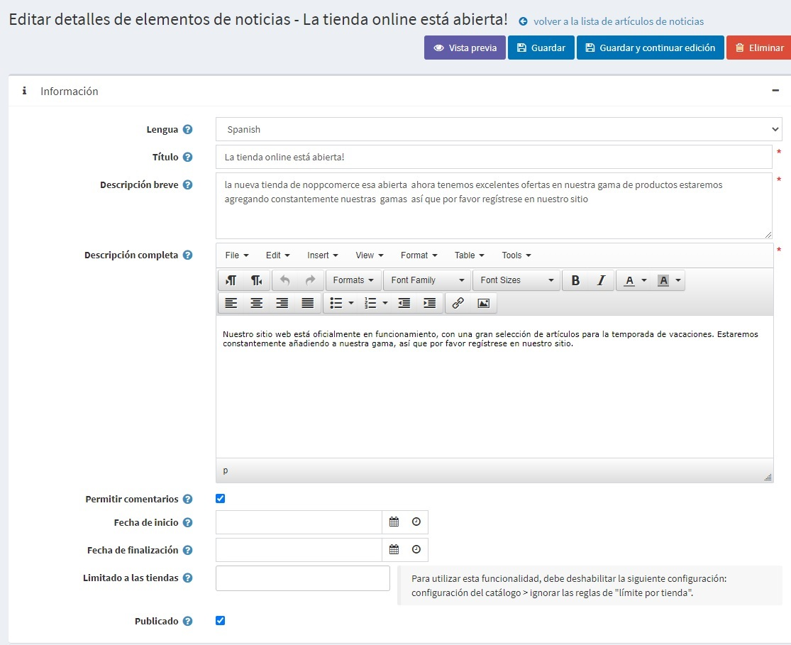
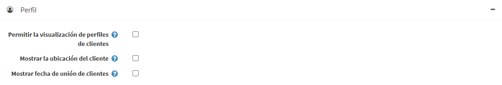

# Ajustes del cliente

La configuración del cliente incluye permitir a los clientes cargar el avatar, mostrar la ubicación del cliente, cambiar el formato del nombre, la fecha de ingreso y más.

Para definir los ajustes del cliente, vaya a **Configuration → Settings → Customer settings**. Se muestra la ventana de ajustes del cliente. Esta ventana contiene seis paneles: Común, Contraseña y seguridad, Cuenta, Perfil, Campos de formulario del cliente y Campos de formulario de dirección.

1. El panel **Común** contiene la configuración general del cliente.

1. 2. **Panel de Contraseña y seguridad** contiene campos que pueden utilizarse para configurar los ajustes de seguridad y la complejidad de la contraseña.

1. 2. **El panel Cuenta** contiene campos para configurar una cuenta de cliente.

1. 2. **Panel de perfil** contiene campos para configurar el perfil del cliente.

1. 2. **Campos de formulario de cliente** el panel contiene campos que se utilizan en la página de registro del cliente.

1. 2. **Campos de formulario de dirección** el panel contiene campos para detallar la dirección del cliente durante el proceso de pago.

## Común

Defina la configuración común de los clientes, de la siguiente manera:
* Seleccione el **Método de registro**, de la siguiente manera:
  * **Creación de cuenta estándar**: los usuarios pueden registrarse, no se requiere aprobación.
  * **Se requiere la validación del correo electrónico después del registro**: los usuarios están habilitados para registrarse, sin embargo, deben aceptar el correo electrónico de confirmación que se les envía antes de que se apruebe su cuenta.
  * **Un cliente debe ser aprobado por el administrador**: los usuarios pueden registrarse, se requiere la aprobación del administrador.
  * **El registro está desactivado**: seleccione esta opción para desactivar el registro.
* Marque la casilla de verificación **Notificar sobre el registro de un nuevo cliente**, para permitir que el propietario de la tienda reciba una notificación por correo electrónico cada vez que se registre un nuevo cliente.
* Marque la casilla de verificación **Requerir registro para productos descargables** si los clientes tienen que completar el registro para poder comprar productos descargables.
* Utilice el campo **Permitir a los clientes comprobar el saldo de la tarjeta de regalo** para permitir a los clientes comprobar el saldo de la tarjeta de regalo.
  > [!NOTE]
  >
  > Si el campo **Permitir a los clientes comprobar el saldo de la tarjeta de regalo** está marcado, entonces la configuración del CAPTCHA debe estar habilitada en el área de administración (**Configuración → Ajustes → Ajustes generales → Panel del CAPTCHA**). Esta característica no es potencialmente segura y el CAPTCHA es necesario para prevenir y complicar la fuerza bruta. Para más detalles consulte [Configuración del CAPTCHA](xref:es/getting-started/advanced-configuration/security-settings#captcha).

* Elija si **Permitir a los clientes seleccionar la zona horaria** en la tienda pública en la página de cuentas. De lo contrario, se utiliza la zona horaria predeterminada.
* Seleccionar la **Zona horaria predeterminada de la tienda** de una lista desplegable.
   > [!NOTE]
   > 
   > La zona horaria actual se muestra automáticamente.
 
 * Marque la casilla **Permitir a los clientes eliminar asociaciones** para permitir a los clientes eliminar las asociaciones de autenticación externa.

## Contraseña y seguridad

* Establezca la **Longitud mínima de la contraseña, la contraseña debe tener al menos una minúscula, la contraseña debe tener al menos una mayúscula, la contraseña debe tener al menos un carácter no alfanumérico, la contraseña debe tener al menos un dígito** para cambiar la complejidad de la contraseña.
* **Número de contraseñas no duplicadas** es un número de contraseñas que no debe ser el mismo que el anterior.
* Seleccione el **Formato de contraseña predeterminado**, de la siguiente manera:
  * * *Borrar*
  * *Hash*
  * * Cifrado *
  > [!NOTE]
  > 
  > Esta configuración es para almacenar las contraseñas de los clientes y se aplicará sólo a los clientes recién registrados.

* En el **Vida útil de la contraseña** introduzca el número de días para la expiración de la contraseña.
  > [!NOTE]
  >
  > Para usar la característica **Vida útil de la contraseña** no te olvides de marcar la propiedad **Habilitar la vida útil de la contraseña** en la página de edición del rol de cliente (**Clientes → Roles de cliente**) para aquellos roles, que necesitan cambiar las contraseñas. Para más detalles, consulte [Customer roles](xref:en/running-your-store/customer-management/customer-roles).

* In the **Password recovery link. Days valid** field, enter the number of days for password recovery link. Set it to 0 if you don't want the link to expire.
* Enter the **Maximum login failures** number. Set 0 to disable this feature.
* In the **Lockout time (login failures)** enter the number of minutes to lockout users.
* Tick the **Force entering email twice** checkbox if you want your customers to enter email twice during the registration.

## Account

* Marque la casilla **'Nombres de usuario' habilitados**, para habilitar el uso de nombres de usuario para el ingreso y registro en lugar de los correos electrónicos. 
  > [!NOTE]
  >
  > No se recomienda cambiar esta opción en el entorno de producción. 
  
  Cuando se selecciona la casilla **'Nombres de usuario' habilitados**, se muestran las siguientes opciones:
  * **Permitir a los clientes cambiar sus nombres de usuario**: seleccione esta opción si los clientes pueden cambiar sus nombres de usuario.
  * **Permitir a los clientes comprobar la disponibilidad de los nombres de usuario**: seleccione esta opción para permitir a los clientes comprobar la disponibilidad de los nombres de usuario antes de hacer clic en el botón *Guardar* de la página *Mi cuenta - Información del cliente*. El botón **Comprobar disponibilidad** se muestra en este caso, ver el ejemplo a continuación.

* Marque el campo **La validación del nombre de usuario está activada** si desea activar la validación del nombre de usuario (cuando se registre o cambie en la página "Mi cuenta" de la tienda pública). Cuando se selecciona esta casilla de verificación, se muestran las siguientes opciones:
  * **Regla de validación de nombre de usuario**: establece la regla de validación para un nombre de usuario en este campo. Puede especificar una lista de caracteres permitidos o una expresión regular. Si utiliza una expresión regular, marque el campo **Use regex for username validation** descrito a continuación.
  * Marque el campo **Use regex for username validation** para utilizar una expresión regular para la validación del nombre de usuario (cuando se registre o cambie en la página "Mi cuenta" en la tienda pública).
* Seleccione el **Formato de nombre de usuario**, como se indica a continuación:
  * *Muestra los correos electrónicos*
  * * Mostrar nombres de usuario *
  * * Mostrar nombres completos *
  * * Mostrar el primer nombre *
  El nombre del cliente se mostrará en la tienda junto a las noticias del cliente y los comentarios del blog, en las páginas del foro y otros.
* Marque la casilla **La validación del número de teléfono está activada** si desea activar la validación del número de teléfono (al registrarse o al cambiar en la página "Mi cuenta" en la tienda pública). Cuando se selecciona esta casilla de verificación, se muestran las siguientes opciones:
  * **Regla de validación de número de teléfono**: establece la regla de validación para un número de teléfono en este campo. Puede especificar una lista de caracteres permitidos o una expresión regular. Si utiliza una expresión regular, marque el campo **Utilizar regex para la validación del nombre de usuario** que se describe a continuación.
  * Marque el campo **Use regex for phone number validation** para utilizar una expresión regular para la validación del número de teléfono (cuando se registre o cambie en la página "Mi cuenta" de la tienda pública).
* **Permitir a los clientes subir avatares**: los avatares de los clientes se mostrarán en la tienda junto a sus noticias y comentarios del blog, en las páginas del foro y otros. Si se selecciona esta opción, se muestra la siguiente casilla de verificación:
  * Marque la casilla de verificación **Avatar predeterminado habilitado**, para mostrar los avatares de usuario predeterminados.
* Marque la casilla de verificación **Ocultar la pestaña 'Productos descargables'**, para ocultar esta pestaña en la página "Mi cuenta".
* Marque la casilla de verificación **Ocultar la pestaña 'Suscripciones de vuelta al stock'**, para ocultar esta pestaña en la página "Mi cuenta".
* Marque la casilla de verificación **Ocultar la casilla del boletín informativo** si no desea mostrar la casilla de suscripción al boletín informativo.
* Marque la casilla **Boletín de noticias. Marque la casilla de verificación **Permitir cancelar la suscripción** para mostrar la opción "cancelar la suscripción" en el bloque de boletines. Por ejemplo, es obligatorio en Alemania.
* Marque la casilla de verificación **Almacenar la última página visitada**, para almacenar la última página visitada del cliente. Luego puede ver las últimas páginas visitadas por diferentes clientes en la página **Clientes → Clientes en línea**. Puede desmarcar esta casilla de verificación, para mejorar el rendimiento del sitio.
* Marque la casilla de verificación **Almacenar dirección IP**, para almacenar la última dirección IP de los clientes. Cuando está desactivada, puede mejorar el rendimiento.

## Perfil

* **Permitir la visualización de los perfiles de los clientes**: esta configuración permite ver los detalles de otros clientes en la tienda pública.
* Marque la casilla **Mostrar la ubicación de los clientes** si es necesario.
* Marque la casilla **Mostrar fecha de ingreso de clientes** si es necesario.

## Campos del formulario de cliente
En el panel *Campos de formulario del cliente*, defina si los siguientes campos de formulario están habilitados en el sistema:

* **'Gender' enabled**
* **'Nombre' activado**. Cuando se habilita, también puede decidir si este campo debe ser requerido.
* **'Apellido' habilitado**. Cuando se habilita, también puedes decidir si este campo debe ser requerido.
* Cuando se habilita, también se puede decidir si este campo es obligatorio e introducir una edad mínima permitida (por ejemplo, para asegurarse de que un cliente es mayor de 18 años).
* Cuando se habilita, también puede decidir si este campo debe ser obligatorio.
* **'Dirección' habilitado.** Cuando se habilita, también puede decidir si este campo debe ser requerido.
* **'Dirección de la calle 2' habilitado**, si la segunda dirección está habilitada. Cuando se habilita, también puede decidir si este campo debe ser requerido.
* **'Código postal' habilitado**. Cuando se habilita, también puede decidir si este campo debe ser requerido.
* **'Ciudad' habilitado.** Cuando se habilita, también puedes decidir si este campo debe ser requerido.
* **'Condado/región' habilitado.** Cuando se habilita, también puede decidir si este campo debe ser requerido.
* **'País' habilitado.** Cuando se habilita, también puede decidir si este campo debe ser requerido.
* **'Estado/provincia' habilitado.** Cuando se habilita, también puede decidir si este campo debe ser requerido. Nota: Este campo es visible sólo cuando el campo **País** está habilitado.
* **'Número de teléfono' habilitado.** Cuando se habilita, también puede decidir si este campo debe ser requerido.
* **'Número de fax' habilitado.** Cuando se habilita, también puede decidir si este campo debe ser requerido.
* Marque la casilla **'Aceptar la política de privacidad' habilitada**, para solicitar a los clientes que acepten la 

* [Configuring password settings](https://www.youtube.com/watch?v=TwWArXNi0CA)
