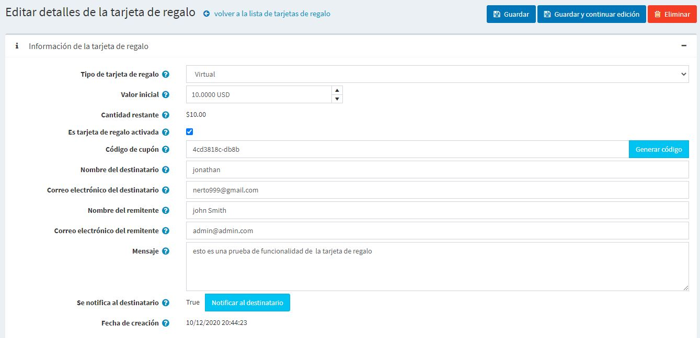
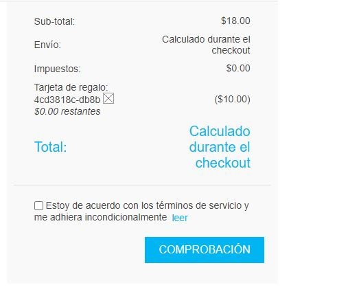

# Tarjetas de regalo

En nopCommerce, tienes la oportunidad de vender tarjetas de regalo entre otros tipos de productos.

Las tarjetas de regalo son una buena herramienta de marketing, que le permite llegar a más clientes y estimular las compras adicionales. Las tarjetas de regalo es un instrumento muy dirigido ya que los receptores están ciertamente motivados a usarlas, porque es como una propuesta personal para ellos.

## Añadir una nueva tarjeta de regalo

Puede crear productos de tarjeta de regalo, definiendo un producto como una tarjeta de regalo marcando la casilla de verificación **Tarjeta de regalo** al crear el producto en el **Catálogo de productos de → → Agregar el nuevo panel de tarjeta de regalo de →**..

En este panel también hay que especificar el **Tipo de tarjeta de regalo**: *Virtual* o *Física*.

> [!WARNING] 
>
> No se recomienda cambiar el tipo de tarjeta de regalo de una a otra en una tienda "viva"..

##  Activar una tarjeta de regalo

Después de que los clientes completen las compras con los productos de tarjetas de regalo, puede buscar y ver la lista de todas las tarjetas de regalo compradas en **Ventas → Tarjetas de regalo**.

To see the gift card details click the **Edit** button deside it. The *Edit gift card details* window will be displayed:

Debes marcar la casilla **Es la tarjeta de regalo activada** para activar la tarjeta de regalo. Luego genera el **Código de cupón**.

> [!NOTA]
>
> Para activar una tarjeta de regalo automáticamente después de completar un pedido, vaya a la página **Configuración → Ajustes → Ajustes del pedido**. Encuentre el panel *Tarjetas de regalo* y marque la casilla de verificación **Activar tarjetas de regalo después de completar un pedido**. En este caso el **Código de cupón** se generará automáticamente también.
> Tenga en cuenta que hay otros ajustes relacionados con la activación de tarjetas de regalo en esta página.

También puede definir la siguiente información de la tarjeta de regalo:

- Desde el **Tipo de tarjeta de regalo** selecciona si es *Virtual* o *Física*.
- Al lado del campo **Orden**, haga clic en **Ver** para ver el orden en que se compró la tarjeta de regalo.
- En el campo **Valor inicial**, edite el valor inicial de la tarjeta si es necesario.
- Si es necesario, edite el **Nombre del destinatario**, el **Email del destinatario** (si el tipo de tarjeta de regalo es *Virtual*), el **Nombre del remitente** y el **Email del remitente** (si el tipo de tarjeta de regalo es *Virtual*) en los campos correspondientes.
- Introduzca un mensaje opcional en el área **Mensaje**.
- Haga clic en **Notificar al destinatario**. Se enviará un correo electrónico con los detalles de la tarjeta de regalo al correo electrónico del destinatario. Este botón es relevante sólo para las tarjetas de regalo virtuales y no para las tarjetas de regalo físicas.

## Historia de uso

En el panel de *Historia de uso* puede ver la lista de pedidos para los que se usó este cupón de tarjeta de regalo. Después de que la tarjeta de regalo se activa y el remitente recibe un código de cupón, puede utilizarlo durante la comprobación.

## Usando tarjetas de regalo

Una tarjeta de regalo se utiliza en la tienda pública introduciendo el número de serie en la caja de la página del carrito de compras.

> [!NOTE]
>
> Puede desactivar la caja de la tarjeta de regalo en la página del carrito de compras desmarcando la casilla de verificación **Mostrar caja de la tarjeta de regalo** en la página **Configuration → Settings → Shopping cart settings** (*Panel común*).

También puede permitir que sus clientes comprueben el balane de la tarjeta de regalo. Para ello, marque la casilla **Permitir a los clientes comprobar el saldo de la tarjeta de regalo** en la página **Configuration → Settings → Configuración del carro de la compra** (*Panel común*).

> [!NOTE]
>
> Esta característica requiere que el CAPTCHA esté activado porque potencialmente no es seguro y el CAPTCHA es necesario para prevenir y complicar la fuerza bruta. Para activar el CAPTCHA vaya a la página **Configuración → Configuración → Configuración general** y marque la casilla de verificación **CAPTCHA habilitado** en el panel *CAPTCHA*. Para aprender a configurar el CAPTCHA consulte la sección [Ajustes de seguridad - CAPTCHA](xref:es/getting-started/advanced-configuration/security-settings#captcha).

## Ver también

- [Adding products](xref:en/running-your-store/catalog/products/add-products)
- [YouTube tutorial on managing gift cards](https://www.youtube.com/watch?v=4SJ7uBZGas0&index=4&list=PLnL_aDfmRHwsbhj621A-RFb1KnzeFxYz4)
