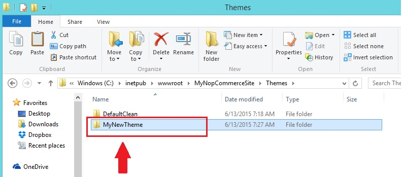

# Instalación / aplicación de tema en nopCommerce
Extraiga el contenido de su archivo zip y cópielo en la carpeta "Temas" como se muestra en la siguiente figura:

1. Extraiga el contenido de su archivo zip y cópielo en la carpeta "Temas" como se muestra en la siguiente figura: 
1. Ir a la sección de administración (`http://www.yourdomain.com/admin`)
1. Vaya a Configuración → Configuración → Configuración general y miscelánea
1. Seleccione un nuevo tema del **Default Store Theme** y haga clic en **Save**.

Ahora, ve a la tienda pública. Debería poder ver el nuevo tema en su sitio web.
