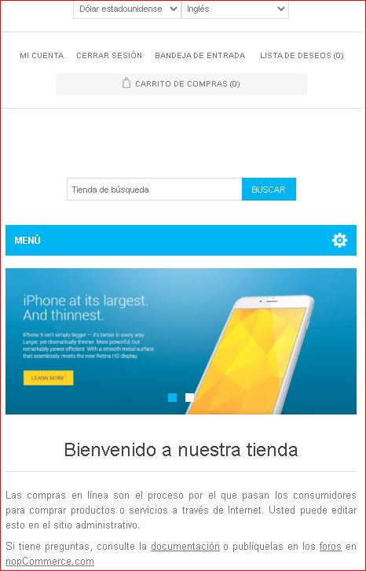

# Diseño de respuesta

**Comprensión del diseño receptivo.** El diseño web receptivo es simplemente el diseño de un sitio web que cambia su diseño de acuerdo con diferentes tamaños de pantalla para ajustar el contenido correctamente cuando se trata de una computadora de escritorio, teléfonos inteligentes, tabletas y otros dispositivos móviles. En esta definición, hay una palabra clave aquí "correctamente". En este contexto, por "correctamente", significa coherente. Mientras trabajan en un diseño receptivo, los desarrolladores web deben asegurarse de que la experiencia del usuario de un sitio web se mantenga constante en todos los dispositivos, independientemente de su tamaño de pantalla. (Fuente:[nopCommerce Blog](https://www.nopcommerce.com/why-a-responsive-design-should-be-a-priority-for-your-business-website))

* La cantidad de dispositivos móviles está aumentando a un ritmo muy rápido y debido a los diferentes tamaños de pantalla / resolución de pantalla, los desarrolladores web utilizan un enfoque de diseño receptivo para mantener la experiencia del usuario igual o similar en todo el sitio web.

* Sí, el diseño/tema predeterminado de nopCommerce admite un diseño receptivo que está optimizado para todos los tamaños de pantalla y este enfoque se maneja a través de consultas de medios en CSS. Esto permite que el diseño de su tienda de comercio electrónico en línea muestre el contenido de su sitio web ajustando automáticamente el área de visualización según el tamaño de la pantalla.

**Ver el diseño receptivo.** Simplemente cambie el tamaño de las ventanas de su navegador y siga disminuyendo su tamaño. A medida que disminuya el tamaño de las ventanas del navegador, verá que el sitio nopCommerce ajustará el contenido en consecuencia.

