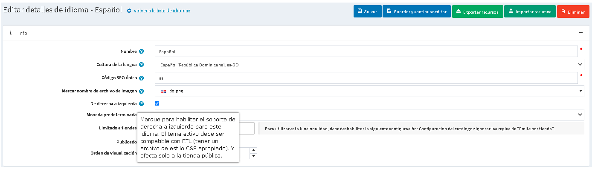
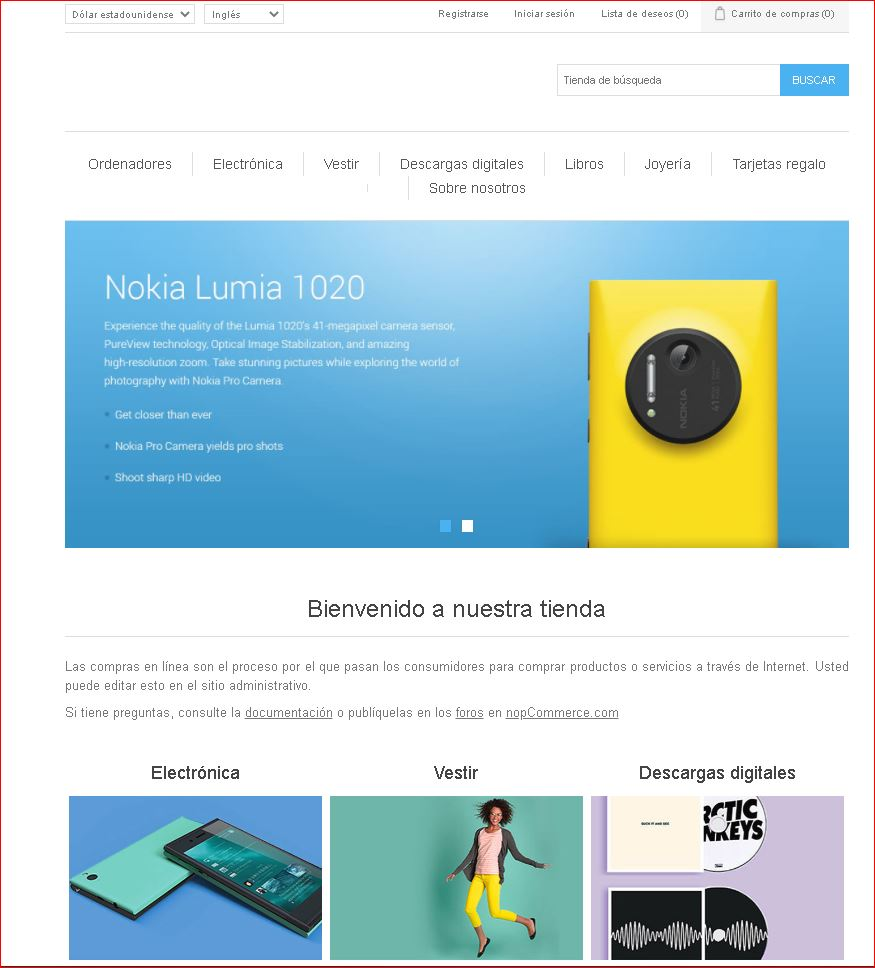
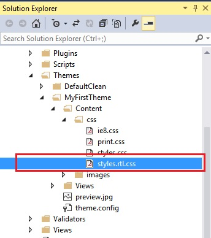

# Tema de derecha a izquierda

nopCommerce también admite la versión de derecha a izquierda del tema de la tienda pública.
Tema de tienda pública predeterminado de nopCommerce **DefaultClean** viene con la característica de una hoja de estilo de versión de derecha a izquierda.

o habilitar la versión "De derecha a izquierda" del tema, vaya a `Administración → Configuración → Idiomas`, haga clic en **Edit** a idioma, y ​​asegúrese de que **De derecha a izquierda** la opción está habilitada.

Ahora, si ve la tienda pública, se verá así:

Los estilos utilizados para la compatibilidad con RTL se encuentran en el archivo `styles.rtl.css`.

