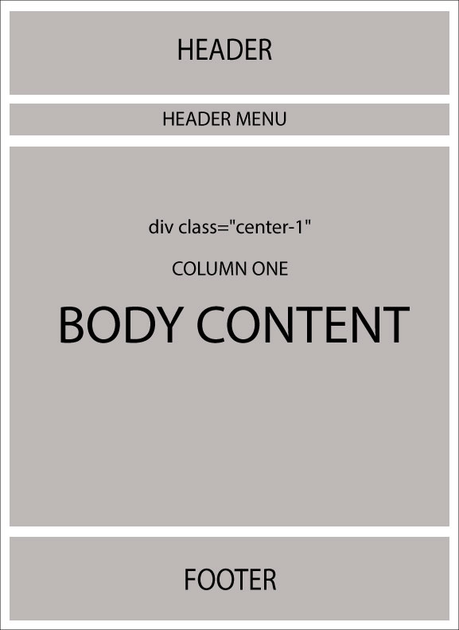

# Comprensión del diseño/diseño

¿Qué son los diseños? Todo desarrollador/diseñador web desea mantener una apariencia coherente en todas las páginas del sitio web. En el pasado, el concepto de "páginas maestras" se introdujo en ASP.NET 2.0, lo que ayuda a mantener un aspecto coherente del sitio web al mapearlo con páginas .aspx.

Razor también admite este concepto similar con una función llamada "Diseños". Básicamente, le permite definir una plantilla de sitio común y luego heredar su apariencia en todas las vistas/páginas de su sitio web.

En nopCommerce, hay 2 tipos diferentes de diseños:

* `_ColumnsOne.cshtml`
* `_ColumnsTwo.cshtml`

Todos estos 2 diseños se heredan de un diseño principal llamado: `_Root.cshtml`. El `_Root.cshtml` en sí se hereda de` _Root.Head.cshtml`. `_Root.Head.cshtml` es el archivo que necesita buscar si está vinculado a una hoja de estilo CSS y archivos jquery (puede agregar / vincular más archivos` .css` y `.js` aquí). La ubicación de todos estos diseños en nopCommerce es la siguiente: `[directorio raíz de nopCommerce]/Views/Shared/ ...`. Si está utilizando la versión del código fuente, entonces:`\Presentation\Nop.Web\Views\Shared\ ...`

* **Diseño de_Root.cshtml**

    

* **Disposición de `_Root.cshtml` (con respecto a la clase css)**

    

Ahora los siguientes 2 diseños anulan el cuerpo de `_Root.cshtml`:

* `_ColumnsOne.cshtml`

   En este caso, no hay ningún cambio en el diseño del cuerpo, por lo que la estructura sigue siendo prácticamente la misma que `_Root.cshtml`:

    

* `_ColumnsTwo.cshtml`

    En este caso, hay 2 columnas en la estructura de la carrocería:

    
