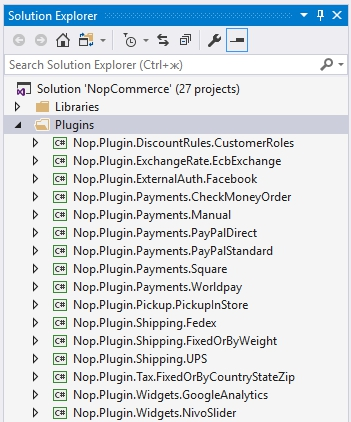
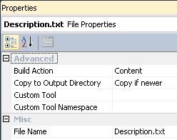
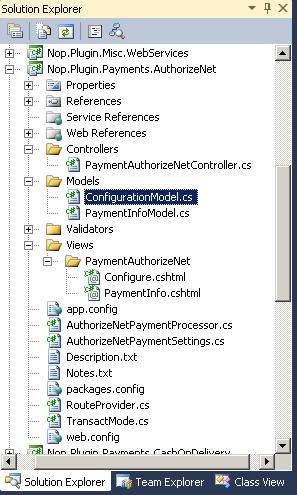

# Cómo escribir un plugin para nopCommerce 3.90 (y versiones anteriores)

> En informática, un plugin (o plugin) es un conjunto de componentes de software que agregan capacidades específicas a una aplicación de software más grande (Wikipedia).

Los plugins se utilizan para ampliar la funcionalidad de nopCommerce. nopCommerce tiene varios tipos de plugins. Por ejemplo, métodos de pago (como PayPal), proveedores de impuestos, métodos de cálculo de métodos de envío (como UPS, USP, FedEx), widgets (como el bloque de 'chat en vivo') y muchos otros. nopCommerce ya se distribuye con muchos plugins diferentes. También puede buscar varios plugins en el [sitio oficial de nopCommerce](https://www.nopcommerce.com/marketplace) para ver si alguien ya ha creado un plugin que se adapte a sus necesidades. De lo contrario, este artículo lo guiará a través del proceso de creación de su propio plugin.

## La estructura del plugin, los archivos requeridos y las ubicaciones

1. Lo primero que debe hacer es crear un nuevo proyecto de "Biblioteca de clases" en la solución. Es una buena práctica colocar todos los plugins en el directorio `\ Plugins` en la raíz de su solución (no se mezcle con el subdirectorio \ Plugins ubicado en el directorio`\Nop.Web` que se usa para los plugins ya implementados). Es una buena práctica colocar todos los plugins en la carpeta de la solución "plugins" (puede encontrar más información sobre las carpetas de la solución [aquí](http://msdn.microsoft.com/library/sx2027y2.aspx)).

    Un nombre recomendado para un proyecto de plugin es "Nop.Plugin. {Group}. {Name}". {Group} es su grupo de plugins (por ejemplo, "Pago" o "Envío"). {Name} es el nombre de su plugin (por ejemplo, "PayPalStandard"). Por ejemplo, el plugin de pago estándar de PayPal tiene el siguiente nombre: Nop.Plugin.Payments.PayPalStandard. Pero tenga en cuenta que no es un requisito. Y puede elegir cualquier nombre para un plugin. Por ejemplo, "MyGreatPlugin".

    

1. Una vez creado el proyecto del plugin, actualice la ruta de salida de la compilación del proyecto. Configúrelo en `.. \ .. \ Presentation\Nop.Web\Plugins \{Group}.{Name}`. Por ejemplo, el plugin de pago Authorize.NET tiene la siguiente ruta de salida: `.. \ .. \ Presentation\Nop.Web\ Plugins\ Payments.AuthorizeNet`. Una vez hecho esto, las DLL de plugins correspondientes se copiarán automáticamente en el directorio `\ Presentation\Nop.Web\Plugins`, que es buscado por el núcleo de nopCommerce en busca de plugins válidos. Pero tenga en cuenta que tampoco es un requisito. Y puede elegir cualquier nombre de directorio de salida para un plugin.

    

    - En el menú Proyecto, haga clic en Propiedades.
    -Haga clic en la pestaña Crear.
    - Haga clic en el botón Examinar junto al cuadro Ruta de salida y seleccione un nuevo directorio de salida de compilación.

    Debe seguir los pasos descritos anteriormente para todas las configuraciones existentes ("Depurar" y "Liberar").

1. El siguiente paso es crear un archivo `Description.txt` requerido para cada plugin. Este archivo contiene metainformación que describe su plugin. Simplemente copie este archivo de cualquier otro plugin existente y modifíquelo según sus necesidades. Por ejemplo, el plugin de pago estándar de PayPal tiene el siguiente archivo `Description.txt`:

    ```TXT
    Grupo: métodos de pago
    FriendlyName: Estándar de PayPal
    Nombre del sistema: Payments.PayPalStandard
    Versión: 1.28
    Versiones admitidas: 3.90
    Autor: equipo de nopCommerce
    DisplayOrder: 1
    Nombre de archivo: Nop.Plugin.Payments.PayPalStandard.dll
    Descripción: Este plugin permite pagar con PayPal Standard
    ```

   En realidad, todos los campos son autodescriptivos, pero aquí hay algunas notas. **SystemName** El campo debe ser único. **Version** el campo es un número de versión de su plugin; puede configurarlo en cualquier valor que desee. **SupportedVersions** El campo puede contener una lista de versiones de nopCommerce compatibles separadas por comas (asegúrese de que la versión actual de nopCommerce esté incluida en esta lista, de lo contrario, no se cargará). **FileName** El campo tiene el siguiente formato *Nop.Plugin. {Group}. {Name} .dll* (es el nombre del archivo de ensamblaje de su plugin). Asegúrese de que la propiedad "Copiar al directorio de salida" de este archivo esté establecida en "Copiar si es más reciente".

    

1. También debe crear un archivo web.config y asegurarse de que se haya copiado en la salida. Simplemente cópielo de cualquier plugin existente.

    > [!IMPORTANT]
    > 
    > En el futuro, asegúrese de que las propiedades de "Copiar local" de todas las referencias de ensamblado de terceros (incluidas las bibliotecas principales como Nop.Services.dll o Nop.Web.Framework.dll) estén configuradas en "False" (no copiar)

1. El último paso requerido es crear una clase que implemente la interfaz IPlugin (espacio de nombres Nop.Core.Plugins). nopCommerce tiene la clase BasePlugin que ya implementa algunos métodos IPlugin y le permite evitar la duplicación del código fuente. nopCommerce también le proporciona algunas interfaces específicas derivadas de IPlugin. Por ejemplo, tenemos la interfaz "IPaymentMethod" que se utiliza para crear nuevos plugins de métodos de pago. Contiene algunos métodos que son específicos solo para métodos de pago como ProcessPayment () o GetAdditionalHandlingFee (). Actualmente, nopCommerce tiene las siguientes interfaces de plugins específicas:

    - **IExternalAuthenticationMethod**. Se utiliza para crear métodos de autenticación externos como Facebook, Twitter, OpenID, etc.
    - **IWidgetPlugin**. Te permite crear widgets. Los widgets se representan en algunas partes de su sitio. Por ejemplo, puede ser un bloque de "chat en vivo" en la columna izquierda de su sitio.
    - **IExchangeRateProvider**. Se utiliza para obtener el tipo de cambio de moneda.
    - **IDiscountRequirementRule**. Le permite crear nuevas reglas de descuento, como "El país de facturación de un cliente debe ser ...".
    - **IPaymentMethod**. plugins que se utilizan para el procesamiento de pagos.
    - **IShippingRateComputationMethod**. Estos plugins se utilizan para recuperar métodos de entrega aceptados y tarifas de envío adecuadas. Por ejemplo, UPS, UPS, FedEx, etc.
    - **ITaxProvider**. Los proveedores de impuestos se utilizan para obtener tasas impositivas.

    Si su plugin no se ajusta a ninguna de estas interfaces, utilice la interfaz "IMiscPlugin".

> [!IMPORTANT]
> 
> Después de la construcción de cada proyecto, limpie la solución antes de realizar cambios. Algunos recursos se almacenarán en caché y pueden provocar la locura del desarrollador.

## Manejo de solicitudes. Controladores, modelos y vistas

Ahora puede ver el plugin yendo a **Admin area → Configuration → Plugins**.Pero como adivinó, nuestro plugin no hace nada. Ni siquiera tiene una interfaz de usuario para su configuración. Creemos una página para configurar el plugin.

Lo que tenemos que hacer ahora es crear un controlador, un modelo y una vista.

- Los controladores MVC son responsables de responder a las solicitudes realizadas en un sitio web ASP.NET MVC. Cada solicitud del navegador se asigna a un controlador en particular.
- Una vista contiene el marcado HTML y el contenido que se envía al navegador. Una vista es el equivalente a una página cuando se trabaja con una aplicación ASP.NET MVC.
- Un modelo MVC contiene toda la lógica de su aplicación que no está contenida en una vista o un controlador.
You can find more information about the MVC pattern [aqui](http://www.asp.net/mvc/tutorials/older-versions/overview/understanding-models-views-and-controllers-cs).

Así que comencemos:

- **Crea el modelo**. Agregue una carpeta de Modelos en el nuevo plugin y luego agregue una nueva clase de modelo que se adapte a sus necesidades.
- **Crear la vista**. Agregue una carpeta de Vistas en el nuevo plugin, luego agregue una carpeta {Nombre} (donde {Nombre} es el nombre de su plugin) y finalmente agregue un archivo cshtml llamado `Configure.cshtml`. Nota importante: para las versiones 2.00-3.30, la vista debe marcarse como un recurso incrustado. Y a partir de las vistas de la versión 3.40, asegúrese de que la propiedad "Acción de compilación" del archivo de vista esté establecida en "Contenido" y que la propiedad "Copiar en el directorio de salida" esté establecida en "Copiar si es más reciente".
- **Crea el controlador**. Agregue una carpeta de controladores en el nuevo plugin y luego agregue una nueva clase de controlador. Una buena práctica es nombrar los controladores de plugins `{Grupo} {Nombre} Controller.cs`. Por ejemplo, PaymentAuthorizeNetController. Por supuesto, no es un requisito nombrar a los controladores de esta manera (sino solo una recomendación). Luego, cree un método de acción apropiado para la página de configuración (en el área de administración). Vamos a llamarlo "Configurar". Prepare una clase modelo y páselo a la siguiente vista. Para las versiones 2.00-3.30 de nopCommerce, debe pasar la ruta de la vista incrustada: "Nop.Plugin. {Group}. {Name} .Views. {Group} {Name} .Configure". Y a partir de la versión 3.40 de nopCommerce, debe pasar la ruta de la vista física:                   `~/Plugins/ {PluginOutputDirectory}/Views/{ControllerName}/Configure.cshtml`. Por ejemplo, abra el plugin de pago Authorize.NET y observe su implementación de PaymentAuthorizeNetController.

    > [!TIP]
    > 
    > - La forma más fácil de completar los pasos descritos anteriormente es abrir cualquier otro plugin y copiar estos archivos en su proyecto de plugin. Luego simplemente cambie el nombre de las clases y directorios apropiados.
    > - Si desea limitar el acceso a un determinado método de acción del controlador a los administradores (propietarios de tiendas), simplemente márquelo con el atributo [AdminAuthorize].

    Por ejemplo, la estructura del proyecto del plugin Authorize.NET se parece a la imagen a continuación

    

## Rutas

Ahora necesitamos registrar las rutas de plugins adecuadas. El enrutamiento ASP.NET es responsable de asignar las solicitudes entrantes del navegador a acciones particulares del controlador MVC. Puede encontrar más información sobre enrutamiento [aquí](http://www.asp.net/mvc/tutorials/older-versions/controllers-and-routing/asp-net-mvc-routing-overview-cs). Entonces sigue los siguientes pasos:

- Algunas de las interfaces de plugins específicas (descritas anteriormente) y la interfaz "IMiscPlugin" tienen el siguiente método: "GetConfigurationRoute". Debería devolver una ruta a una acción de controlador que se utiliza para la configuración del plugin. Implemente el método "GetConfigurationRoute" de la interfaz de su plugin. Este método informa a nopCommerce sobre qué ruta se usa para la configuración del plugin. Si su plugin no tiene una página de configuración, entonces "GetConfigurationRoute" debería devolver un valor nulo. Por ejemplo, vea el código a continuación:

    ```csharp
    public void GetConfigurationRoute(out string actionName,
                out string controllerName,
                out RouteValueDictionary routeValues)
    {
        actionName = "Configure";
        controllerName = "PaymentAuthorizeNet";
        routeValues = new RouteValueDictionary()
        {
            { "Namespaces", "Nop.Plugin.Payments.AuthorizeNet.Controllers" },
            { "area", null }
        };
    }
    ```

- (opcional) Si necesita agregar alguna ruta personalizada, cree el archivo `RouteProvider.cs`. Informa al sistema nopCommerce sobre las rutas de los plugins. Por ejemplo, la siguiente clase RouteProvider agrega una nueva ruta a la que se puede acceder abriendo su navegador web y navegando a la URL `http://www.yourStore.com/Plugins/PaymentPayPalStandard/PDTHandler` (utilizada por el plugin de PayPal):

    ```csharp
    public partial class RouteProvider : IRouteProvider
    {
        public void RegisterRoutes(RouteCollection routes)
        {
             routes.MapRoute("Plugin.Payments.PayPalStandard.PDTHandler",
                 "Plugins/PaymentPayPalStandard/PDTHandler",
                 new { controller = "PaymentPayPalStandard", action = "PDTHandler" },
                 new[] { "Nop.Plugin.Payments.PayPalStandard.Controllers"  }
            );
        }

        public int Priority
        {
            get
            {
                return 0;
            }
        }
    }
    ```

    Una vez que haya instalado su plugin y agregado el método de configuración, encontrará un enlace para configurar su plugin en Admin → Configuración → plugins.

## Manejo de los métodos "Instalar" y "Desinstalar"

Este paso es opcional. Algunos plugins pueden requerir lógica adicional durante la instalación del plugin. Por ejemplo, un plugin puede insertar nuevos recursos de configuración regional. Entonces, abra su implementación de IPlugin (en la mayoría de los casos se derivará de la clase BasePlugin) y anule los siguientes métodos:

- Instalar en pc. Este método se invocará durante la instalación del plugin. Puede inicializar cualquier configuración aquí, insertar nuevos recursos de configuración regional o crear algunas tablas de base de datos nuevas (si es necesario).
- Desinstalar. Este método se invocará durante la desinstalación del plugin.

> [!IMPORTANT]
>
> Si anula uno de estos métodos, no oculte su implementación base.

Por ejemplo, la estructura del proyecto del plugin Authorize.NET se parece a la imagen a continuación

```csharp
public override void Install()
{
    var settings = new AuthorizeNetPaymentSettings()
    {
        UseSandbox = true,
        TransactMode = TransactMode.Authorize,
        TransactionKey = "123",
        LoginId = "456"
    };
    _settingService.SaveSetting(settings);
    base.Install();
}
```

> [!TIP]
> 
>La lista de plugins instalados se encuentra en `\App_Data\InstalledPlugins.txt`. La lista se crea durante la instalación.

## La actualización de nopCommerce puede romper los plugins
Algunos plugins pueden quedar desactualizados y ya no funcionan con la versión más reciente de nopCommerce. Si tiene problemas después de actualizar a la versión más reciente, elimine el plugin y visite el sitio web oficial de nopCommerce para ver si hay una versión más nueva disponible. Muchos autores de plugins actualizarán sus plugins para adaptarse a la versión más nueva, sin embargo, algunos no lo harán y su plugin se volverá obsoleto con las mejoras en nopCommerce. Pero en la mayoría de los casos, simplemente puede abrir un archivo `plugin.json` apropiado y actualizar el campo **SupportedVersions**.

## Conclusión

Con suerte, esto lo ayudará a comenzar con nopCommerce y lo preparará para crear plugins más elaborados.