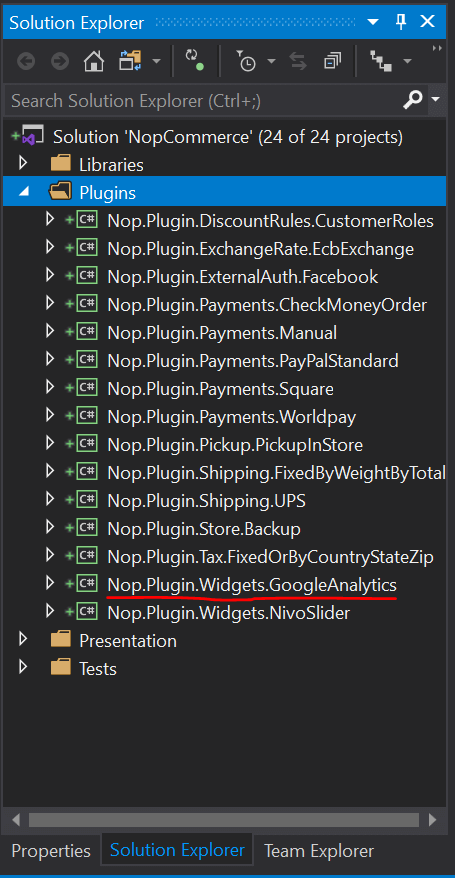
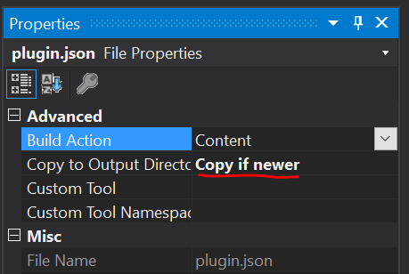
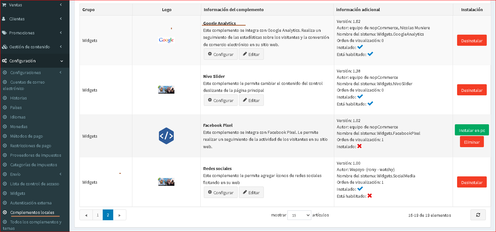
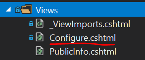

---
title: How to write a widget for nopCommerce
uid: es/developer/plugins/how-to-write-widget-for-nopCommerce
author: git.nopsg
contributors: git.nopsg, git.DmitriyKulagin
---

# Cómo escribir un widget para nopCommerce

Para ampliar la funcionalidad de nopCommerce, se utilizan widgets. Hay varios tipos de widgets como [NivoSlider](https://github.com/nopSolutions/nopCommerce/tree/master/src/Plugins/Nop.Plugin.Widgets.NivoSlider) y [Google Analytics](https://github.com/nopSolutions/nopCommerce/tree/master/src/Plugins/Nop.Plugin.Widgets.GoogleAnalytics) que ya se encuentran en el repositorio de nopCommerce. El mercado de nopCommerce ya contiene varios widgets (tanto gratuitos como de pago) que pueden cumplir con sus requisitos. Si no ha encontrado uno, entonces está en el lugar correcto porque este artículo lo guiará a través del proceso de creación de un widget de acuerdo con sus necesidades.

## La estructura del widget, los archivos necesarios y las ubicaciones

1. Empiece por crear un nuevo proyecto **Biblioteca de clases** en la solución. Se recomienda colocar su widget en el directorio **Complementos**, ubicado en la carpeta raíz de la fuente, donde ya se encuentran otros widgets y complementos.

    

    > [!NOTE]
    > No confunda este directorio con el que existe en el directorio `Presentation\Nop.Web`. El directorio de complementos en el directorio Nop.Web contiene los archivos compilados de complementos.

    Un nombre recomendado para un proyecto de widget es `Nop.Plugin.Widgets. {Name}`. `{Name}` es el nombre de su widget (por ejemplo, "**GoogleAnalytics**"). Por ejemplo, *el widget de Google Analytics* tiene el siguiente nombre: `Nop.Plugin.Widgets.GoogleAnalytics`. Pero tenga en cuenta que no es un requisito. Y puede elegir cualquier nombre para un widget. Por ejemplo, "*MyFirstNopWidget*". La estructura del directorio de complementos de una solución se parece a la siguiente.

      

1. Una vez creado el proyecto de widget, el contenido del archivo **.Csproj** debe actualizarse utilizando cualquier aplicación de edición de texto disponible. Reemplace el contenido con el siguiente:

    ```xml
    <Project Sdk="Microsoft.NET.Sdk">
        <PropertyGroup>
            <TargetFramework>netcoreapp3.1</TargetFramework>
            <Copyright>SOME_COPYRIGHT</Copyright>
            <Company>YOUR_COMPANY</Company>
            <Authors>SOME_AUTHORS</Authors>
            <PackageLicenseUrl>PACKAGE_LICENSE_URL</PackageLicenseUrl>
            <PackageProjectUrl>PACKAGE_PROJECT_URL</PackageProjectUrl>
            <RepositoryUrl>REPOSITORY_URL</RepositoryUrl>
            <RepositoryType>Git</RepositoryType>
            <OutputPath>..\..\Presentation\Nop.Web\Plugins\WIDGET_OUTPUT_DIRECTORY</OutputPath>
            <OutDir>$(OutputPath)</OutDir>
            <!--Establezca este parámetro en verdadero para copiar las DLL de la caché de NuGet a la salida de su proyecto. Debe establecer este parámetro en verdadero si su complemento tiene un paquete nuget para asegurarse de que las dlls se copien del caché de NuGet a la salida de su proyecto-->
            <CopyLocalLockFileAssemblies>true</CopyLocalLockFileAssemblies>
        </PropertyGroup>
        <ItemGroup>
            <ProjectReference Include="..\..\Presentation\Nop.Web.Framework\Nop.Web.Framework.csproj" />
            <ClearPluginAssemblies Include="$(MSBuildProjectDirectory)\..\..\Build\ClearPluginAssemblies.csproj" />
        </ItemGroup>
        <!-- Este objetivo se ejecuta después del objetivo "Construir" -->
        <Target Name="NopTarget" AfterTargets="Build">
            <!-- Eliminar bibliotecas innecesarias de la ruta de los complementos -->
            <MSBuild Projects="@(ClearPluginAssemblies)" Properties="PluginPath=$(MSBuildProjectDirectory)\ $(OutDir)" Targets="NopClear" />
        </Target>
    </Project>
    ```

    > [!NOTA]
     > El **WIDGET_OUTPUT_DIRECTORY** debe reemplazarse por el nombre del complemento, por ejemplo, Widgets.GoogleAnalytics.

1. Después de actualizar el archivo .csproj, se debe agregar el archivo **plugin.json**, que es necesario para el widget. Este archivo contiene metainformación que describe su widget. Simplemente copie este archivo de cualquier otro complemento/widget existente y modifíquelo según sus necesidades. Por ejemplo, el widget de **Google Analytics** tiene el siguiente archivo *plugin.json*:


    ```json
    {
        "Group": "Widgets",
        "FriendlyName": "Google Analytics ",
        "SystemName": "Widgets.GoogleAnalytics",
        "Version": "1.62",
        "SupportedVersions": [ "4.30" ],
        "Author": "nopCommerce team, Nicolas Muniere",
        "DisplayOrder": 1,
        "FileName": "Nop.Plugin.Widgets.GoogleAnalytics.dll",
        "Description": "This plugin integrates with Google Analytics. It keeps track of statistics about the visitors and eCommerce conversion on your website"
    }
    ```

    En realidad, todos los campos son autodescriptivos, pero aquí hay algunas notas:

       - El campo **SystemName** debe ser único.
       - El campo **Versión** es un número de versión de su widget. Puede configurarlo en cualquier valor que desee.
       - El campo **SupportedVersions** puede contener una lista de versiones de nopCommerce admitidas separadas por comas (asegúrese de que la versión actual de nopCommerce esté incluida en esta lista; de lo contrario, no se cargará).
       - El campo **FileName** tiene el siguiente formato `Nop.Plugin.Widgets. {Name} .dll` (es el nombre del archivo de ensamblaje del complemento). Asegúrese de que la propiedad **Copiar al directorio de salida** de este archivo esté establecida en **Copiar si es más reciente**.

    

    El último paso requerido es crear una clase que implemente **BasePlugin** (espacio de nombres *Nop.Core.Plugins*) y la interfaz **IWidgetPlugin** (espacio de nombres *Nop.Services.Cms*). IWidgetPlugin te permite crear widgets. Los widgets se representan en algunas partes de su sitio. Por ejemplo, puede ser un bloque de chat en vivo en la parte inferior derecha de su sitio.

## Manejo de solicitudes. Controladores, modelos y vistas

Ahora puede ver el widget yendo a **Área de administración** → **Configuración** → **Complementos locales**.



Cuando se instala un complemento / widget, verá el botón **Desinstalar**. *Para mejorar el rendimiento, es una buena práctica desinstalar los complementos / widgets que no son necesarios*.


Habrá el botón **Instalar** y **Eliminar** cuando un complemento/widget no esté instalado o desinstalado. *La eliminación eliminará los archivos físicos del servidor*.

Pero como habrás adivinado, nuestro widget no hace nada. Ni siquiera tiene una interfaz de usuario para su configuración. Creemos una página para configurar el widget.

Lo que tenemos que hacer ahora es crear un controlador, un modelo, una vista y un componente de vista.

Pero como habrás adivinado, nuestro widget no hace nada. Ni siquiera tiene una interfaz de usuario para su configuración. Creemos una página para configurar el widget.

Lo que tenemos que hacer ahora es crear un controlador, un modelo, una vista y un componente de vista.

- **Los controladores MVC** son responsables de responder a las solicitudes realizadas en un sitio web *ASP.NET MVC*. Cada solicitud del navegador se asigna a un controlador en particular.
- Una vista contiene el marcado **HTML** y el contenido que se envía al navegador. Una vista es el equivalente a una página cuando se trabaja con una aplicación *ASP.NET MVC*.
- Un componente de vista que implementa **NopViewComponent** que contiene lógica y códigos para representar una vista.
- El **modelo MVC** contiene toda la lógica de su aplicación que no está contenida en una vista o un controlador.

Así que comencemos:

1. Cree el modelo. Agregue una carpeta `Modelos` en el nuevo widget y luego agregue una nueva clase de modelo que se adapte a sus necesidades.

1. Cree la vista. Agregue una carpeta `Views` en el nuevo widget y luego agregue un archivo` cshtml` llamado `Configure.cshtml`. La propiedad "**Acción de compilación**" del archivo de vista se establece en "**Contenido**", y la propiedad "**Copiar en el directorio de salida**" se establece en "**Copiar siempre**". Tenga en cuenta que la página de configuración debe utilizar el diseño "**_ConfigurePlugin**".

    ```cs
    @{
        Layout = "_ConfigurePlugin";
    }
    ```

3.También asegúrese de tener el archivo **_ViewImports.cshtml** en su directorio `Views`. Puede copiarlo desde cualquier otro complemento o widget existente.

 

4. Cree el controlador. Agregue una carpeta `Controllers` en el nuevo widget y luego agregue una nueva clase de controlador. Una buena práctica es nombrar los controladores de complementos `Widgets {Nombre} Controller.cs`. Por ejemplo, **WidgetsGoogleAnalyticsController**. Por supuesto, no es un requisito nombrar a los controladores de esta manera, sino solo una recomendación. Luego, cree un método de acción apropiado para la página de configuración (en el área de administración). Vamos a llamarlo "` Configurar` ". Prepara una clase de modelo y pásala a la siguiente vista usando una ruta de vista física: `~ / Plugins / {PluginOutputDirectory} / Views / Configure.cshtml`.

    ```cs
    public IActionResult Configure()
    {
        if (!_permissionService.Authorize(StandardPermissionProvider.ManageWidgets))
            return AccessDeniedView();

        //load settings for a chosen store scope
        var storeScope = _storeContext.ActiveStoreScopeConfiguration;
        var myWidgetSettings = _settingService.LoadSetting<MyWidgetSettings>(storeScope);

        var model = new ConfigurationModel
        {
            // configuration model settings here
        };

        if (storeScope > 0)
        {
            // override settings here based on store scope
        }

        return View("~/Plugins/Widgets.MyFirstNopWidget/Views/Configure.cshtml", model);
    }
    ```

1. Utilice los siguientes atributos para su método de acción:

    `` `cs
     [AuthorizeAdmin]//confirma el acceso al panel de administración
     [Area(AreaNames.Admin)]//especifica el área que contiene un controlador o acción
     [AdminAntiForgery]//Ayuda a evitar que scripts maliciosos envíen solicitudes de página falsificadas.
     ''

     Por ejemplo, abra el widget `GoogleAnalytics` y observe su implementación de` WidgetsGoogleAnalyticsController`.
      Luego, para cada widget que tenga una página de configuración, debe especificar una URL de configuración. La clase base llamada **asePlugin** tiene el método `GetConfigurationPageUrl` que devuelve una URL de configuración:

    ```cs
    public override string GetConfigurationPageUrl()
    {
        return $"{_webHelper.GetStoreLocation()}Admin/{CONTROLLER_NAME}/{ACTION_NAME}";
    }
    ```

    Donde `{CONTROLLER_NAME}` es el nombre de su controlador y `{ACTION_NAME}` es el nombre de la acción (normalmente es "Configurar").
     Cada widget debe especificar una lista de zonas de widgets. La clase base llamada **IWidgetPlugin** tiene el método `GetWidgetZones` que devuelve una lista de zonas de widgets donde se renderizará.

    ```cs
    public IList<string> GetWidgetZones()
    {
        return new List<string> { PublicWidgetZones.HeadHtmlTag };
    }
    ```

    Puede encontrar una lista de zonas de widgets públicos en este [enlace] (https://github.com/nopSolutions/nopCommerce/blob/master/src/Presentation/Nop.Web.Framework/Infrastructure/PublicWidgetZones.cs) y widget de administración zonas siguiendo este [enlace] (https://github.com/nopSolutions/nopCommerce/blob/master/src/Presentation/Nop.Web.Framework/Infrastructure/AdminWidgetZones.cs).
     Además de `GetWidgetZones`, **IWidgetPlugin** tiene el método` GetWidgetViewComponentName` que devuelve el nombre de ViewComponent. Acepta el nombre "*widgetZone*" como parámetro y se puede utilizar para representar diferentes vistas en función de la zona de widgets seleccionada.

    ```cs
    public string GetWidgetViewComponentName(string widgetZone)
    {
        return "MyFirstWidget";
    }
    ```

## Estructura del proyecto del widget de Google Analytics


## Manejo de los métodos "Instalar" y "Desinstalar"

Este paso es opcional. Algunos widgets pueden requerir lógica adicional durante su instalación. Por ejemplo, un widget puede insertar nuevos recursos de configuración regional o valores de configuración. Así que abre tu implementación **IWidgetPlugin** (en la mayoría de los casos se derivará de la clase **BasePlugin**) y anula los siguientes métodos:

1. **Instalar**. Este método se invocará durante la instalación del complemento. Puede inicializar cualquier configuración aquí, insertar nuevos recursos de configuración regional o crear algunas tablas de base de datos nuevas (si es necesario).

    ```cs
    public override void Install()
    {
        // lógica personalizada como agregar configuraciones, recursos locales y tablas de bases de datos aquí

        base.Install();
    }
    ```

1.**Desinstalar**. Este método se invocará durante la desinstalación del complemento. Puede eliminar la configuración, los recursos locales o las tablas de la base de datos previamente inicializados mediante un widget durante la instalación.

    ```cs
    public override void Uninstall()
    {
        // lógica personalizada como eliminar configuraciones, recursos locales y tablas de bases de datos que se crearon durante la instalación del widget

        base.Uninstall();
    }
    ```

 >[!IMPORTANT]
 > Si anula uno de estos métodos, no oculte su implementación base - **base.Install()** and **base.Uninstall()** que ha sido marcado en las imágenes de arriba