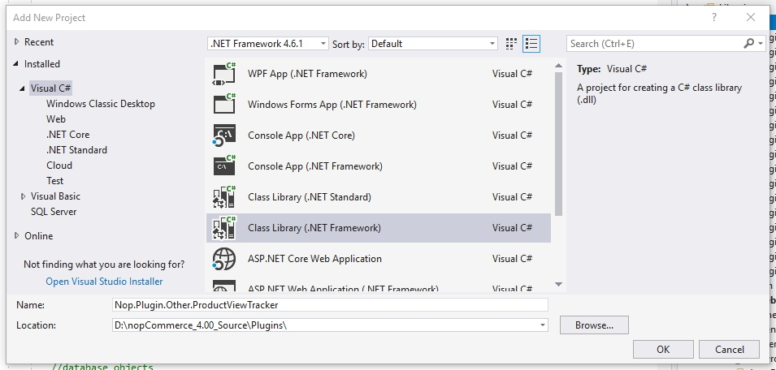
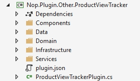
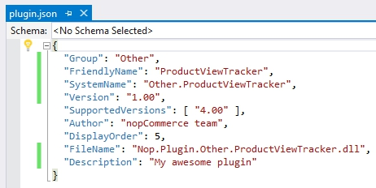

# Complemento con acceso a datos "(4.20 y menos)

En este tutorial, usaré la arquitectura del complemento nopCommerce para implementar un rastreador de vistas de productos. Antes de comenzar con el desarrollo, es muy importante que haya leído, comprendido y completado con éxito los tutoriales que se enumeran a continuación. Pasaré por alto algunas explicaciones cubiertas en los artículos anteriores, pero puede recapitular utilizando los enlaces proporcionados.

- [Tutoriales para desarrolladores](xref:es/developer/tutorials/index)
- [Actualización de una entidad existente. Cómo agregar una nueva propiedad.](Xref:es/developer/tutorials/update-existing-entity)
- [Cómo escribir un complemento para nopCommerce 4.20](xref:es/developer/plugins/how-to-write-plugin-4.20)

Comenzaremos a codificar con la capa de acceso a datos, pasaremos a la capa de servicio y finalmente terminaremos con la inyección de dependencia.

> [!NOTE]

> La aplicación práctica de este complemento es cuestionable, pero no pude pensar en una función que no vega con nopCommerce y que se ajuste a una publicación de tamaño razonable. Si usa este complemento en un entorno de producción, no ofrezco garantías. Siempre me interesan las historias de éxito y me alegraría saber que la publicación aportó más que un valor educativo.

## Empezando

Cree un nuevo proyecto de biblioteca de clases "Nop.Plugin.Other.ProductViewTracker".



Agregue las siguientes carpetas y `plugin.json` archivos.



Puede ver el `plugin.json`archivo y la imagenes continuación.



Luego agregue referencias a los siguientes proyectos: Nop.Core, Nop.Data, Nop.Web.Framework

## La capa de acceso a datos (A.K.A. Creación de nuevas entidades en nopCommerce)

Dentro del espacio de nombres "dominio" vamos a crear una clase pública denominada ProductViewTrackerRecord. Esta clase extiende BaseEntity, pero de lo contrario es un archivo muy aburrido. Algo a recordar es que todas las propiedades están marcadas como virtuales y no es sólo por diversión. Las propiedades virtuales son necesarias en las entidades de base de datos debido a cómo Entity Framework crea instancias y realiza un seguimiento de las clases. Otra cosa a tener en cuenta es que no tenemos propiedades de navegación (propiedades relacionales), y las cubriré con más detalle más adelante.

```csharp
namespace Nop.Plugin.Other.ProductViewTracker.Domain
{
    public class ProductViewTrackerRecord : BaseEntity
    {
        public virtual int ProductId { get; set; }
        public virtual string ProductName { get; set; }
        public virtual int CustomerId { get; set; }
        public virtual string IpAddress { get; set; }
        public virtual bool IsRegistered { get; set; }
    }
}
```

**Localización de archivos**: Para averiguar dónde deberían existir ciertos archivos, analiza el espacio de nombres y crea el archivo en consecuencia.

La siguiente clase a crear es la clase de mapeo Entity Framework. Dentro de la clase de mapeo se mapean las columnas, las relaciones de la tabla y la tabla de la base de datos.

```csharp
namespace Nop.Plugin.Other.ProductViewTracker.Data
{
    public class ProductViewTrackerRecordMap : NopEntityTypeConfiguration<ProductViewTrackerRecord>
    {
        /// <summary>
        /// Configures the entity
        /// </summary>
        /// <param name="builder">The builder to be used to configure the entity</param>
        public override void Configure(EntityTypeBuilder<ProductViewTrackerRecord> builder)
        {
            builder.ToTable(nameof(ProductViewTrackerRecord));
            //Map the primary key
            builder.HasKey(record => record.Id);
            //Map the additional properties
            builder.Property(record => record.ProductId);
            //Avoiding truncation/failure
            //so we set the same max length used in the product tame
            builder.Property(record => record.ProductName).HasMaxLength(400);
            builder.Property(record => record.IpAddress);
            builder.Property(record => record.CustomerId);
            builder.Property(record => record.IsRegistered);
        }
    }
}
```

La siguiente clase es la clase más complicada y la más importante de la capa de acceso a datos. El contexto de objeto de Entity Framework es una clase de paso a través que nos da acceso a la base de datos y ayuda a realizar un seguimiento del estado de la entidad (por ejemplo, agregar, actualizar, eliminar). El contexto también se utiliza para generar el esquema de base de datos o actualizar un esquema existente. En las clases de contexto personalizadas no podemos hacer referencia a entidades existentes anteriormente porque esos tipos ya están asociados a otro contexto de objeto. También es por eso que no tenemos propiedades de navegación complejas en nuestro registro de seguimiento.

```csharp
namespace Nop.Plugin.Other.ProductViewTracker.Data
{
    public class ProductViewTrackerRecordObjectContext : DbContext, IDbContext
    {
        public ProductViewTrackerRecordObjectContext(DbContextOptions<ProductViewTrackerRecordObjectContext> options) : base(options)
        {
        }
        protected override void OnModelCreating(ModelBuilder modelBuilder)
        {
            modelBuilder.ApplyConfiguration(new ProductViewTrackerRecordMap());
            base.OnModelCreating(modelBuilder);
        }

        public new virtual DbSet<TEntity> Set<TEntity>() where TEntity : BaseEntity
        {
            return base.Set<TEntity>();
        }

        public virtual string GenerateCreateScript()
        {
            return Database.GenerateCreateScript();
        }

        public virtual IQueryable<TQuery> QueryFromSql<TQuery>(string sql) where TQuery : class
        {
            throw new NotImplementedException();
        }

        public virtual IQueryable<TEntity> EntityFromSql<TEntity>(string sql, params object[] parameters) where TEntity : BaseEntity
        {
            throw new NotImplementedException();
        }

        public virtual int ExecuteSqlCommand(RawSqlString sql, bool doNotEnsureTransaction = false, int? timeout = null, params object[] parameters)
        {
            using (var transaction = Database.BeginTransaction())
            {
                var result = Database.ExecuteSqlCommand(sql, parameters);
                transaction.Commit();
                return result;
            }
        }

        public void Install()
        {
               //create the table
               this.ExecuteSqlScript(GenerateCreateScript());
        }
        public void Uninstall()
        {
               //drop the table
               this.DropPluginTable(nameof(ProductViewTrackerRecord));
        }

        public IList<TEntity> ExecuteStoredProcedureList<TEntity>(string commandText, params object[] parameters) where TEntity : BaseEntity, new()
        {
            throw new NotImplementedException();
        }

        public IEnumerable<TElement> SqlQuery<TElement>(string sql, params object[] parameters)
        {
            throw new NotImplementedException();
        }
        public int ExecuteSqlCommand(string sql, bool doNotEnsureTransaction = false, int? timeout = null, params object[] parameters)
        {
            throw new NotImplementedException();
        }

        public virtual void Detach<TEntity>(TEntity entity) where TEntity : BaseEntity
        {
            throw new NotImplementedException();
        }

        public IQueryable<TQuery> QueryFromSql<TQuery>(string sql, params object[] parameters) where TQuery : class
        {
            throw new NotImplementedException();
        }

        public virtual bool ProxyCreationEnabled
        {
            get => ProxyCreationEnabled;
            set => ProxyCreationEnabled = value;
        }

        public virtual bool AutoDetectChangesEnabled
        {
            get => AutoDetectChangesEnabled;
            set => AutoDetectChangesEnabled = value;
        }
    }
}
```

## Inicio de la aplicación

Esta parte registra el contexto del objeto de registro que creamos en el paso anterior.

```csharp
using Microsoft.AspNetCore.Builder;
using Microsoft.Extensions.Configuration;
using Microsoft.Extensions.DependencyInjection;
using Nop.Core.Infrastructure;
using Nop.Plugin.Other.ProductViewTracker.Data;
using Nop.Web.Framework.Infrastructure.Extensions;

namespace Nop.Plugin.Misc.RepCred.Infrastructure
{
    /// <summary>
    /// Represents object for the configuring plugin DB context on application startup
    /// </summary>
    public class PluginDbStartup : INopStartup
    {
        /// <summary>
        /// Add and configure any of the middleware
        /// </summary>
        /// <param name="services">Collection of service descriptors</param>
        /// <param name="configuration">Configuration of the application</param>
        public void ConfigureServices(IServiceCollection services, IConfiguration configuration)
        {
            //add object context
            services.AddDbContext<ProductViewTrackerRecordObjectContext>(optionsBuilder =>
            {
                optionsBuilder.UseSqlServerWithLazyLoading(services);
            });
        }

        /// <summary>
        /// Configure the using of added middleware
        /// </summary>
        /// <param name="application">Builder for configuring an application's request pipeline</param>
        public void Configure(IApplicationBuilder application)
        {
        }

        /// <summary>
        /// Gets order of this startup configuration implementation
        /// </summary>
        public int Order => 11;
    }
}
```

## Capa de servicio

La capa de servicio conecta la capa de acceso a datos y la capa de presentación. Dado que es una mala forma compartir cualquier tipo de responsabilidad en el código, cada capa debe estar aislada. La capa de servicio ajusta la capa de datos con lógica de negocios y la capa de presentación depende de la capa de servicio. Debido a que nuestra tarea es muy pequeña, nuestra capa de servicio no hace más que comunicarse con el repositorio (el repositorio en nopCommerce actúa como fachada al contexto del objeto).

```csharp
namespace Nop.Plugin.Other.ProductViewTracker.Services
{
    public interface IProductViewTrackerService
    {
        /// <summary>
        /// Logs the specified record.
        /// </summary>
        /// <param name="record">The record.</param>
        void Log(ProductViewTrackerRecord record);
    }
}

namespace Nop.Plugin.Other.ProductViewTracker.Services
{
    public class ProductViewTrackerService : IProductViewTrackerService
    {
        private readonly IRepository<ProductViewTrackerRecord> _productViewTrackerRecordRepository;
        public ViewTrackingService(IRepository<ProductViewTrackingRecord> productViewTrackerRecordRepository)
        {
            _productViewTrackerRecordRepository = productViewTrackerRecordRepository;
        }

        /// <summary>
        /// Logs the specified record.
        /// </summary>
        /// <param name="record">The record.</param>
        public virtual void Log(ProductViewTrackerRecord record)
        {
            if (record == null)
                throw new ArgumentNullException(nameof(record));
            _productViewTrackerRecordRepository.Insert(record);
        }
    }
}
```

## Inyección de dependencia

Martin Fowler ha escrito una gran descripción de la inyección de dependencia o Inversión de control. No voy a duplicar su trabajo y puedes encontrar su artículo aquí. La inyección de dependencias gestiona el ciclo de vida de los objetos y proporciona instancias para que las utilicen los objetos dependientes. Primero, necesitamos configurar el contenedor de dependencias para que comprenda qué objetos controlará y qué reglas podrían aplicarse a la creación de esos objetos.

```csharp
namespace Nop.Plugin.Other.ProductViewTracker.Infrastructure
{
    public class DependencyRegistrar : IDependencyRegistrar
    {
        private const string CONTEXT_NAME = "nop_object_context_product_view_tracker";

        public virtual void Register(ContainerBuilder builder, ITypeFinder typeFinder, NopConfig config)
        {
            builder.RegisterType<ProductViewTrackerService>().As<IProductViewTrackerService>().InstancePerLifetimeScope();

            //contexto de datos
            builder.RegisterPluginDataContext<ProductViewTrackerRecordObjectContext>(CONTEXT_NAME);

            //anular el repositorio requerido con nuestro contexto personalizado
            builder.RegisterType<EfRepository<ProductViewTrackerRecord>>()
            .As<IRepository<ProductViewTrackerRecord>>()
            .WithParameter(ResolvedParameter.ForNamed<IDbContext>(CONTEXT_NAME))
            .InstancePerLifetimeScope();
        }

        public int Order => 1;
    }
}
```

En el código anterior registramos diferentes tipos de objetos para que luego puedan inyectarse en controladores, servicios y repositorios. Ahora que hemos cubierto los nuevos temas, traeré de vuelta algunos de los más antiguos para que podamos terminar el complemento.

## El componente de vista

Creemos un componente de vista:

```csharp
namespace Nop.Plugin.Other.ProductViewTracker.Components
{
    [ViewComponent(Name = "ProductViewTracker")]
    public class ProductViewTrackerViewComponent : NopViewComponent
    {
        private readonly IProductService _productService;
        private readonly IProductViewTrackerService _productViewTrackerService;
        private readonly IWorkContext _workContext;
        public ProductViewTrackerViewComponent(IWorkContext workContext,
        IProductViewTrackerService productViewTrackerService,
        IProductService productService)
        {
            _workContext = workContext;
            _productViewTrackerService = productViewTrackerService;
            _productService = productService;
        }
        public IViewComponentResult Invoke(int productId)
        {
            //Leer del servicio de producto
            Product productById = _productService.GetProductById(productId);
            //Si el producto existe lo registraremos.
            if (productById != null)
            {
                //Configurar el producto para ahorrar
                var record = new ProductViewTrackerRecord();
                record.ProductId = productId;
                record.ProductName = productById.Name;
                record.CustomerId = _workContext.CurrentCustomer.Id;
                record.IpAddress = _workContext.CurrentCustomer.LastIpAddress;
                record.IsRegistered = _workContext.CurrentCustomer.IsRegistered();
                //Map the values we're interested in to our new entity
                _productViewTrackerService.Log(record);
            }
            return Content("");
        }
    }
}
```

## Plugin installer

```csharp
namespace Nop.Plugin.Other.ProductViewTracker
{
    public class ProductViewTrackerPlugin : BasePlugin
    {
        private readonly ProductViewTrackerRecordObjectContext _context;
        public ProductViewTrackerPlugin(ProductViewTrackerRecordObjectContext context)
        {
            _context = context;
        }
        public override void Install()
        {
            _context.Install();
            base.Install();
        }
        public override void Uninstall()
        {
            _context.Uninstall();
            base.Uninstall();
        }
    }
}
```

## El uso

El código de seguimiento debe agregarse a `ProductTemplate.Simple.cshtml` y `ProductTemplate.Grouped.cshtml` archivos. Estos son plantillas de productos.

```csharp
@await Component.InvokeAsync("ProductViewTrackerIndex", new { productId = Model.Id })
```

P.S También puede implementarlo como un widget. En este caso, no necesitará editar un archivo cshtml.
