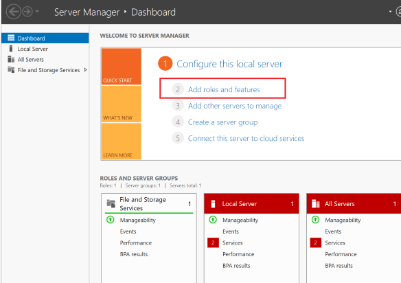
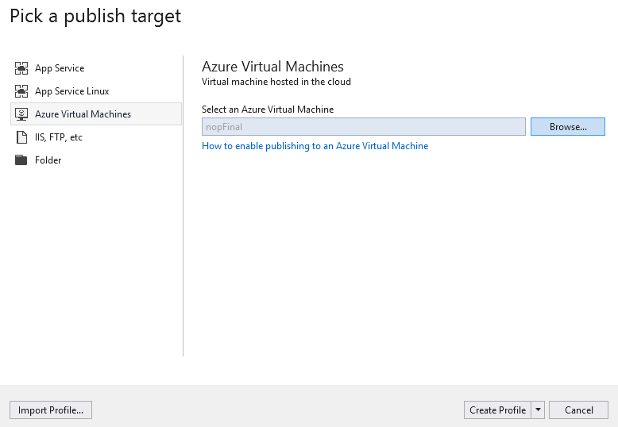

# Cómo implementar nopCommerce en Azure

## Crea una máquina virtual en Azure

Esta instrucción de los pasos necesarios para configurar una máquina virtual de Azure para alojar aplicaciones web nopCommerce y permitir su publicación mediante WebDeploy.

### Crea una nueva VM

1. Inicie sesión en [Azure Portal](https://portal.azure.com/).
1. Haga clic en el botón **Agregar**

     

1. Seleccione *Windows Server 2016 VM* en la categoría *Get Started* o cualquier Windows Server 2016 en la categoría Compute, como **Windows Server 2016 Datacenter**
1. Complete los campos obligatorios para configurar la nueva VM.
     - Usuario Contraseña. Lo necesitará para acceder a la VM. Esta es la cuenta de administrador para conectarse a la máquina virtual mediante RDP.
     - Grupo de recursos. Este es el nombre de la "carpeta virtual" que contiene todos los recursos creados para esta VM. Puede eliminar todos los recursos creados durante este proceso eliminando el grupo de recursos.

### Configurar componentes y funciones en la VM

1. Nombre DNS:
     - Desde el [portal de Azure](https://portal.azure.com/), navegue hasta la página de descripción general de su máquina virtual.
     - Debajo del nombre DNS, haga clic en **Configurar**
     - Proporcione un nombre DNS único a nivel mundial. (Aparece una marca verde cuando se valida el nombre).
     - Haga clic en **Guardar** para guardar la configuración.

### Configurar las reglas de Azure Firewall

1. Configure las reglas de firewall de entrada en Azure Portal. En la sección Redes, agregue la regla de puerto de entrada para crear nuevas entradas de firewall:
    - http-Port 80 (Priority 100)
    - WebDeploy-Port 8172 (Priority 1010)
    - RDP-Port 3389 (Priority 320)

    

2. Configure las reglas de firewall de salida en Azure Portal. En la sección Redes, agregue la regla del puerto de salida para crear nuevas entradas de firewall:
    - RDP - Port 3389 (Priority 100)

### Conéctese a la máquina virtual (RDP) mediante inicio de sesión y contraseña

### Instale IIS (servidor web) y ASP.NET 4.6

1. Abra el **Panel del administrador del servidor** (Administrador del servidor: el panel se abre en el primer inicio)
1. Elija **Agregar roles y funciones**

    

1. Acepte los valores predeterminados y presione **Siguiente** tres veces para avanzar a la sección Funciones del servidor.
1. Seleccione **Servidor web (IIS)**

    

1. Cuando se le solicite, confirme la instalación adicional de *IIS Management Console*.
1. Presione **Siguiente** tres veces para avanzar a la *Función del servidor web (IIS) -> sección Servicios de funciones*
1. Seleccione el servicio **Administración**, que es necesario para habilitar Web Deploy (a través del puerto 8172). Cuando se le solicite, confirme la instalación adicional de ASP.NET 4.6.

    

1. Seleccione **Siguiente** para confirmar la configuración, luego **Instalar** para completar la configuración de IIS.

     

     Una vez que se completa la instalación:
     - IIS está instalado y ejecutándose con una regla de firewall interna creada para el puerto 80.
     - El servicio de administración web se instala con una regla de firewall interna creada para el puerto 8172.
### Configurar la seguridad mejorada de IE (desactivada)

En una nueva máquina virtual de Azure, las reglas de seguridad predeterminadas evitan que los ejecutables se descarguen a través de Internet Explorer. Para descargar el ejecutable de WebDeploy, primero debe deshabilitar la seguridad mejorada de IE.

1. En **Administrador del servidor**, abra la sección **Servidor local** a la izquierda.
1. En el panel principal, junto a "**Configuración de seguridad mejorada de IE:**", seleccione Activado.
1. En el cuadro de diálogo que aparece, seleccione **Desactivado para administradores**, seleccione **Activado para usuarios**, luego seleccione **Aceptar**.

    

### Instalar Web Deploy

1. Inicie Internet Explorer.
1. Acepte la configuración de seguridad predeterminada.
1. [Descargar](https://www.microsoft.com/download/details.aspx?id=43717) *WebDeploy_amd64_en-US.msi*
1. Siga los pasos de instalación para Web Deploy
1. Elija la opción Completo para instalar todos los componentes

### Instalar la última versión [NET Core SDK] (https://www.microsoft.com/net/download/all)

### Instalar paquete [.NET Core Windows Server Hosting](https://www.microsoft.com/net/download/all)

IIS se utiliza para alojar aplicaciones web ASP.NET Core, su función se reducirá a un servidor proxy. El alojamiento de aplicaciones ASP.NET Core en IIS se produce mediante el AspNetCoreModule nativo, que está configurado para redirigir las solicitudes al servidor web Kestrel. Este módulo controla el inicio del proceso externo `dotnet.exe`, dentro del cual se aloja la aplicación, y reenvía todas las solicitudes de IIS a este proceso de host.

Después de instalar este paquete, ejecute el comando **iisreset** en la línea de comandos o reinicie IIS manualmente para que el servidor aplique los cambios.

### Configurar IIS

1. Debe otorgar permiso a la carpeta wwwroot. Con el sitio seleccionado en **Administrador de IIS**, elija **Editar permisos** y asegúrese de que *IUSR*, *IIS_IUSRS* o el usuario configurado para el grupo de aplicaciones sea un usuario autorizado con derechos de lectura y ejecución . Si ninguno de estos usuarios está presente, agregue *IUSR* como un usuario con derechos de *Leer y ejecutar*.

    ! [azure-publish_10] (_static/azure-publish/azure-publish_10.png)

1. Haga clic en **Reiniciar** en el panel derecho para reiniciar IIS.

Ahora todo está listo para publicar el proyecto.

## Publique nopCommerce en una máquina virtual de Azure desde Visual Studio

La publicación de la aplicación nopCommerce no es diferente de la publicación de cualquier otra aplicación ASP.NET Core. Por lo tanto, se describirán los requisitos mínimos para ejecutar la publicación. Se pueden encontrar más detalles [aquí](https://docs.microsoft.com/aspnet/core/tutorials/publish-to-azure-webapp-using-vs?view=aspnetcore-2.1#deploy-the-app-to-azur).

## Publicar proyecto `Nop.Web`

1. Abra su solución de aplicación web en Visual Studio 2017. Haga clic con el botón derecho en el proyecto en el Explorador de soluciones y elija *Publicar*.

    

1. Utilice la flecha a la derecha de la página para desplazarse por las opciones de publicación hasta que encuentre **Microsoft Azure Virtual Machines**. Seleccione la máquina virtual adecuada de la lista de máquinas virtuales existentes.
1. Haga clic en **Crear perfil**.

    

1. Para ver y modificar la configuración del perfil de publicación, seleccione **Configurar**. Utilice el botón **Validar conexión** para confirmar que ha introducido la información correcta.

    

1. Si desea asegurarse de que el servidor web tenga una copia limpia de la aplicación web después de cada carga (y que no queden otros archivos de una implementación anterior), puede marcar **Eliminar archivos adicionales en el destino** casilla de verificación en la pestaña **Configuración**. Advertencia: la publicación con esta configuración elimina todos los archivos que existen en el servidor web (directorio wwwroot). Asegúrese de conocer el estado de la máquina antes de publicar con esta opción habilitada.

    

1. Haga clic en **Guardar**.
1. Haga clic en **Publicar** para comenzar a publicar.

Ahora ha publicado su aplicación web en una máquina virtual de Azure.

## Problemas y soluciones potenciales

Para [más](https://docs.microsoft.com/aspnet/core/host-and-deploy/aspnet-core-module?view=aspnetcore-2.0) comprender con precisión cuál es el problema, debe habilitar el registro: habilitado stdoutLog en web.config:

`` sh
stdoutLogEnabled = "true" stdoutLogFile = ".\logs\stdout"
''

## IIS no puede localizar el web.config

Solución: [support.microsoft.com](http://support.microsoft.com/kb/942055)
