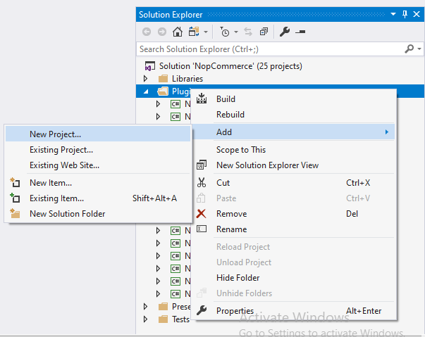
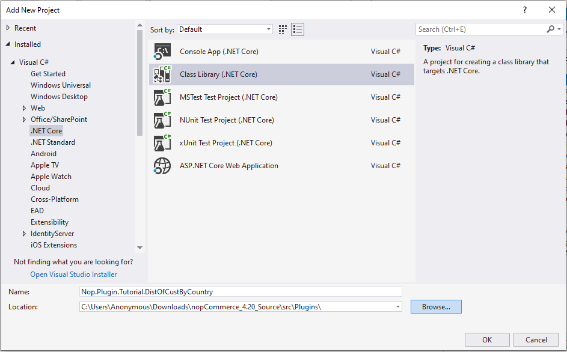
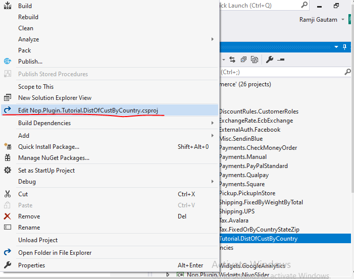

---
title: Description of plugin system
uid: es
developer/tutorials/description-of-plugin-system
author: git.nopsg
contributors: git.nopsg, git.DmitriyKulagin
---

# Descripción del sistema de plugins

Temas que cubriremos en este tutorial

1. Inicialice un nuevo sistema de plugins para nopCommerce.
1. Cómo buscar y utilizar plugins de la tienda nopCommerce.
1. Explique IPlugin, IPluginManager, PluginDescriptor

## Cómo inicializar un nuevo sistema de plugins (Cómo crear un nuevo proyecto de plugins)

nopCommerce utiliza un sistema de plugins para ampliar el  PLUGIN de la tienda nopCommerce. Los plugins son un conjunto de programas o componentes independientes que se pueden agregar a un sistema existente para extender alguel el PLUGIN específica y también se pueden eliminar del sistema sin afectar el sistema principal durante el proceso.

Hay una serie de pasos y procesos que debemos seguir para inicializar un nuevo proyecto de plugin.

nopCommerce usa su estructura de archivos para administrar proyectos en su solución. Por lo tanto, es una buena práctica crear todos los proyectos de plugins dentro del directorio `plugins` en la raíz de la solución. Y la versión compilada del plugin debe almacenarse dentro del directorio `Presentation/Nop.Web/Plugins`. Esta es la ubicación desde donde nopCommerce carga todos sus plugins para mostrarlos en la lista de plugins en el menú Admin /Configuración/LocalPlugins.

Así que vamos a crear un nuevo proyecto de plugin (biblioteca de clases) dentro del directorio raíz `Plugins`. Para crear un proyecto, haga clic con el botón derecho en la carpeta del plugin y en el menú contextual en **Agregar** haga clic en **Nuevo proyecto**.



Esto abrirá una nueva ventana donde podremos elegir qué tipo de proyecto queremos crear. Aquí, debajo de **Visual C#**, haga clic en **.Net Core** ya que nopCommerce 4.2 usa .Net core 2.2 debajo de eso, elija **Class Library**. nopCommerce usa una convención de nomenclatura específica para el plugin, por lo que el nombre recomendado para un proyecto de plugin es **Nop.Plugin. {Grupo}. {Nombre}**.     **{Group}** es su grupo de plugins. Por ejemplo, estamos usando este `Nop.Plugin.Tutorial.DistOfCustByCountry` aquí `Tutorial` es el grupo y `DisOfCustByCountry` es el nombre que describe de qué se trata nuestro plugin. Para tener una mejor idea de cuál debería ser el nombre de su grupo, puede consultar el nombre de los plugins disponibles anteriormente como referencia. Pero tenga en cuenta que no es un requisito. Además, puede elegir cualquier nombre para un plugin. Después de elegir el nombre apropiado para su plugin, cambie la ubicación a la carpeta de su plugin y haga clic en **Aceptar**.



Una vez creado el proyecto del plugin, debemos configurar el proyecto para que podamos usar ese proyecto como plugin. Para hacerlo, abra el archivo **.Csproj** de sus proyectos de plugins recién creados en modo de edición. Para eso, haga clic con el botón derecho en su proyecto de plugin y haga clic en **Editar el nombre de su proyecto de plugin .csproj** menú que se muestra en el menú contextual. Abrirá su **.Csproj** en modo de edición.



Ahora reemplace su contenido con el siguiente código.

```xml
<Proyecto Sdk = "Microsoft.NET.Sdk">
    <PropertyGroup>
        <TargetFramework> netcoreapp2.2</TargetFramework>
        <Copyright>SOME_COPYRIGHT</Copyright>
        <Company>SU_EMPRESA </Company>
        <Autores>ALGUNOS AUTORES </Autores>
        <PackageLicenseUrl>PACKAGE_LICENSE_URL</PackageLicenseUrl>
        <PackageProjectUrl>PACKAGE_PROJECT_URL</PackageProjectUrl>
        <RepositoryUrl> REPOSITORY_URL</RepositoryUrl>
        <RepositoryType> Git </RepositoryType>
        <OutputPath>..\..\Presentation\Nop.Web\Plugins\<PLUGIN_OUTPUT_DIRECTORY></OutputPath>
        <OutDir>$(OutputPath)</OutDir>
        <!--: Establezca este parámetro en verdadero para copiar las dlls de la caché de NuGet a la salida de su proyecto. Debe establecer este parámetro en verdadero si su plugin tiene un paquete nuget para asegurarse de que las dlls se copien del caché NuGet a la salida de su proyecto -->
        <CopyLocalLockFileAssemblies> verdadero </CopyLocalLockFileAssemblies>
    </PropertyGroup>
    <ItemGroup>
        <ProjectReference Incluir = "..\..\Presentation\Nop.Web.Framework\Nop.Web.Framework.csproj" />
    </ItemGroup>
    <!-- Este objetivo se ejecuta después del objetivo "Construir" ->
    <Nombre de destino = "NopTarget" AfterTargets = "Construir">
        <! - Elimina las bibliotecas innecesarias de la ruta de los plugins ->
        <Proyectos de MSBuild = "@ (ClearPluginAssemblies)" Propiedades = "PluginPath = $ (MSBuildProjectDirectory) \ $ (OutDir)" Destinos = "NopClear" />
    </Target>
</Proyecto>
''

> [!NOTE]
> Aquí debe reemplazar `PLUGIN_OUTPUT_DIRECTORY` con el nombre del directorio de su plugin.

Ahora necesitamos crear un archivo **plugin.json** dentro del directorio raíz de nuestro proyecto de plugin. Cada plugin de nopCommerce debe tener este archivo. Este archivo contiene la descripción de la metainformación que utiliza nopCommerce para determinar a qué grupo pertenece este plugin, si el plugin es compatible con la versión actual de nopCommerce o no, cuál es la versión del plugin y varias otras informaciones. Que se describirá a continuación. Pero primero copie el texto a continuación en su archivo **plugin.json**. Esto fue copiado del plugin existente `Nop.Plugin.Payments.PayPalStandard` proporcionado por nopCommerce. Necesitamos modificar esto