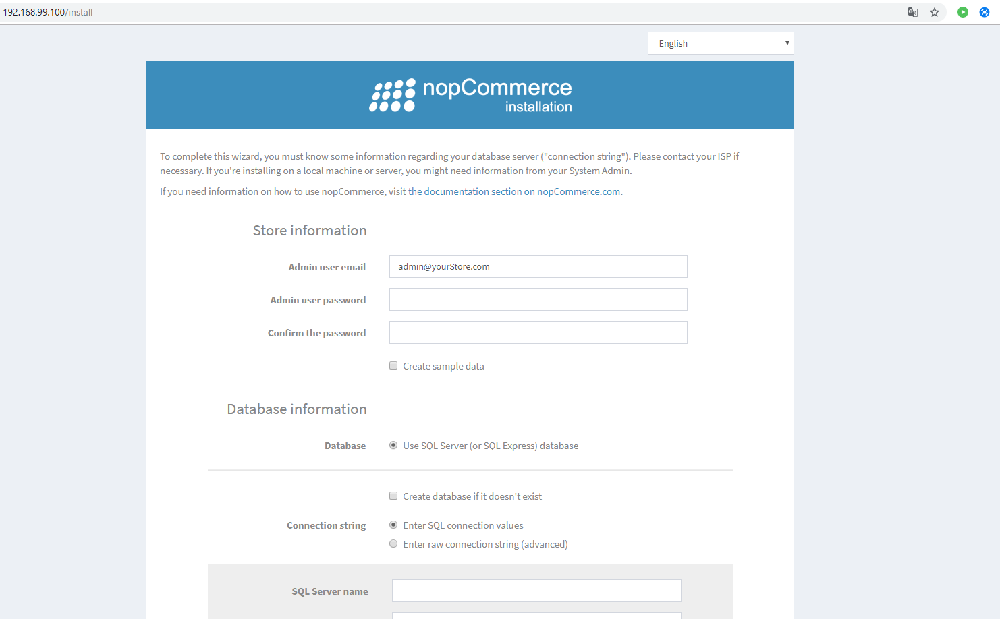

# Estibador

Este documento describe una guía paso a paso para compilar y ejecutar un contenedor Docker.

1. **Preparación para la implementación de Docker virtual** en el entorno de Windows.

    Necesita descargar e instalar la aplicación [Kitematic](https://kitematic.com/). Este programa nos permitirá desplegar una máquina virtual Linux en VirtualBox con Docker instalado y gestionarlo desde nuestro ordenador principal. Después del primer lanzamiento, elegimos que trabajaremos a través de VirtualBox y esperamos hasta que la aplicación se instale e inicie la máquina virtual.

1. **Ejecute el shell de comandos** en Docker a través de la interfaz [Kitematic](https://kitematic.com/). Para hacer esto, simplemente haga clic en el botón discreto en la interfaz.

    ! [docker_1] (_static/docker/docker_1.png)

    Todo el trabajo adicional se llevará a cabo en la ventana familiar de PowerShell.

1. **ecogemos el contenedor Docke**. Para la comodidad de ejecutar comandos, vaya al directorio donde se encuentra Dockerfile (el directorio raíz de los archivos fuente de nopCommerce).

    El comando que necesitamos:

    ```csharp
    [docker build -t nopcommerce .]
    ```

    Este comando crea el contenedor de acuerdo con las instrucciones descritas en el archivo "Dockerfile". El primer lanzamiento del ensamblaje llevará mucho tiempo, ya que requerirá descargar dos imágenes básicas para aplicaciones .Net Core.

     La primera imagen que contiene el SDK es necesaria para el contenedor intermedio, que ensamblará la aplicación reparando todas las dependencias, y luego ejecutará el proceso de publicación de la aplicación `Nop.Web` en un directorio separado, desde el cual creará el resultado contenedor con el nombre *nopcommerce* más adelante (puede crear una imagen sin nombre, pero el nombre es más conveniente. Para especificar el nombre del contenedor durante el ensamblaje, debe especificar la bandera [–t], como se hizo en nuestro caso ).

     Después de la instalación, si todo salió bien, ejecute el siguiente comando:

    ```csharp
    [docker images]
    ```

    Deberíamos ver algo similar a esto:

    

    Esta es una lista de todos los contenedores cargados, entre los cuales podemos ver fácilmente nuestro contenedor, está creado y listo para usar.

1. **Ejecute y pruebe el contenedor.**

     Primero, comencemos el contenedor con el comando:

    ```csharp
    [docker run -d -p 80:80 nopcommerce]
    ```

    Este comando lanzará nuestro contenedor en segundo plano (bandera [-d]) y establecerá el puerto 80 desde el contenedor al puerto 80 de la máquina host (bandera [–p]).

    > [!TIP]
    > 
    > Puede ver la lista de contenedores en ejecución con el siguiente comando:
    > 
    > ```csharp
    > [docker ps]
    > ```

    Dado que estamos iniciando la ventana acoplable a través de una máquina virtual, primero debemos obtener una dirección IP en la que podamos probar el funcionamiento de la aplicación. Para ello ejecutamos el comando, que iniciará el servicio de redirección y nos dará la dirección IP en la que podemos verificar que la aplicación se ha iniciado.

    ```csharp
    [docker-machine ip]
    ```

    Habiendo hecho clic en esta dirección, deberíamos ver la página con la instalación de nopCommerce

    

    Esta será nuestra verificación de que el contenedor se está creando, lanzando y funcionando correctamente.

1. Pero para **probar completamente** el funcionamiento de la aplicación de esta manera solo funcionará si tienes un servidor SQL al que pueda acceder nuestro contenedor. Pero, como regla, nuestros entornos y los de los usuarios son limitados, por lo que hemos preparado un archivo de diseño que le permitirá implementar el contenedor nopCommerce junto con el contenedor que contiene el servidor SQL.

     Para comenzar, detenga todos los contenedores para no interferir. Utilice el comando para esto:

    ```csharp
    [docker stop $ (docker ps -a -q)]
    ```

    Para implementar la composición del contenedor, use el comando:

    ```csharp
    [docker-compose up -d]
    ```

    Este comando utiliza el archivo docker-compose.yml para la implementación, que describe la creación de dos contenedores "nopcommerce_web" y "nopcommerce_database", que proporcionan un paquete de aplicaciones y una base de datos. Ahora obtendremos la dirección IP para las pruebas ejecutando el comando:

    ```csharp
    [docker-machine ip]
    ```

    Y al abrir la página en esta dirección en el navegador, podremos probar todo lo que queramos. Para conectarnos al servidor de la base de datos, usamos los siguientes datos (como se describe en el archivo docker-compose.yml):

    ```csharp
    Server name: nopcommerce_mssql_server
    User: sa
    Password: nopCommerce_db_password
    ```

1. Una vez completada la prueba, puede quitar todos los contenedores para que no interfieran la próxima vez. Dos comandos ayudarán a ejecutarlo:

    ```csharp
    [docker stop $ (docker ps -a -q)]
    ```

    Y

    ```csharp
    [docker system prune -a]
    ```
