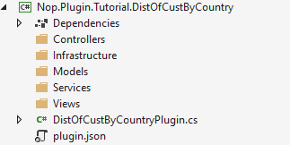
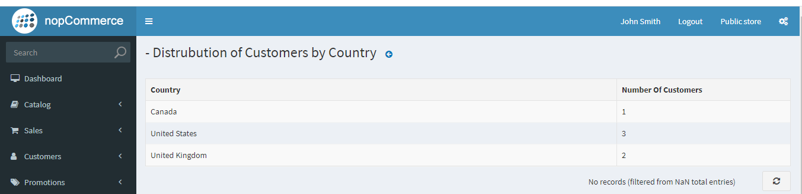

---
title: Guide to creating a page containing a c 
uid: en/developer/tutorials/guide-to-creating-a-page-containing-a-reporting-table-of-datatables
author: nop.sea
contributors: git.RomanovM, git.DmitriyKulagin
---

# Guía para crear una página que contenga una tabla de informes de DataTables

En este tutorial aprenderemos sobre cómo extender la funcionalidad de nopCommerce con funcionalidad personalizada para el panel de administración y crear una página que contenga una tabla con algunos datos como informe. Entonces, antes de comenzar con este tutorial, debe tener algunos conocimientos y comprensión previos sobre algunos de los temas como.

* [arquitectura nopCommerce](xref:en/developer/tutorials/source-code-organization).
* plugin nopCommerce.
* Enrutamiento nopCommerce.

Si no está familiarizado con los temas anteriores, le recomendamos que los conozca primero. Sin embargo, si se siente cómodo o al menos tiene algunos conocimientos básicos sobre el tema anterior, entonces es lo suficientemente bueno para continuar con este tutorial.

Entonces, en este tutorial crearemos un plugin con una página que contiene la tabla que muestra información sobre la distribución de usuarios por país (según la dirección de facturación). Repasemos el proceso paso a paso para crear la funcionalidad mencionada anteriormente.

## Crea un proyecto de plugin nopCommerce

Supongo que ya sabe dónde y cómo crear el proyecto de plugin nopCommerce y configurar el proyecto de acuerdo con el estándar nopCommerce. Si no lo sabe, puede visitar el enlace [esta_página](xref:en/developer/plugins/how-to-write-plugin-4.30) para saber cómo crear y configurar el proyecto de plugin nopCommerce.

Si ha seguido el enlace proporcionado anteriormente para crear y configurar su proyecto de plugin, puede terminar con la estructura de carpetas como esta.



Y también sabe qué tipo de archivos contiene cada una de estas carpetas/directorios. Aquí el archivo "DistOfCustBuCountryPlugin.cs" es el inherente a la clase BasePlugin. Aquí está el código básico que queremos en este archivo por el bien de este tutorial.

```cs
public class DistOfCustByCountryPlugin: BasePlugin
    {
        public DistOfCustByCountryPlugin()
        {

        }

        public override string GetConfigurationPageUrl()
        {
            return $"{_webHelper.GetStoreLocation()}Admin/DistOfCustBuCountryPlugin/Configure";
        }

        public override void Install()
        {
            //Code you want to run while installing the plugin goes here.
            base.Install();
        }

        public override void Uninstall()
        {
            //Code you want to run while Uninstalling the plugin goes here.
            base.Uninstall();
        }
    }
```

Esta clase tiene dos métodos reemplazados Instalar y Desinstalar de la clase BasePlugin. Si queremos hacer algo antes de instalar y desinstalar nuestro plugin pondremos ese código antes de llamar al método de instalación y desinstalación desde la clase base. Por ejemplo, si nuestro plugin puede tener que crear su propia tabla, entonces crearemos esa tabla antes de llamar al método de instalación desde la clase base y, de la misma forma, es posible que también deseemos eliminar nuestra tabla de la base de datos si los usuarios desean desinstalar nuestro plugin. En este caso, es posible que deseemos ejecutar código para eliminar tablas antes de llamar al método de desinstalación desde la clase base.

Primero creemos un modelo llamado "ClientesDistribución" dentro de la carpeta/directorio Modelos.

## #Models/ CustomersDistribution.cs

```cs
public class CustomersDistribution : BaseNopModel
{
    /// <summary>
    /// Country based on the billing address.
    /// </summary>
    public string Country { get; set; }

    /// <summary>
    /// Number of customers from specific country.
    /// </summary>
    public int NoOfCustomers { get; set; }
}
```

Además, agreguemos el modelo de búsqueda llamado "Clientes porPaísModelo de búsqueda" dentro de la carpeta/directorio de Modelos.

```cs
public class CustomersByCountrySearchModel : BaseSearchModel
{
}
```

nopCommerce usa el patrón de repositorio para el acceso a los datos, que es ideal para el mecanismo de inyección de dependencia. Ahora creemos un servicio que obtenga los datos requeridos de la base de datos. Para el servicio, crearemos una interfaz y crearemos una clase de servicio que implemente esa interfaz.

## #Services/ ICustomersByCountry.cs

```cs
public interface ICustomersByCountry
{
    List<CustomersDistribution> GetCustomersDistributionByCountry();
}
```

Aquí solo tenemos una descripción de método ya que por el bien de este plugin no necesitamos ningún otro método.

## #Services/ CustomersByCountry.cs

```cs
public class CustomersByCountry : ICustomersByCountry
{
    private readonly IAddressService _addressService;
    private readonly ICountryService _countryService;
    private readonly ICustomerService _customerService;

    public CustomersByCountry(IAddressService addressService, 
        ICountryService countryService,
        ICustomerService customerService)
    {
        _addressService = addressService;
        _countryService = countryService;
        _customerService = customerService;
    }

    public List<CustomersDistribution> GetCustomersDistributionByCountry()
    {
        return _customerService.GetAllCustomers()
            .Where(c => c.ShippingAddressId != null)
            .Select(c => new
            {
                _countryService.GetCountryByAddress(_addressService.GetAddressById(c.ShippingAddressId ?? 0))
                    .Name,
                c.Username
            })
            .GroupBy(c => c.Username)
            .Select(cbc => new CustomersDistribution { Country = cbc.Key, NoOfCustomers = cbc.Count() }).ToList();
    }
}
```

Aquí estamos creando una clase llamada "Clientes por País" que es inherente a la interfaz "ICustomersByCountry". Además, estamos implementando el método que recupera datos de la base de datos. Usamos este enfoque para poder usar técnicas de inyección de dependencia para inyectar este servicio en el controlador.

Ahora creemos una clase de controlador. Una buena práctica para nombrar controladores de plugins es como {Grupo} {Nombre} Controller.cs. Por ejemplo, TutorialCustomersByCountryController, aquí {Tutorial} {ClientesByCountry} Controlador. Pero recuerde que no es un requisito nombrar el controlador con {Group} {Name}, solo es una forma recomendada por nopCommerce para la convención de nomenclatura, pero la parte del controlador es el requisito de .Net MVC.

## # Controladores/ClientesByCountryController.cs

```cs
[AuthorizeAdmin] //confirms access to the admin panel
    [Area(AreaNames.Admin)] //specifies the area containing a controller or action
    public class DistOfCustBuCountryPluginController : BasePluginController
    {
        private readonly ICustomersByCountry _service;
        public DistOfCustBuCountryPluginController(ICustomersByCountry service)
        {
            _service = service;
        }

        [HttpGet]
        public IActionResult Configure()
        {
            CustomersByCountrySearchModel customerSearchModel = new CustomersByCountrySearchModel
            {
                AvailablePageSizes = "10"
            };
            return View("~/Plugins/Tutorial.DistOfCustByCountry/Views/Configure.cshtml", customerSearchModel);
        }

        [HttpPost]
        public IActionResult GetCustomersCountByCountry()
        {
            try
            {
                return Ok(new DataTablesModel { Data = _service.GetCustomersDistributionByCountry() });
            }
            catch (Exception ex)
            {
                return BadRequest(ex);
            }
        }
    }
```

En el controlador estamos inyectando el servicio "ICustomersByCountry" que creamos previamente para obtener datos de la base de datos. Aquí hemos creado dos Acciones una es de tipo "HttpGet" y otra de tipo "HttpPost". La acción "Configurar" HttpGet está devolviendo una vista llamada "Configure.cshtml" que aún no hemos creado. Y la acción GetCustomersCountByCountry HttpPost que utiliza el servicio inyectado para recuperar datos y devolver datos en formato json. Esta acción será llamada por la tabla de datos que espera una respuesta como objeto DataTablesModel. Sin embargo, aquí estamos configurando la propiedad de datos que en realidad son los datos que se mostrarán en la tabla.

Ahora creemos una vista con DataTables donde podemos mostrar nuestros datos que luego pueden ser vistos por nuestros usuarios. Así como un archivo _ViewImports.cshtml que contiene código para importar todas las referencias requeridas para nuestros archivos de vista.

## # Views/Configure.cshtml

```cs
@using Nop.Web.Framework.Models.DataTables
@{
    Layout = "_ConfigurePlugin";
}

@await Html.PartialAsync("Table", new DataTablesModel
{
    Name = "customersDistributionByCountry-grid",
    UrlRead = new DataUrl("GetCustomersCountByCountry", "TutorialCustomersByCountry"),
    Paging = false,
    ColumnCollection = new List<ColumnProperty>
    {
        new ColumnProperty(nameof(CustomersDistribution.Country))
        {
            Title = "Country",
            Width = "300"
        },
        new ColumnProperty(nameof(CustomersDistribution.NoOfCustomers))
        {
            Title = "Number Of Customers",
            Width = "100"
        }
    }
})
```

## #Views/_ViewImports.cshtml

```cs
@inherits Nop.Web.Framework.Mvc.Razor.NopRazorPage<TModel>
@addTagHelper *, Microsoft.AspNetCore.Mvc.TagHelpers
@addTagHelper *, Nop.Web.Framework

@using Microsoft.AspNetCore.Mvc.ViewFeatures
@using Nop.Web.Framework.UI
@using Nop.Web.Framework.Extensions
@using System.Text.Encodings.Web
@using Nop.Plugin.Tutorial.DistOfCustByCountry.Models
@using Nop.Web.Framework.Models.DataTables;
@using Microsoft.AspNetCore.Routing;
```

* En "Configure.cshtml" estamos usando una vista parcial llamada "Tabla". Esta es la implementación nopCommerce de JQuery DataTables. Podemos encontrar este archivo en `Nop.Web/Areas/Admin/Views/Shared/Table.cshtml`. Allí puede ver el código para la implementación de DataTables. Este modelo de vista toma la clase DataTablesModel para la configuración de DataTables. Expliquemos la propiedad que hemos establecido para la clase DataTablesModel.
* **Nombre:** Esto se establecerá como una identificación para DataTables.
* **UrlRead:** esta es la URL desde donde DataTables va a obtener datos para representar en la tabla. Aquí estamos configurando la URL en "GetCustomersCountByCountry" Acción del controlador "TutorialCustomersByCountry" desde que estamos obteniendo datos para DataTables.
* **Paginación:** Esta propiedad se usa para habilitar o deshabilitar la paginación para DataTables.
* **ColumnCollection:** Esta propiedad contiene la propiedad de configuración de columna.

Hay varias otras propiedades con las que puede jugar para comprender para qué se utilizan.

Casi hemos terminado, pero aún no estamos completos. Si ha recordado, creamos previamente una interfaz de servicio y una clase de servicio heredando esa interfaz y hemos inyectado ese servicio a nuestro controlador. Pero aún no hemos registrado ese servicio en ningún contenedor de IOC. nopCommerce usa AutoFac para la inyección de dependencias. Entonces, creemos una clase para registrar el servicio para la inyección de dependencia.

## # Infraestructura/DependencyRegistrar.cs

```cs
class DependencyRegistrar : IDependencyRegistrar
{
    public int Order => 1;

    public void Register(ContainerBuilder builder, ITypeFinder typeFinder, NopConfig config)
    {
        builder.RegisterType<CustomersByCountry>().As<ICustomersByCountry>().InstancePerLifetimeScope();
    }
}
```

Aquí estamos heredando de la interfaz "IDependencyRegistrar" que es proporcionada por nopCommerce. Aquí tenemos que implementar un método de "registro" y una propiedad entera Order. Dentro del método Register registramos todos nuestros servicios para nuestro plugin como se muestra en el código anterior. Bajo el capó Utiliza AutoFac para registrar nuestros servicios DependencyRegistrar es solo la capa creada por nopCommerce que estamos usando para registrar nuestras dependencias.

Ahora el último paso es registrar nuestra ruta para la Acción "GetCustomersCountByCountry" del Controlador "TutorialCustomersByCountry". No necesitamos registrar la ruta para la acción "Configurar" porque ya la hemos registrado en la clase `DistOfCustByCountryPlugin`.

## # Infraestructura/Proveedor de rutas

```cs
/// <summary>
/// Represents plugin route provider
/// </summary>
public class RouteProvider : IRouteProvider
{
    /// <summary>
    /// Register routes
    /// </summary>
    /// <param name="endpointRouteBuilder">Route builder</param>
    public void RegisterRoutes(IEndpointRouteBuilder endpointRouteBuilder)
    {
        //add route for the access token callback
        endpointRouteBuilder.MapControllerRoute("CustomersDistributionByCountry", "Plugins/Tutorial/CustomerDistByCountry/",
            new { controller = "TutorialCustomersByCountry", action = "GetCustomersCountByCountry" });
    }

    /// <summary>
    /// Gets a priority of route provider
    /// </summary>
    public int Priority => 0;
}
```

Para obtener más información sobre el enrutamiento de nopCommerce, visite [esta página](xref:en/developer/tutorials/register-new-routes)

Ahora solo cree su proyecto y ejecútelo. Inicie sesión como usuario administrativo y vaya al menú LocalPlugins en Configuración, allí verá su plugin recién creado. Instale ese plugin. Una vez completada la instalación, verá un botón de configuración en su plugin. Si ha seguido correctamente este tutorial, verá un resultado como:


