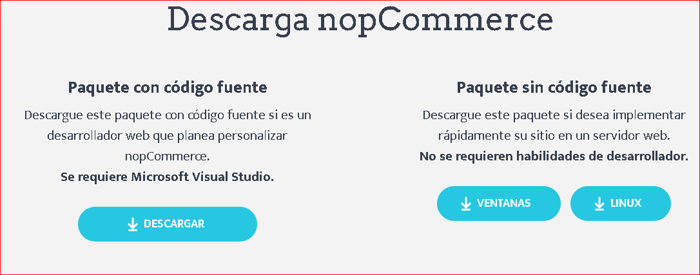
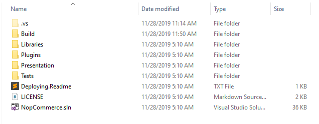
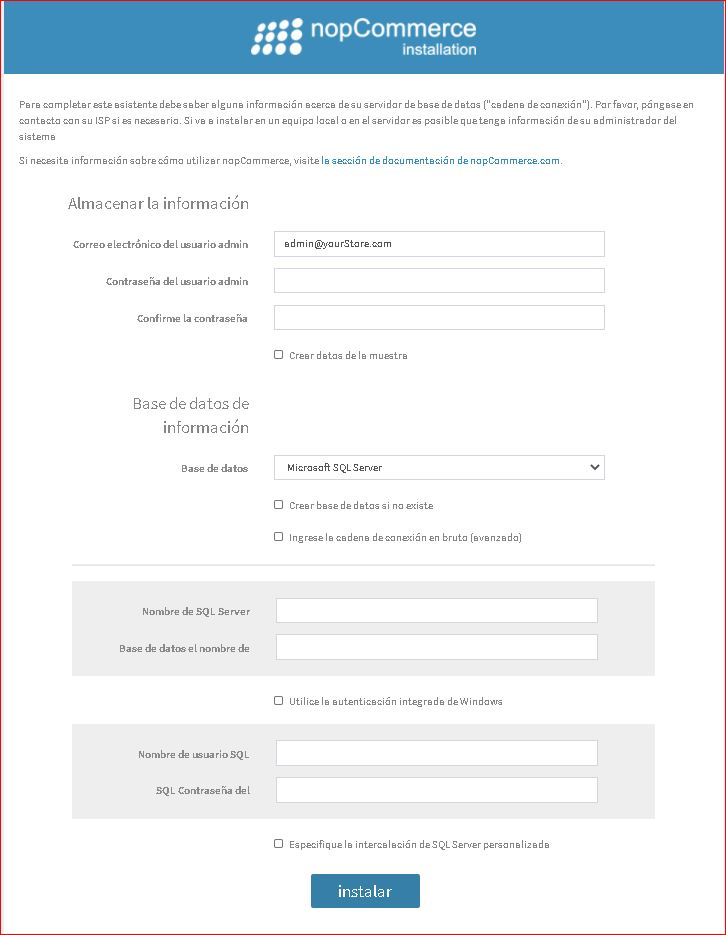
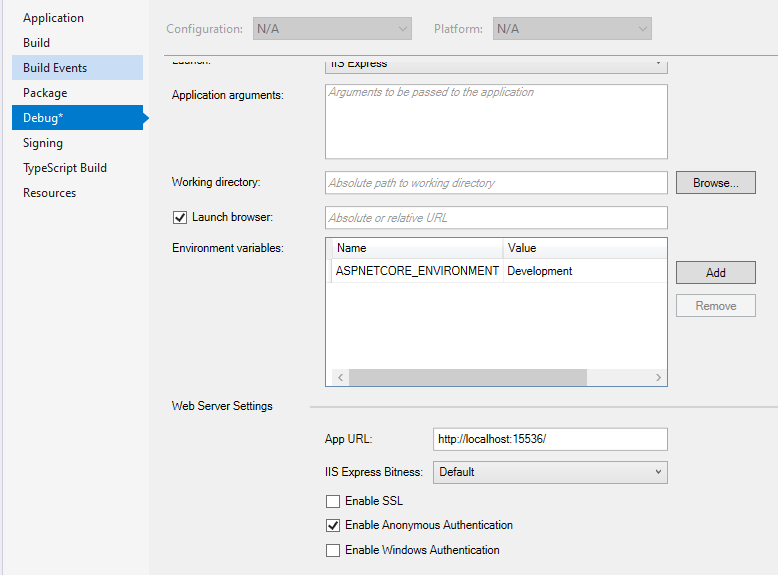

# Instrucciones sobre cómo comenzar a desarrollar en nopCommerce 4.30

## Cosas cubiertas en este tutorial

1. Herramientas necesarias para el desarrollo.
2. Pila de tecnologías utilizadas en nopCommerce.
3. Instrucciones sobre cómo descargar el proyecto y ejecutarlo en la máquina local.
4. Cómo configurar nopCommerce para que se ejecute en HTTPS.

## Resumen

nopCommerce es una solución de comercio electrónico basada en Microsoft ASP.NET de código abierto. Esta es una guía básica para desarrolladores sobre cómo comenzar a desarrollar en nopCommerce.

## 1. Herramientas necesarias para el desarrollo

Puede obtener información sobre la tecnología y los requisitos del sistema en el **"[Herramientas necesarias para el desarrollo](xref:es/developer/tutorials/system-requirements-for-development#2-tools-required-for-development)"** artículo

## 2. Pila de tecnologías utilizadas en nopCommerce

La mejor parte de nopCommerce es que su código fuente es totalmente personalizable y su arquitectura conectable facilita el desarrollo de funciones personalizadas y el seguimiento de los requisitos comerciales mediante el uso del sistema de complementos. Sigue arquitecturas de software conocidas, patrones y las mejores prácticas de seguridad. Y, sobre todo, funciona con las últimas tecnologías para ofrecer la mejor experiencia posible a los usuarios finales. Entonces, para lograr todo esto, nopCommerce usa una pila de tecnologías en su arquitectura.

* Capa de aplicación
  * Motor Razor View

    Es para renderizar la página html en el lado del cliente. El motor Razor View es una sintaxis de marcado que nos ayuda a escribir código HTML y del lado del servidor en páginas web usando C # o VB.NET.
  * JQuery

    Es una biblioteca de JavaScript que se utiliza para ampliar la funcionalidad de UI y UX de las páginas html.
  * Interfaz de usuario de Kendo

    Kendo UI es un marco integral de interfaz de usuario HTML5 para crear sitios web y aplicaciones interactivos y de alto rendimiento

* Capa empresarial
  * Validación fluida

    Es una biblioteca de validación para .NET que utiliza una interfaz fluida y expresiones lambda para crear reglas de validación.
  * AutoMapper

    AutoMapper es una biblioteca simple que nos ayuda a transformar un tipo de objeto en otro. Es un mapeador objeto a objeto basado en convenciones que requiere muy poca configuración.
  * AutoFac

    Autofac es un contenedor de IoC adictivo para .NET. Gestiona las dependencias entre clases para que las aplicaciones sean fáciles de cambiar a medida que crecen en tamaño y complejidad.
  * Linq2DB

    Linq2DB es un marco ORM de código abierto para aplicaciones .NET. Es un proyecto de .NET Foundation. Permite a los desarrolladores trabajar con datos utilizando objetos de clases específicas de dominio sin centrarse en las tablas y columnas de la base de datos subyacente donde se almacenan estos datos. Por lo tanto, es el puente entre la capa empresarial y la capa de datos.
  * FluentMigrator

    Fluent Migrator es un marco de migración para .NET. Las migraciones son una forma estructurada de alterar el esquema de su base de datos y son una alternativa a la creación de muchos scripts SQL que todos los desarrolladores involucrados deben ejecutar manualmente. Las migraciones resuelven el problema de desarrollar un esquema de base de datos para múltiples bases de datos (por ejemplo, la base de datos local del desarrollador, la base de datos de prueba y la base de datos de producción). Los cambios en el esquema de la base de datos se describen en clases escritas en C # que se pueden registrar en un sistema de control de versiones.
* Capa de datos
  * Microsoft SQL Server

    SQL Server es el sistema de administración de bases de datos relacionales (RDBMS) con todas las funciones de Microsoft.
  * Servidor MySQL

    MySQL es la base de datos de código abierto más popular del mundo. Con su rendimiento, confiabilidad y facilidad de uso comprobados, MySQL se ha convertido en la principal opción de base de datos para aplicaciones basadas en web.
  * Redis (caché)

    Redis es un almacén de estructura de datos en memoria de código abierto (licencia BSD) que se utiliza como base de datos, caché y agente de mensajes. Entonces, en nopCommerce Redis se usa para almacenar datos antiguos como un conjunto de datos de caché en memoria. Lo que aumenta la velocidad y el rendimiento de la aplicación.
  * Microsoft Azure (opcional)

    Azure es una plataforma de computación en la nube pública con soluciones que incluyen infraestructura como servicio (IaaS), plataforma como servicio (PaaS) y software como servicio (SaaS) que se puede utilizar para servicios como análisis, computación virtual, almacenamiento, redes. , y mucho más.

## 3. Cómo descargar el proyecto y ejecutarlo en la máquina local

Antes de comenzar a trabajar con nopCommerce, debemos asegurarnos de que nuestra máquina local esté configurada y debemos asegurarnos de que todas nuestras herramientas necesarias para desarrollar en nopCommerce estén instaladas y funcionando correctamente. Ahora, vayamos a las instrucciones paso a paso sobre cómo descargar y ejecutar nopCommerce en nuestra máquina local.

### Paso 1: Descarga el código fuente de nopCommerce

Para descargar, visite [este sitio](https://www.nopcommerce.com/download-nopcommerce). Allí puede ver dos botones de descarga, uno con un código fuente y otro sin código fuente, como se muestra en la siguiente imagen.

Ya que estamos descargando nopCommerce para propósitos de desarrollo, necesitamos descargar el que dice "Paquete con código fuente" que contiene todo el código fuente de nopCommerce. Para descargar nopCommerce, debe iniciar sesión o registrar una nueva cuenta. Ahora puede descargar nopCommerce como un archivo RAR y extraerlo a la ubicación de la carpeta que desee.

### Paso 2: Abra la solución nopCommerce en Visual Studio

Abra la carpeta, dentro de esa carpeta verá un montón de archivos y carpetas que contienen todo el código fuente de nopCommerce.

Allí también verá un archivo de solución con la extensión `.sln`, haga doble clic en ese archivo de solución para abrir el proyecto nopCommerce en su Visual Studio.

### Paso 3: Ejecución del proyecto nopCommerce con Visual Studio

nopCommerce no requiere que usted tenga ninguna configuración adicional sólo para ejecutar el proyecto. nopCommerce está listo para salir de la caja. Por lo tanto, ahora puede ejecutar el proyecto con Visual Studio pulsando ctrl+F5 o solo F5 para ejecutar el proyecto en modo de depuración, o puede ejecutar con el botón físico con el icono de reproducción en Visual Studio. Después de ejecutar el proyecto por primera vez, verá una página de instalación como la siguiente:

Aquí necesita llenar toda la información necesaria para completar su instalación.

### Información de la tienda

Aquí se requiere que proporcione una dirección de correo electrónico y una contraseña que luego se utilizarán como su cuenta de administrador en su tienda de nopCommerce.

### Información de la base de datos

Aquí debe proporcionar la información que desea utilizar para este proyecto.

Aquí tiene dos elegir el almacenamiento de la base de datos. Puede utilizar MS SQL Server o servidor MySQL. Es tu decisión la que quieres usar.

Por el bien de este tutorial vamos a utilizar MS SQL Server.

También verá la casilla de verificación preguntando si desea crear una base de datos si no existe, marque la casilla de verificación.

Avanzando más, debe configurar la cadena de conexión. Para eso, tienes dos opciones. Uno es rellenar el formulario con "Nombre de SQL Server" y "Nombre de base de datos". En el nombre de SQL ServerSQL Server debe proporcionar el nombre del servidor SQL y, en el nombre de la base de datos, debe proporcionar un nombre de base de datos que desee crear o, si ya tiene uno, no creará sino que usará el existente. Sin embargo, también puede elegir la opción "Enter raw connection string" y luego debe escribir toda la cadena de conexión por sí mismo. Después de eso, debe proporcionar las credenciales de su servidor SQL para la autenticación.

Después de llenar toda esta información que necesita para presionar "instalar" botón, tomará alrededor de 1 minuto para completar la instalación, entonces usted será redirigido a la página de inicio de la tienda en línea.

### 4. Cómo configurar nopCommerce para que se ejecute en HTTPS

Para establecer SSL/HTTPS para tu nopCommerce necesitas ir a la ventana de propiedades del proyecto 'Nop.Web'  en Carpeta de presentación ya que es el proyecto de inicio para nopCommerce. Para abrir la ventana de propiedades haga clic derecho en el proyecto 'Nop.Web'  y en la parte inferior del menú contextual verá un menú llamado "Propiedades", simplemente haga clic en ese menú y aparecerá una ventana de propiedades. En la ventana de propiedades vaya a la pestaña "Depurar".

Marque el "Habilitar SSL", e ingrese el URL HTTPS además de él. A continuación, guarde este proyecto.

Ahora ejecute el proyecto de nuevo y navegue a la dirección URL dada y puede ver que ahora se está ejecutando en SSL/HTTPS. Así que esta es la única manera de configurar HTTPS en su WebProject, pero también hay otra manera de configurar SSL. Para ello, vaya a su proyecto 'Nop.Web'  y expanda el proyecto dentro de allí verá un archivo virtual llamado "Propiedades" en la estructura de su proyecto justo debajo de "Dependencias". Dentro de Properties encontrará un archivo JSON llamado launchSetting.json. Abra ese archivo y verá un montón de configuración ya escrita en ese archivo.

Dentro de ese archivo puede tener una sección como se muestra en la figura anterior. Por lo tanto, para habilitar SSL solo necesita reemplazar 0 en la propiedad "sslPort" en el puerto que desea ejecutar para la conexión SSL, asegúrese de que el puerto está disponible. Para probar, ejecute el proyecto y vaya a 'https://localhost:yourport'.

