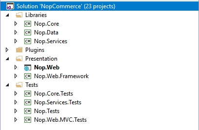

# Organización del código fuente. Arquitectura de nopCommerce

Este documento es una guía para desarrolladores sobre la estructura de la solución de nopCommerce. Es un documento para que un nuevo desarrollador de nopCommerce comience a aprender sobre el código base de nopCommerce. En primer lugar, el código fuente de nopCommerce es bastante fácil de obtener. Es una aplicación de código abierto, por lo que todo lo que tiene que hacer para obtener el código es simplemente descargarlo del sitio web. Los proyectos y carpetas se enumeran en el orden en que aparecen en Visual Studio. Le recomendamos que abra la solución nopCommerce en Visual Studio y explore los proyectos y archivos mientras lee este documento.

La mayoría de los proyectos, directorios y archivos se nombran para que pueda tener una idea aproximada de su propósito. Por ejemplo, ni siquiera tengo que mirar dentro del proyecto llamado Nop.Plugin.Payments.PayPalStandard para adivinar qué hace.

## `\Bibliotecas\Nop.Core`

El proyecto Nop.Core contiene un conjunto de clases principales para nopCommerce, como almacenamiento en caché, eventos, ayudantes y objetos comerciales (por ejemplo, entidades de pedidos y clientes).

## `\Bibliotecas\Nop.Data`

El proyecto Nop.Data contiene un conjunto de clases y funciones para leer y escribir en una base de datos u otro almacén de datos. Ayuda a separar la lógica de acceso a datos de sus objetos comerciales. nopCommerce utiliza el enfoque Code-First de Entity Framework (EF). Le permite definir entidades en el código fuente (todas las entidades centrales se definen en el proyecto Nop.Core) y luego hacer que EF genere la base de datos a partir de eso. Por eso se llama Code-First. Luego puede consultar sus objetos usando LINQ, que se traduce a SQL detrás de escena y se ejecuta en la base de datos. nopCommerces usa [Fluent API](https://www.entityframeworktutorial.net/efcore/fluent-api-in-entity-framework-core.aspx) para personalizar completamente el mapeo de persistencia.

## `\Bibliotecas\Nop.Servicios`

Este proyecto contiene un conjunto de servicios básicos, lógica empresarial, validaciones o cálculos relacionados con los datos, si es necesario. Algunas personas lo llaman Business Access Layer (BAL).

## Proyectos en la carpeta de soluciones`\ Plugins\`

`\ Plugins` es una carpeta de soluciones de Visual Studio que contiene proyectos de complementos. Físicamente está ubicado en la raíz de su solución. Pero las DLL de complementos se copian automáticamente en el directorio `\Presentation\Nop.Web\Plugins` que se utiliza para los complementos ya implementados porque las rutas de salida de compilación de todos los complementos están configuradas en 
`..\.. \Presentation\Nop.Web\Plugins\{Grupo}.{Nombre}`. Esto permite que los complementos contengan algunos archivos externos, como contenido estático (archivos CSS o JS) sin tener que copiar archivos entre proyectos para poder ejecutar el proyecto.

## `\Presentación\Nop.Web`

`Nop.Web` es un proyecto de aplicación web MVC, una capa de presentación para tienda pública que también contiene un panel de administración incluido como área. Si no ha utilizado `ASP.NET` antes, busque más información [aquí](http://www.asp.net/). Esta es la aplicación que realmente ejecuta. Es el proyecto de inicio de la aplicación.

## `\Presentation\Nop.Web.Framework`

Nop.Web.Framework es un proyecto de biblioteca de clases que contiene algunas cosas de presentación comunes para el proyecto `Nop.Web`.

## `\Test\Nop.Core.Tests`

Nop.Core.Tests es el proyecto de prueba para el proyecto Nop.Core.

## `\Test\Nop.Services.Tests`

Nop.Services.Tests es el proyecto de prueba para el proyecto Nop.Services.

## `\Test\Nop.Tests`

Nop.Tests es un proyecto de biblioteca de clases que contiene algunas clases de prueba comunes y ayudantes para otros proyectos de prueba. No tiene ninguna prueba.

## `\Test\Nop.Web.MVC.Tests`

Nop.Web.MVC.Tests es el proyecto de prueba para los proyectos de la capa de presentación.

## Tutorials

- [La arquitectura detrás de la plataforma de comercio electrónico nopCommerce](https://www.youtube.com/watch?v=6gLbizzSA9o&list=PLnL_aDfmRHwtJmzeA7SxrpH3-XDY2ue0a)
