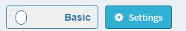
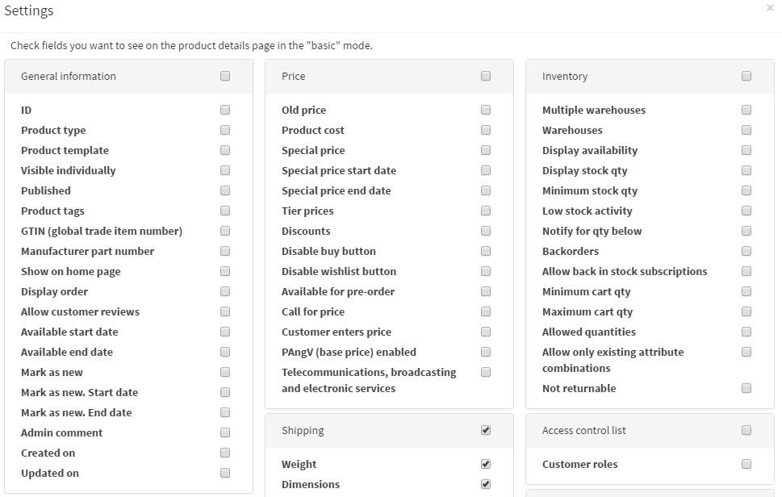

# interfaz nopCommerce

Este capítulo cubre los conceptos básicos de la interfaz nopCommerce.

Una vez que haya iniciado sesión, debería ver el hipervínculo **Administración** en la parte superior de su sitio web. O simplemente puede agregar `/admin` al final de la URL de su sitio para abrir el área de administración. Por ejemplo: `www.example.com/admin`.

La primera pantalla que se muestra después de iniciar sesión en el área de administración de nopCommerce es el *Panel de control*:

El tablero tiene las siguientes secciones:

* **nopCommerce news** es una sección donde se muestra información importante sobre noticias, ventas y promociones de nopCommerce.

* **Estadísticas comunes** de su tienda web que incluyen el número de pedidos, solicitudes de devolución pendientes, clientes registrados y productos con poco stock.

* Otras secciones que muestran las estadísticas vitales de su tienda web: **pedidos, nuevos clientes, totales de pedidos, pedidos incompletos, últimos pedidos, palabras clave de búsqueda populares, más vendidos por cantidad, más vendidos por cantidad**:

Obtenga más información sobre estos informes [aquí](xref:es/running-your-store /reports).

Las secciones del tablero se contraen fácilmente haciendo clic en el icono! [Elemento](_static/admin-area-overview/item.png).

## Elementos comunes de la página nopCommerce

### Barra lateral

La barra lateral se coloca a la izquierda de cada página en el área de administración. Le permite navegar a través de la funcionalidad del administrador de nopCommerce.

¡La barra lateral se puede contraer fácilmente haciendo clic en el icono de "hamburguesa" junto al logotipo 

### Campo de búsqueda

En la parte superior de la barra lateral, hay un campo de búsqueda. Comience a escribir el nombre de una sección a la que desea navegar, la línea de búsqueda sugiere automáticamente las opciones, proceda directamente a la requerida.

### Menu del sistema

Esta parte de la interfaz muestra el nombre de un usuario que inició sesión, el botón de cierre de sesión, el enlace de la tienda pública y un pequeño menú desde el cual un usuario puede seleccionar borrar la caché o reiniciar la aplicación.

## Modos básicos y avanzados

En algunas páginas del área de administración, verá el siguiente interruptor:

Este interruptor de dos posiciones *Básico-Avanzado* le permite cambiar entre los modos de visualización de página.

Para mayor comodidad de uso, hicimos el modo **Básico** donde se muestran las configuraciones más frecuentes.

Si no puede encontrar una configuración requerida en una página, cambie al modo **Avanzado** para ver todas las configuraciones disponibles.

En algunas páginas, el interruptor tiene un botón **Configuración** al lado. Puede usarlo para configurar el modo básico de acuerdo con sus necesidades agregando/quitando la configuración requerida.

Haga clic en **Configuración** para ver una lista de las configuraciones disponibles. Marque las casillas de verificación de la **configuración deseada**. Las configuraciones agregadas se mostrarán en el modo **Básico**.

