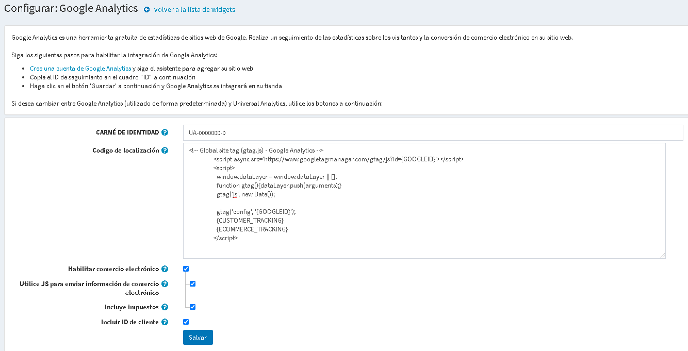

# Complemento de Google Analytics

Esta sección describe cómo agregar e integrar el complemento **Google Analytics** en su tienda.

Para configurar el plugin de Google Analytics:

Vaya a **Configuración → Widgets**. Se muestra la ventana *Widgets*:

## Activar el complemento

Haga clic en **Editar** junto a **Google Analytics**. La ventana se expande de la siguiente manera:

Seleccione la casilla de verificación **Está activo** para habilitar el complemento de análisis de Google. Luego haga clic en el botón **Actualizar** para guardar los cambios.

## Configurar el complemento

Haga clic en **Configurar** junto a **Google Analytics**. Se muestra la ventana *Configurar - Google Analytics*, de la siguiente manera:

Realice los siguientes pasos para habilitar la integración de Google Analytics:

* Cree una **cuenta de Google Analytics** en el siguiente enlace [http://www.google.com/analytics/](http://www.google.com/analytics/) y siga el asistente para agregar su sitio web
* Copie el **ID de Google Analytics** en el cuadro **ID** del formulario.
* Ingrese el **Código de seguimiento** generado por Google Analytics. {GOOGLEID} y {CUSTOMER_TRACKING} se reemplazarán dinámicamente.
* Marque la casilla de verificación **Habilitar comercio electrónico** para pasar información sobre pedidos a la función de comercio electrónico de Google. Si se marca, se mostrarán los siguientes campos:
* Marque **Usar JS para enviar información de comercio electrónico** para usar el código JS para enviar información de comercio electrónico desde la página de pedido completado. Pero en el caso de los métodos de pago de redireccionamiento, algunos clientes pueden omitirlo. De lo contrario, la información de comercio electrónico se enviará mediante una solicitud HTTP. La información se envía cada vez que se paga un pedido, pero UTM no es compatible con este modo.
* Marque **Incluir impuestos** para incluir impuestos al generar el código de seguimiento para la parte de comercio electrónico.
* Marque la casilla de verificación **Incluir ID de cliente** para incluir el identificador de cliente en el script.

Clic en **Guardar**. Google Analytics se integrará en su tienda.