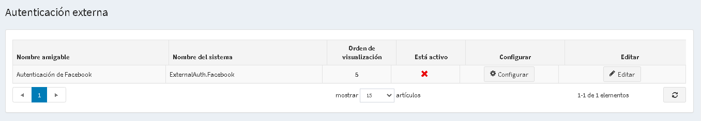
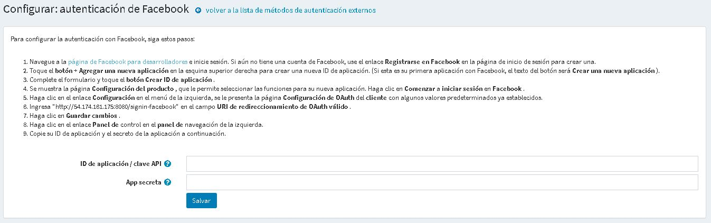

# Métodos de autenticación externos

Los métodos de autenticación externos permiten a los usuarios iniciar sesión en un sitio nopCommerce sin ingresar sus credenciales: correo electrónico y contraseña. Los usuarios pueden autenticarse mediante un sitio externo (como Facebook, Google, etc.). nopCommerce tiene una autenticación externa incorporada a través de Facebook. Puede configurar otros métodos utilizando complementos del [mercado] (https://www.nopcommerce.com/marketplace).

Una vez que se configura un método de autenticación externo y se marca como activo, los usuarios verán una nueva opción de autenticación en la página de inicio de sesión.

## Gestionar los métodos de autenticación externos

Vaya a **Configuración → Autenticación externa**. Se muestra la ventana *Autenticación externa*:

Haga clic en **Editar** junto a un método de autenticación y marque **Está activo** para activar el método. También puede definir el método **Orden de visualización**. Luego haga clic en el botón **Actualizar** para guardar los cambios.

Haga clic en **Configurar** para la configuración del método.

## Administra la autenticación de Facebook

El método de autenticación de Facebook es un complemento de autenticación externo integrado. Para configurar la autenticación con Facebook, siga estos pasos:

1. En la página **Configuración → Autenticación externa**, haga clic en **Configurar** junto a **Autenticación de Facebook**. Se muestra la ventana *Configurar - Autenticación de Facebook*:

1. Vaya a la página [Facebook para desarrolladores](https://developers.facebook.com/apps) e inicie sesión. Si aún no tiene una cuenta de Facebook, utilice el enlace Registrarse en Facebook en la página de inicio de sesión. para crear uno.
1. Toque el botón **+ Agregar una nueva aplicación** en la esquina superior derecha para crear una nueva ID de aplicación. (Si esta es su primera aplicación con Facebook, el texto del botón será **Crear una nueva aplicación**).
1. Complete el formulario y toque el **botón Crear ID de aplicación**.
1. Se muestra la página *Configuración del producto*, que le permite seleccionar las funciones para su nueva aplicación. Haga clic en **Comenzar** en *Facebook Login*.
1. Haga clic en el enlace **Configuración** en el menú de la izquierda. Se le presentará la página *Configuración de OAuth del cliente* con algunos valores predeterminados ya establecidos.
1. Ingrese `https://yoursitename.com/signin-facebook` en el campo **URI de redireccionamiento de OAuth válido** reemplazando `yoursitename.com` con la URL de su sitio.
1. Haga clic en **Guardar cambios**.
1. Haga clic en el enlace **Panel de control** en el panel de navegación de la izquierda.
1. Copie su **App ID / API Key** y **App secret** en el formulario de la página de configuración del complemento.

Haga clic en el botón **Guardar**. En la página de inicio de sesión de la tienda pública, vea el método de autenticación recién agregado.

## Ver también

* [Complementos en nopCommerce](xref:en/Getting-started/advanced-configuration/plugins-in-nopcommerce)