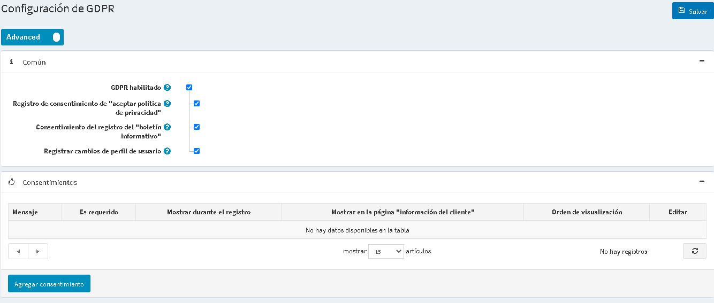
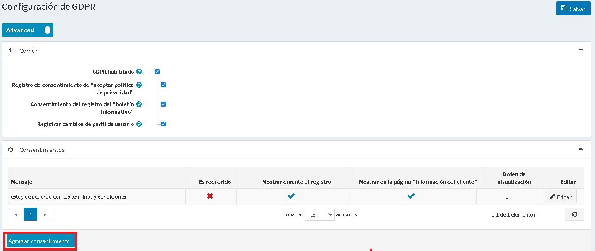
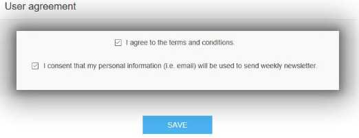

# Configuración de GDPR

* GDPR *(Reglamento general de protección de datos)* es una nueva ley de privacidad de datos revisada de la Unión Europea que afecta la forma en que todas las empresas recopilan, usan y comparten los datos personales de sus clientes europeos. El reglamento entró en vigor el 24 de mayo de 2016 y se aplica desde el 25 de mayo de 2018. El reglamento es un paso esencial para fortalecer los derechos fundamentales de las personas en la era digital y facilitar los negocios al aclarar las reglas para las empresas y organismos públicos en el mercado único digital. .

Para obtener más información (consulte esta fuente):

[https://ec.europa.eu/info/law/law-topic/data-protection/data-protection-eu_en]
(https://ec.europa.eu/info/law/law-topic/data-protección/protección-de-datos-eu_es)

## Configurar GDPR

Para habilitar la configuración de GDPR en su tienda nopCommerce, vaya a **Administración → Configuración → Configuración → Configuración de GDPR**.

Luego marque la casilla de verificación **RGPD habilitado**. Las configuraciones adicionales le permitirán capturar un registro de las siguientes actividades:

* **Registre el consentimiento de "aceptar política de privacidad"**.
* **Registrar consentimiento de "newsletter"**.
* **Registrar cambios de perfil de usuario**.

Puede agregar consentimientos en su sitio nopCommerce haciendo clic en el botón **Agregar consentimiento** en el panel *Consentimientos*:

Para agregar un nuevo consentimiento, será redirigido a la ventana *Agregar consentimiento*:

Defina las siguientes configuraciones de consentimiento:

* **Mensaje** o pregunta que se mostrará a los clientes.
* Si se requiere el **consentimiento**. 
* Si el consentimiento se **mostrará durante el registro**.
* Si el consentimiento se mostrará **en la página "información del cliente"** en la sección "Mi cuenta".
* **Orden de visualización** es el orden de visualización de consentimiento. 1 representa el primer elemento de la lista.

A continuación, se muestra un ejemplo de una opción de consentimiento en la página de información del cliente:

Si ha habilitado la configuración del registro de consentimiento, puede ver la actividad del registro yendo a: **Administración → Clientes → Solicitudes de GDPR (registro)**.

Cuando la configuración de GDPR está habilitada, el propietario de la tienda también puede realizar acciones como:

* **Eliminación permanente** para la eliminación del registro del cliente.
* **Exportar datos** para exportar datos de clientes.

Para hacer esto, vaya a la página **Administración → Clientes → Editar cliente**.

## Tutoriales

* [Gestión de la configuración de GDPR en nopCommerce](https://www.youtube.com/watch?v=6bLc_TDqD18&feature=youtu.be)
