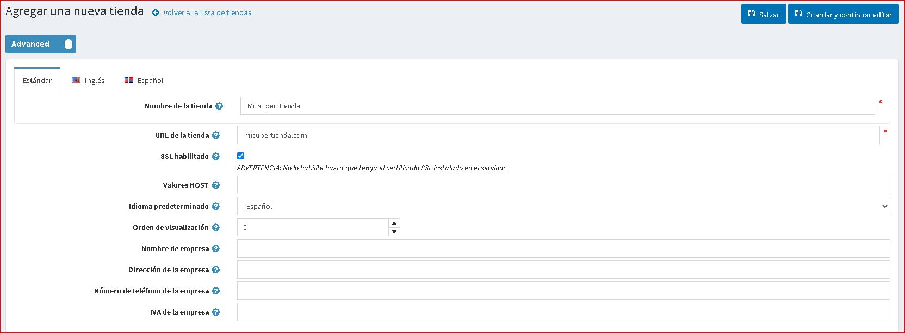

# Varias tiendas

nopCommerce le permite ejecutar más de una tienda usando una interfaz desde una única instalación de nopCommerce.

Esto le permite alojar más de una tienda front-end en diferentes dominios y gestionar todas las operaciones de administración desde su único panel de administración. Puede compartir los datos del catálogo entre tiendas, tener un producto en más de una tienda, por ejemplo, y sus clientes pueden iniciar sesión en todas sus tiendas con las mismas credenciales.

## Configuración de varias tiendas

### 1. Parte del panel de control de hosting

En el siguiente ejemplo, describiremos la configuración de dos tiendas de muestra, de la siguiente manera:

* `www.store1.com`
* `www.store2.com`

1. Cargue e instale el sitio en `www.store1.com`. Este es el único lugar donde se almacenan los archivos nopCommerce y las DLL.
      > [!NOTE]
      >
      > Lea más sobre cómo instalar nopCommerce en el siguiente capítulo:
      [Instalación de nopCommerce](xref:es/installation-and-upgrade/installation-nopcommerce/index).

1. Desde el panel de control de `www.store2.com` (es decir, el panel de control de su alojamiento, no el área de administración de nopCommerce) asegúrese de que todas las solicitudes a `www.store2.com` se reenvíen (no se redirijan) a `www.store1 .com`. Realice esto usando registros CNAME. Este paso es crucial.

1. Desde el panel de control de `www.store1.com`, configure un alias de dominio para `www.store2.com`. Este paso puede resultar complicado para algunos usuarios (solicite al administrador del sistema que realice este paso si tiene problemas).

    Después de completar los pasos anteriores, al acceder a `www.store2.com` desde su navegador, se mostrará el contenido de `www.store1.com`. El siguiente paso es configurar las tiendas en el área de administración de nopCommerce que se describirá a continuación. A continuación, puede comenzar a cargar contenido para ambas tiendas.

1. Opcional (muestra): este paso se puede realizar desde el panel de control de Plesk a continuación, de la siguiente manera:
  
      Cuando `www.store2.com` se redirige a `www.store1.com`, el servidor web de Plesk no sabe cómo mostrar `www.store2.com` ya que utiliza un alojamiento virtual basado en nombres. Por lo tanto, debe crear un alias de dominio para `www.store2.com`, como se describe a continuación:

      * Inicie sesión en el panel de dominio de `www.store1.com`, ya sea directamente o mediante el enlace **Abrir en el panel de control** del panel de administración del servidor.

      * En la pestaña **Sitios web y dominios**, seleccione el enlace **Agregar nuevo alias de dominio** cerca de la parte inferior de la pestaña.

      * Ingrese el alias completo. Por ejemplo, `store2.com`.

      * Asegúrese de que la opción **Servicio web** esté seleccionada.

      * El servicio **Correo** es opcional. Marque esta opción si desea que los correos electrónicos de `www.store2.com` sean redirigidos de manera similar.

      * Asegúrese de que la opción **Sincronizar zona DNS con el dominio principal** no esté marcada.

### 2. parte del área de administración de nopCommerce

Una vez realizada la instalación y configuración técnica, puede administrar sus tiendas desde el área de administración de nopCommerce. Vaya a **Configuración → Tiendas**. Se muestra la ventana *Tiendas*:

> [!NOTE]
>
> Por defecto, solo se crea una tienda.

Para configurar varias tiendas, haga clic en **Agregar nuevo** y defina la siguiente configuración de la tienda:

* Defina el **Nombre de la tienda**.
* Ingrese la **URL de la tienda** de su tienda.
* Seleccione la casilla de verificación **SSL habilitado** si su tienda está protegida por SSL. SSL (Secure Sockets Layer) es la tecnología de seguridad estándar para establecer un enlace cifrado entre un servidor web y un navegador. Este enlace garantiza que todos los datos que se transmiten entre el servidor web y los navegadores permanezcan privados e integrales. SSL es un estándar de la industria y lo utilizan millones de sitios web para proteger sus transacciones en línea con sus clientes.

  > [!IMPORTANT]
  >
  > Marque esta opción solo después de haber instalado el certificado SSL en su servidor. De lo contrario, no podrá acceder a su sitio y     tendrá que editar manualmente el registro apropiado en su base de datos (tabla [Tienda]).

  > [!TIP]
  >
  > Lea más sobre la configuración de SSL en el siguiente capítulo: [Cómo instalar y configurar la certificación SSL](xref:es/Getting-started/advanced-configuration/how-to-install-and-configure-ssl-certificate).

* El campo **Valores HOST** es una lista de posibles valores HTTP_HOST de su tienda (por ejemplo, `store1.com`, `www.store1.com`). El llenado de este campo solo es necesario cuando tiene una solución de varias tiendas para determinar la tienda actual. Este campo permite distinguir solicitudes a distintas URL y determina la tienda actual. También puede ver el valor HTTP_POST actual en **Sistema → Información del sistema**.
* En el campo **Idioma predeterminado**, elija un idioma predeterminado de su tienda. También puede dejarlo sin seleccionar. En este caso, se utilizará el primero encontrado (con el orden de visualización más bajo).
* Defina el **orden de exhibición** para esta tienda. 1 representa la parte superior de la lista.
* Defina el **Nombre de la empresa**.
* Defina la **Dirección de la empresa**.
* Configure su **número de teléfono de la empresa**.
* En el campo **IVA de la empresa**, ingrese el IVA de su com