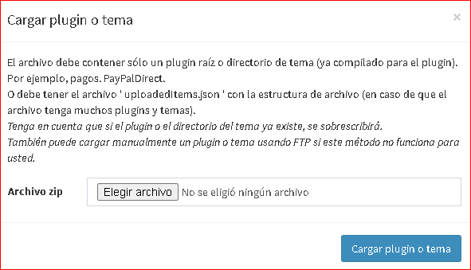
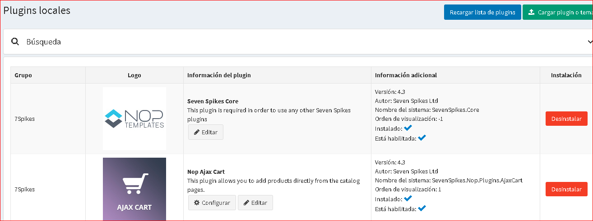
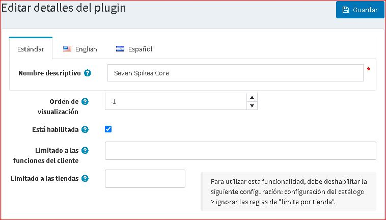

# plugins en nopCommerce

Los plugins son un conjunto de componentes que agregan capacidades específicas a una tienda nopCommerce. Los ejemplos de plugin incluyen módulos de pago, métodos de cálculo de tarifas de envío y más. Esta sección describe cómo instalar plugins manualmente.

nopCommerce tiene una variedad de plugins, expandiendo las funciones de su tienda, en su [mercado]http://www.nopcommerce.com/marketplace). Los plugins se pueden instalar descargándolos desde el mercado o accediendo a la tienda directamente desde el panel de administración.

Los plugins en el mercado se pueden ordenar por categoría, versión, nombre o calificación, y son gratuitos o de pago.

Los plugins disponibles en el mercado son desarrollados por el equipo de nopCommerce, socios de soluciones o proveedores externos.

> [!NOTE]
>
> Los plugin etiquetados como "Por el equipo de nopCommerce" son desarrollados por el equipo de nopCommerce y se distribuyen libremente. Los conectores de servicios de terceros se desarrollan en el curso del *programa de asociación tecnológica*, están sujetos a nopCommerce [servicios de soporte premium](http://www.nopcommerce.com/nopcommerce-premium-support-services) y también distribuido libremente.

## Para instalar un plugin

1. El usuario tiene dos opciones para cargar el plugin. Puede usar el que le parezca más conveniente:
    * Cargue el plugin  en la carpeta `/ plugins` en su directorio nopCommerce. Y reinicie su aplicación **(o haga clic en el botón Recargar lista de plugin).**
    * Cargue el plugin o tema usando el botón **Cargar plugin o tema** que indica la ruta a la ubicación del archivo con el plugin en su almacenamiento local.

    > [!TIP]
    >
    > Puede descargar más plugin de nopCommerce en nuestro [directorio de extensiones](https://www.nopcommerce.com/marketplace).

    

1. Desplácese hacia abajo por la lista de plugin para encontrar el plugin recién instalado.
1. Haga clic en el enlace **Instalar** para instalar el plugin.
1. Haga clic en el botón **Reiniciar la aplicación para aplicar los cambios** en el panel superior para finalizar el proceso de instalación.
1. El plugin se muestra en la lista de plugins (**Configuración → lcal plgn**).

    > [!NOTE]
    >
    > Si está ejecutando nopCommerce con una confianza media, se recomienda borrar su directorio `\ Plugins \ bin \`.

## Para configurar un plugin
1. Vaya a **Configuración →local plugin**. Se muestra la lista de pluging:
    
1. Haga clic en el enlace **Configurar** junto al plugin para ir a la página de configuración del plugin. Si el botón **Configurar** no existe junto a un plugin, esto indica que el plugin no requiere ninguna configuración.

## Para cambiar el nombre descriptivo del plugin, el orden de visualización y las limitaciones

1. Vaya a **Configuración → local plugin**. Se muestra la lista de pluging:
    
1. Haga clic en el botón **Editar** junto al plugin. Edite los detalles del plugin, de la siguiente manera:
    
1. Ingrese el **Nombre descriptivo**.
1. En el campo **Mostrar orden**, defina la ubicación requerida para mostrar este plugin. 1 representa la parte superior de la lista.
1. Marque el campo **Está habilitado** si desea habilitar el plugin en la tienda.
1. De la lista desplegable **Limitado a roles de cliente**, elija los roles en los que desea poder utilizar este plugin.
1. En el campo **Limitado a tiendas**, defina las tiendas en las que se utilizará el plugin.
1. Haga clic en **Guardar** en la parte superior de la página.

## Para desinstalar un plugin

1. Vaya a **Configuración → local plugin**. Se muestra la lista de pluging:

1. Haga clic en el enlace **Desinstalar** junto al plugin para desinstalar. El plugin está desinstalado. El enlace de la **columna Instalación** cambia a **Instalar**, lo que le permite reinstalar el plugin en cualquier momento.
1. Haga clic en el botón **Reiniciar la aplicación para aplicar los cambios** en el panel superior para finalizar el proceso de desinstalación.

## Tutoriales

- [Instalación de un plugin(para las versiones 3.90 - 4.10)](https://youtu.be/eLDsSm-4gKA)
- [Gestión del acceso a pluging por función de cliente](https://www.youtube.com/watch?v=52lVVpQ3Qag)
