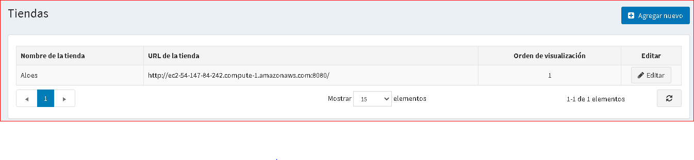
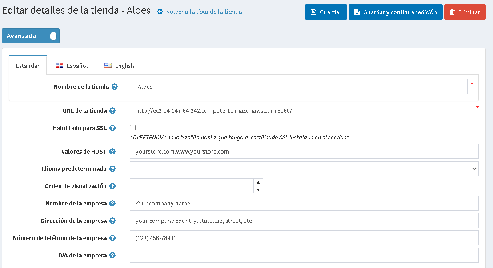

# Información de su tienda

De forma predeterminada, la instalación de nopCommerce, solo se crea una tienda y debe configurarse, como se describe a continuación.
Para configurar la tienda predeterminada, vaya a **Configuración → Tiendas**.

Haga clic en **Editar** junto a una tienda predeterminada para configurarla.

Configure los detalles de su tienda principal, de la siguiente manera:

* Defina el **Nombre de la tienda**.
* Ingrese la **URL de la tienda** de su tienda.
* Seleccione la casilla de verificación **SSL habilitado** si su tienda está protegida por SSL. SSL (Secure Sockets Layer) es la tecnología de seguridad estándar para establecer un enlace cifrado entre un servidor web y un navegador. Este enlace garantiza que todos los datos que se transmiten entre el servidor web y los navegadores permanezcan privados e integrales. SSL es un estándar de la industria y lo utilizan millones de sitios web para proteger sus transacciones en línea con sus clientes.

  > [!IMPORTANT]
  >
  > Marque esta opción solo después de haber instalado el certificado SSL en su servidor. De lo contrario, no podrá acceder a su sitio y tendrá que editar manualmente el registro apropiado en su base de datos (tabla [Tienda]).

  > [!TIP]
  >
  > Lea más sobre la configuración de SSL en el siguiente capítulo: [Cómo instalar y configurar la certificación SSL](xref:es/Getting-started/advanced-configuration/how-to-install-and-configure-ssl-certificate).

* El campo **HOST values​​** es una lista de posibles valores HTTP_HOST de su tienda (por ejemplo, `yourstore.com`, `www.yourstore.com`). Completar este campo solo es necesario cuando tiene una [solución de múltiples tiendas](xref:es/Getting-started/advanced-configuration/multi-store) para determinar la tienda actual. Este campo permite distinguir solicitudes a distintas URL y determina la tienda actual. También puede ver el valor HTTP_POST actual en **Sistema → Información del sistema**.
* En el campo **Idioma predeterminado**, elija un idioma predeterminado de su tienda. También puede dejarlo sin seleccionar. En este caso, se utilizará el primero encontrado (con el orden de visualización más bajo).
* Defina el **orden de exhibición** para esta tienda. 1 representa la parte superior de la lista.
* Defina el **Nombre de la empresa**.
* Defina la **Dirección de la empresa**.
* Configure su **número de teléfono de la empresa**.
* En el campo **IVA de la empresa**, introduzca el IVA de su empresa (utilizado en la UE).

## Ver también

* [Configuración de varias tiendas](xref:es/Getting-started/advanced-configuration/multi-store)
* [Países](xref:es/Getting-started/configure-shipping/advanced-configuration/countries-states)
* [Idiomas](xref:es/Getting-started/advanced-configuration/localization)
* [Configuración de seguridad](xref:es/Getting-started/advanced-configuration/security-settings)
* [Configuración de PDF](xref:es/Getting-started/advanced-configuration/pdf-settings)
* [Configuración de GDPR](xref:es/Getting-started/advanced-configuration/gdpr-settings)