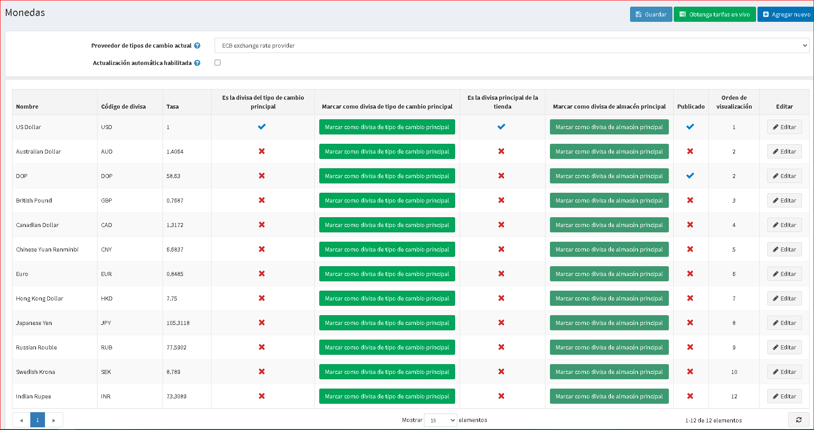
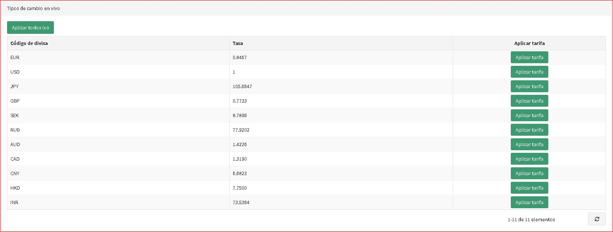

# Monedas

En nopCommerce, se utiliza **la única moneda principal de la tienda**. La moneda principal de la tienda es la moneda con la que se configurarán todas las demás monedas permitidas. Aunque nopCommerce permite tener múltiples monedas para mostrar los precios de sus productos, la moneda principal se usa para transacciones de pago con pasarelas de pago en línea.

Si está utilizando una pasarela de pago en línea (como PayPal), la cantidad se envía a la pasarela de pago y será el precio que ingresó en la moneda principal de la tienda.

La moneda principal de la tienda solo la utilizan los administradores de la tienda. Se utiliza para establecer los precios de los productos y no tiene por qué coincidir con las monedas publicadas.

Si solo tiene una moneda publicada, la tienda no mostrará un selector de moneda ni ningún símbolo de moneda con precios. Si se publica más de una moneda, todos los precios se marcan con la moneda seleccionada actualmente. nopCommerce recomienda eliminar cualquier moneda que no sea necesaria.

nopCommerce utiliza un **tipo de cambio** para calcular los importes de las monedas publicadas. El tipo de cambio se ingresa cuando se agrega o se edita una moneda. Alternativamente, puede utilizar un servicio de tasa de **cambio en tiempo real** para calcular la cantidad, y el precio del producto se multiplica por la tasa de cambio proporcionada.

Los tipos de cambio fluctúan a diario. Por lo tanto, puede editar el tipo de cambio con la frecuencia que necesite para mantenerse actualizado. Las transacciones reales solo se manejan en la moneda principal de su tienda. En las transacciones con tarjeta de crédito, los bancos suelen realizar cambios automáticamente en función de los valores de moneda más actuales.

Para definir la configuración de moneda, vaya a **Configuración → Monedas**.

En la lista desplegable **Proveedor de tasa de cambio actual**, seleccione el proveedor de tasa de cambio que se utilizará para obtener las tasas en vivo.

> [!NOTE]
>
> De forma predeterminada, en nopCommerce solo hay un proveedor de tipos de cambio disponible: ECB. Para obtener las tasas en vivo del BCE, debe seleccionar EUR como moneda de tipo de cambio principal.

 Marque la casilla de verificación **Actualización automática habilitada** para permitir recibir una actualización automática de los tipos de cambio cada hora.

 Clic en **Guardar**.

> [!NOTE]
>
> De forma predeterminada, todos los tipos de cambio se actualizan una vez por hora. Puede cambiar la configuración de actualización de los tipos de cambio en **Sistema → Programar tareas**, elija **Actualizar tipos de cambio**.

## Agregar una nueva moneda

Haga clic en el botón **Agregar nuevo**.

Defina la configuración de moneda:

* Moneda **Nombre**.
* **Código de moneda**. Para obtener una lista de códigos de moneda, vaya a: https://en.wikipedia.org/wiki/ISO_4217
* Ingrese la **Tasa** de cambio contra la tasa de cambio principal de la moneda.
* En la lista desplegable **Mostrar configuración regional**, seleccione la configuración regional de visualización para los valores de moneda.
* Introduzca **Formato personalizado** que se aplicará a los valores de la moneda. En este campo, puede especificar cualquier símbolo para la moneda que se muestra en la tienda pública, el número de decimales, etc.
* En **Limitado a tiendas**, seleccione una tienda creada previamente de la lista desplegable. Deje el campo vacío en caso de que esta funcionalidad no sea necesaria.
  > [!NOTE]
  >
> Para utilizar esta funcionalidad, debe desactivar la siguiente configuración: **Configuración del catálogo → Ignorar las reglas de "límite por tienda" (en todo el sitio)**. Lea más sobre la funcionalidad de múltiples tiendas [aquí](xref:en/Getting-started/advanced-configuration/multi-store).

* De la lista desplegable **Tipo de redondeo**, elija uno de los tipos de redondeo:
  * *Redondeo predeterminado*
  * *Redondeo al alza con intervalos de 0.05 (0.06 redondeo a 0.10)*
  * *Redondeo hacia abajo con intervalos de 0.05 (0.06 redondeo a 0.05)*
  * *Redondeo al alza con intervalos de 0.10 (1.05 redondeo a 1.10)*
  * *Redondeo hacia abajo con intervalos de 0.10 (1.05 redondeo a 1.00)*
  * *Redondeo con intervalos de 0,50*
  * *Redondeo con intervalos de 1,00 (1,01-1,49 redondeado a 1,00, 1,50-1,99 redondeado a 2,00)*
  * *Redondeo al alza con intervalos de 1,00 (1,01–1,99 redondeado a 2,00)*

* Seleccione la casilla de verificación **Publicado**, para permitir que esta moneda sea visible y seleccionada por los visitantes en su tienda. nopCommerce admite una visualización de precios en varias monedas. Si tiene varias monedas publicadas, los clientes podrán seleccionar la moneda que deseen.
* En el campo **Mostrar orden**, ingrese el orden de visualización de esta moneda. Un valor de 1 representa la parte superior de la lista.

Clic en Guardar**.

## Obtén tarifas en vivo

Haga clic en el botón **Obtener tasas en vivo** en la parte superior derecha de la ventana *Monedas*. El panel se expande en la parte inferior de la página de la siguiente manera:

Haga clic en **Aplicar todo** aquí o aplique manualmente nuevas tasas para todas las monedas necesarias utilizando el botón **Aplicar tasa**.

## Tutoriales

* [Gestión de divisas en nopCommerce](https://www.youtube.com/watch?v=2nzVxGyc5-M)
