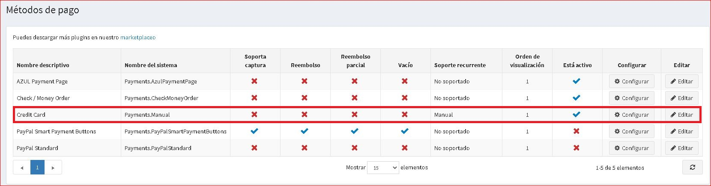
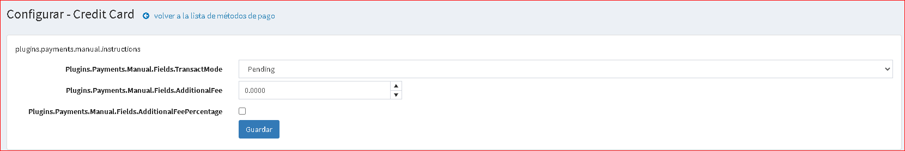
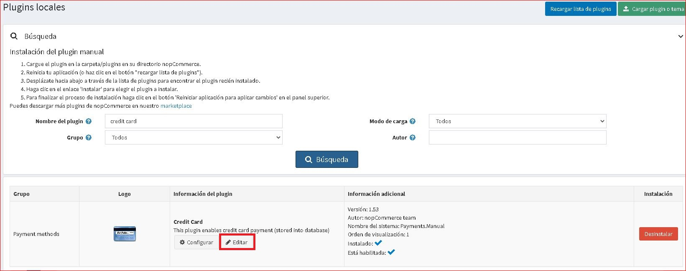
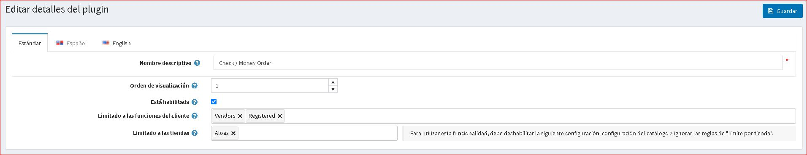

# Tarjeta de crédito (procesamiento manual)

Esta es una puerta de enlace especial que permite que todos los pedidos se ingresen con éxito en el sitio, pero NO cobra al cliente ni realiza ninguna llamada a ninguna puerta de enlace en vivo. Se recomienda utilizar este método de pago si desea realizar una de las siguientes acciones:

* Procesar todos los pedidos sin conexión
* Procesarlos manualmente a través de otro sistema de back-office
* Pruebe el sitio de un extremo a otro antes de publicarlo

Para configurar este método de pago vaya a **Configuración → Métodos de pago**. Luego busque el método de pago **Tarjeta de crédito (Payments.Manual)** en la lista de métodos de pago:

## Activa el método, edita su nombre y muestra el orden

Puede editar el nombre del método de pago que se mostrará a los clientes en la tienda pública o su orden de exhibición. Para hacer esto, haga clic en el botón **Editar** en la fila del complemento en la página de lista de métodos de pago. Podrá ingresar **Nombre descriptivo** y **Orden de visualización**. En esta fila también puede activar el complemento o desactivarlo mediante el campo **Está activo**. Haga clic en el botón **Actualizar**. Se guardarán sus cambios.

## Configurar el método de pago

En **Configuración → Métodos de pago** busque el método de pago **Tarjeta de crédito (Pagos.Manual)** y haga clic en el botón **Configurar**. Aparecerá la ventana *Configurar - Tarjeta de crédito*, de la siguiente manera:

Configure el método de pago de la siguiente manera:

* En el campo **Después de finalizar la compra, marque el pago como** especifique el modo de transacción.
* Defina la **tarifa adicional** por usar este método.
* En la **Tarifa adicional. Usar porcentaje** campo define si se aplica una tarifa adicional porcentual al total del pedido. Si no está habilitado, se usa un valor fijo.

Clic en Guardar**.

## Límite a tiendas y roles de clientes

Puede limitar cualquier método de pago a la tienda y al rol del cliente. Esto significa que el método estará disponible solo para determinadas tiendas o roles de clientes. Puede hacerlo desde la página *lista de complementos*.

1. Vaya a **Configuración → Complementos locales**. Busque el complemento que desea limitar. En nuestro caso es **Tarjeta de crédito**. Para encontrarlo más rápido, use el panel *Buscar* en la parte superior de la página y busque por **Nombre del complemento** o por **Grupo** usando la opción *Métodos de pago*.

1. Haga clic en el botón **Editar** y se mostrará la ventana *Editar detalles del complemento*, de la siguiente manera:

2. Puede configurar los siguientes límites:

* En el campo **Limitado a roles de cliente**, elija uno o varios roles de cliente, es decir, administradores, proveedores, invitados, que podrán utilizar este complemento. Si no necesita esta opción, deje este campo vacío.

> [!Importante]
> Para utilizar esta funcionalidad, debe deshabilitar la siguiente configuración: **Configuración del catálogo → Ignorar las reglas de ACL (en todo el sitio)**. Lea más sobre la lista de control de acceso [aquí](xref:en/running-your-store/customer-management/access-control-list).

* Utilice la opción **Limitado a tiendas** para limitar este complemento a una determinada tienda. Si tiene varias tiendas, elija una o varias de la lista. Si no usa esta opción, deje este campo vacío.

> [!Important]
> Para utilizar esta funcionalidad, debe desactivar la siguiente configuración: **Configuración del catálogo → Ignorar las reglas de "límite por tienda" (en todo el sitio)**. Lea más sobre la funcionalidad de múltiples tiendas [aquí](xref:en/Getting-started/advanced-configuration/multi-store).

Clic en **Guardar**.

## Tutoriales

* [Configuración del método de pago con tarjeta de crédito (procesamiento manual)](https://www.youtube.com/watch?v=dN2q27dKvUU)
