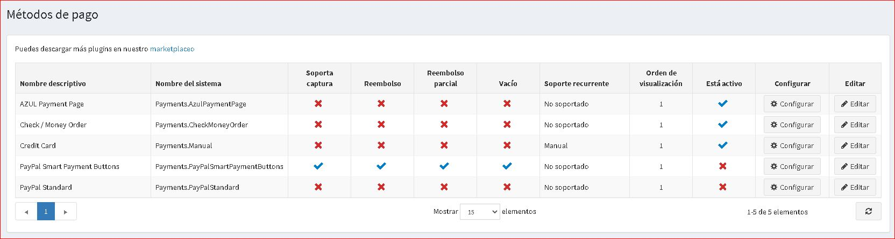

# Métodos de pago

Un método de pago es la forma en que un cliente paga el pedido. nopCommerce admite transacciones *online* y *offline*. Para los métodos en línea, nopCommerce se integra con pasarelas de pago de terceros, por lo que la información de la tarjeta de crédito del cliente se enviará automáticamente a través de la pasarela (ya sea como una autorización o una autorización y cargo) al completar un pedido. Puede tener varios métodos de pago activos a la vez. El cliente puede seleccionar cómo quiere pagar en la caja.

Para definir los métodos de pago, vaya a **Configuración → Métodos de pago**.

> [!TIP]
>
> De forma predeterminada, hay varios métodos de pago disponibles en nopCommerce, pero puede encontrar más complementos de pago en nopCommerce [marketplace](https://www.nopcommerce.com/marketplace).

Para obtener detalles sobre el desarrollo del método de pago, consulte el [documento](xref:es/developer/plugins/payment-method).

Para activar un método de pago, haga clic en **Editar** junto al método requerido, marque la casilla de verificación **Está activo** y haga clic en **Actualizar**. La opción **Está activa** cambia de *falso* a *verdadero*.

 Los diferentes métodos de pago admiten diferentes opciones. Hay ** 4 opciones de pago ** que pueden ser compatibles con un método de pago o no:

* **Admite captura** indica si este método permite procesar la transferencia de dinero después de que se cargó el monto.
* **Reembolso** indica que este método permite realizar un reembolso de dinero después de que se haya cobrado y capturado el monto.
* **Reembolso parcial** indica si este método permite realizar un reembolso parcial del dinero después de que se haya cobrado y capturado el monto.
* **Anulado** indica si este método permite realizar un reembolso de dinero antes de que se cargue el monto (cuando el estado de pago está pendiente).
* **Soporte recurrente** indica si este método permite pagos recurrentes.

Haga clic en **Configurar** junto a un método de pago para configurarlo.

## Ver también

* [Cheque/giropostal](xref:es/Getting-started/configure-payments/payment-methods/cheque-money-order)
* [Tarjeta de crédito(procesamiento manual)](xref:es/Getting-started/configure-payments/payment-methods/credit-card-manual-processing)
* [Estándar de PayPal](xref:es/Getting-started/configure-payments/payment-methods/paypal-standard)
* [Botones de pago inteligente de PayPal](xref:es/Getting-started/configure-payments/payment-methods/paypal-smart-payment-buttons)