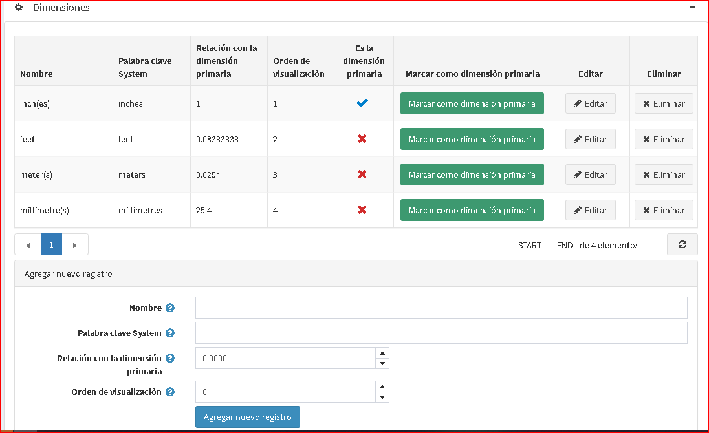
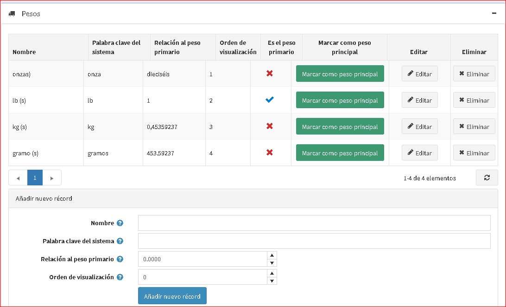

# Medidas

Esta sección describe cómo agregar nuevas unidades de pesos y dimensiones.

Para agregar nuevas dimensiones o pesos:

Vaya a **Configuración → Envío → Medidas**. Las secciones *Dimensiones* y *Peso* se expanden de la siguiente manera:

En la parte inferior de la sección, defina los siguientes detalles de la nueva unidad:
* **Nombre** de la nueva unidad de dimensión (peso).
* **Palabra clave del sistema** para esta unidad.
* **Unidad de relación a la dimensión primaria (peso)**.
* **Orden de visualización** de la medida en la lista. Un valor de 1 representa la parte superior de la lista.

Luego haga clic en **Agregar nuevo registro**.

La nueva unidad de dimensión (peso) se agrega a la tabla *Dimensiones* (*Pesos*).

> [!NOTE]
>
> Puede establecer la dimensión primaria (peso) haciendo clic en **Marcar como dimensión primaria (peso)**.

Haga clic en **Editar** junto a la medida para editar sus detalles, como se describe arriba.