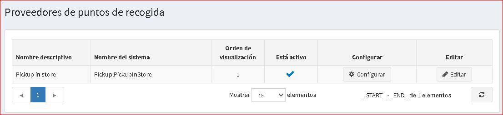
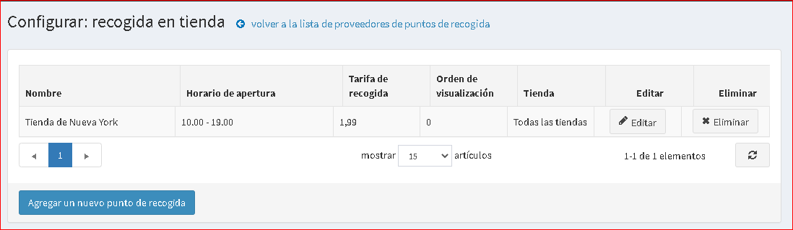
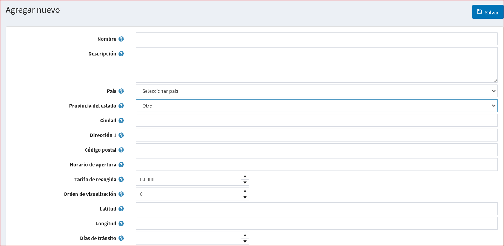

# Puntos de recogida

El punto de recogida es una opción que ofrece a los clientes la flexibilidad de seleccionar un punto donde puedan recibir paquetes.

> [!NOTE]
>
> Esta opción está disponible solo cuando la casilla de verificación **"Recoger en tienda" habilitada** está marcada en la página de configuración de envío (**Configuración → Configuración → Configuración de envío**).

Para administrar proveedores de puntos de recogida:

Vaya a **Configuración → Envío → Puntos de recogida**, se muestra la página *Proveedores de puntos de recogida*:

De forma predeterminada, solo está disponible una opción **Recoger en tienda**. Asegúrese de que el proveedor del punto de recogida esté activo. De lo contrario, haga clic en el botón **Editar** y marque la casilla de verificación en la columna ** Está activo **. Luego, guarde los cambios haciendo clic en el botón **Actualizar**.

Para editar puntos de recogida existentes o agregar nuevos, haga clic en **Configurar** en la cuadrícula. Se abrirá la página *Configurar - Recogida en tienda*:

Haga clic en **Agregar un nuevo punto de recogida**, se muestra la ventana *Agregar nuevo*:

Defina los siguientes detalles:

* **Nombre** del punto de recogida.
* **Descripción** si es necesario.
* Seleccione un **País** de la lista desplegable.
* Seleccione un **Estado/provincia** de la lista desplegable.
* **Ciudad**.
* **Dirección 1**.
* **Código postal**.
* Punto de recogida **Horario de apertura**.
* **Tarifa de recogida** necesaria.
* **Mostrar orden** de este punto de recogida.
* **Tienda (s)** usando este punto de recogida.

**Guardar cambios**.

Haga clic en **Editar** junto al punto de recogida para editar los detalles ingresados ​​anteriormente.