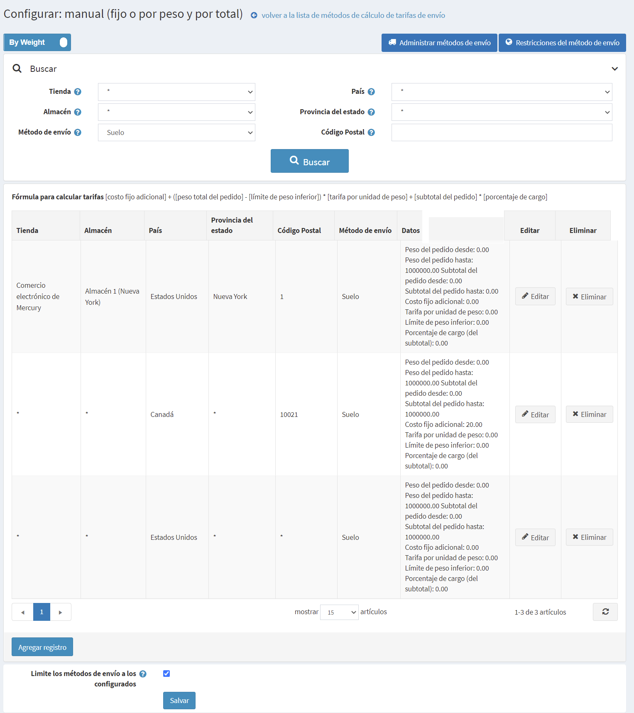
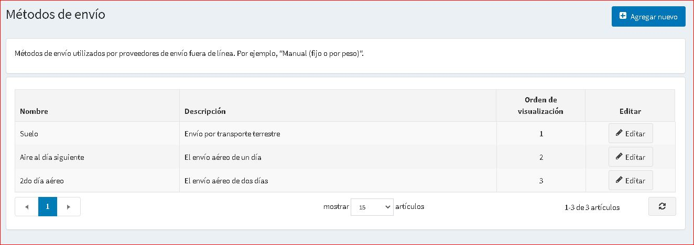
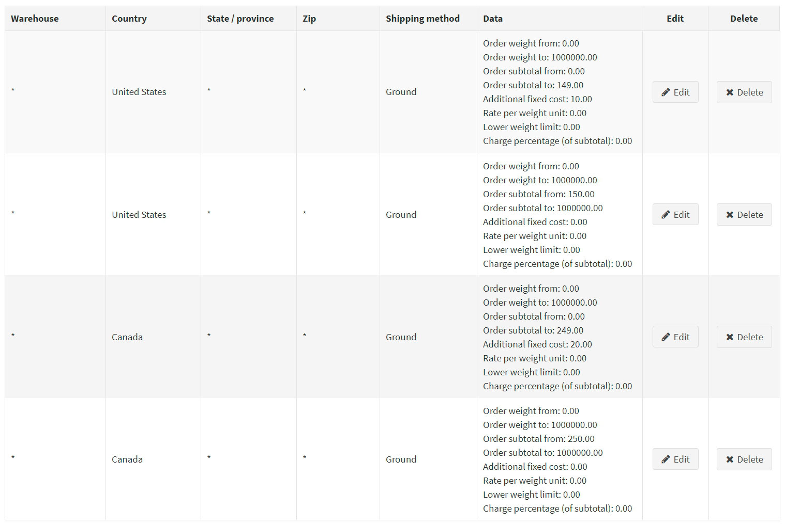
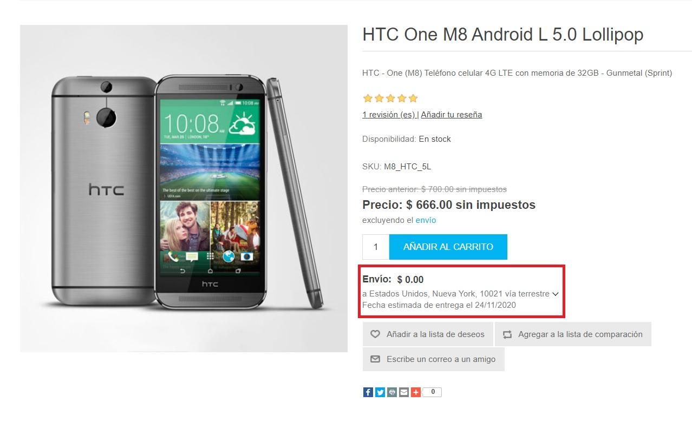

---
title: Manual (fixed or by weight and by total)
uid: en/getting-started/configure-shipping/shipping-providers/manual
author: git.AndreiMaz
contributors: git.rajupaladiya, git.DmitriyKulagin, git.exileDev, git.mariannk
---

# Proveedor manual (fijo o por peso y por total)

El envío manual (fijo o por peso y total) permite establecer tarifas fijas o calcular tarifas por peso y por total para todos los métodos de envío predefinidos.

Para ver el ejemplo de cómo se puede aplicar este método a su tienda, consulte la sección [Ejemplo] (# ejemplo) a continuación.

## Definir el proveedor de envío manual

Vaya a **Configuración → Envío → Proveedores de envío**. Se muestra la ventana de proveedores de envío:

Habilite el método de cálculo manual de tarifas de envío, de la siguiente manera:

* En la fila **Manual (fijo o por peso y por total)**, haga clic en el botón **Editar**.
* En la columna **Está activo**, marque la casilla de verificación.
* Haga clic en el botón **Actualizar**. La opción *falso* se convierte en *verdadero*.

Haga clic en el botón **Configurar** al lado de la opción Manual (fijo o por peso y por total) en la lista.

Puede cambiar *Tarifa fija* cálculo de tarifa de envío a envío *Por peso/cálculo total* haciendo clic en el botón en la parte superior de la página.

## Configurar tarifa fija

Haga clic en el botón **Editar** al lado de un método de envío e ingrese la **Tarifa** y **Días de tránsito** (si es necesario) para ello.

Haga clic en **Actualizar**.

> [!NOTE]
>
> Puede agregar/eliminar métodos de envío en la *ventana de métodos de envío*, a la que se accede haciendo clic en  y restringir algunos métodos para los países seleccionados haciendo clic en  en la parte superior.

## Configurar tarifa por peso / total

La opción **envío por peso y por total** permite establecer diferentes tarifas de envío según el peso y el total del envío. La capacidad de cobrar diferentes tarifas según el peso y el total del envío ayuda a mantener bajos los costos de envío de la empresa cuando se envían artículos pesados, pero ofrece costos de envío razonables a los clientes que compran productos ligeros.

Usar fórmula **[costo fijo adicional] + ([peso total del pedido] - [límite de peso inferior]) &veces; [tarifa por unidad de peso] + [order subtotal] &veces; [porcentaje de carga]**para calcular las tarifas, donde:

* **costo fijo adicional** - es el costo del envío en caso de que el peso esté por debajo de cierto nivel (límite de peso más bajo).
* **tarifa por unidad de peso** - es el costo de cada unidad de peso por encima del límite de peso inferior.
* **subtotal del pedido y porcentaje de cargo**: son parámetros para calcular el costo adicional en función del subtotal del pedido.

Por ejemplo, si tiene las siguientes condiciones de envío:

* desde el peso 0 a 1 libra y el subtotal del pedido desde $ 1 y el subtotal del pedido hasta $ 10 el costo es $ 10. Debes crear las**siguientes reglas de envío**:
  * Peso del pedido desde: **0**
  * Peso del pedido hasta: **1**
  * Subtotal del pedido desde: **1**
  * Ordenar subtotal a: **10**
  * Costo fijo adicional: **10**
  * Límite de peso inferior: **0**
  * Tarifa por unidad de peso: **0**
* desde 1,1 libras a 2 libras y el subtotal del pedido desde $ 11 y el subtotal del pedido hasta $ 1000000 el costo es $ 15. Debes crear las **siguientes reglas de envío**:
  * Peso del pedido desde: **1.000**
  * Peso del pedido hasta: **2**
  * Subtotal del pedido desde: **11**
  * Ordenar subtotal a: **1000000**
  * Costo fijo adicional: **15**
  * Límite de peso inferior: **0**
  * Tarifa por unidad de peso: **0**
* más de 2 libras, el costo es de $ 3 por cada 0.5 libras adicionales. Debe crear las **siguientes reglas de envío**:
  * Si su costo fijo es de $ 15 y $ 6 por libra de más de 2 libras
  * Peso del pedido desde: **2.0001**
  * Peso del pedido hasta: **99999**
  * Costo fijo adicional: **15**
  * Límite de peso inferior: **2**
  * Tarifa por unidad de peso: **3**
  
> [!NOTE]
>
> Se cobrará proporcionalmente por peso adicional;
> ejemplo por 2,1 libras cobrará $ 15 + (0,1 * 6) = $ 15,6

Para agregar una nueva regla de envío, haga clic en **Agregar registro**. Se muestra la ventana *Agregar nuevo registro*:

Defina la siguiente información:

* **Tienda** en la que se aplicarán las tarifas calculadas. Elija *para aplicar las reglas a todas las tiendas.
* **Almacén** desde donde se realizará el envío. Elija *para aplicar las reglas a todos los almacenes.
* **País, estado/provincia, código postal** de un destino de envío.
* Seleccione un **método de envío** de la lista de opciones creadas previamente. Utilice **Administrar métodos de envío** en la parte superior para agregar/eliminar métodos de envío.
* Cree su configuración de peso completando los campos **Peso del pedido desde** y **Peso del pedido hasta**. Si el peso del envío del cliente cae dentro de este rango, el costo adicional será fijo y se calculará de acuerdo con este registro.
* Configure las reglas de precios para este registro usando los campos **Subtotal del pedido desde, Subtotal del pedido hasta, Costo fijo adicional, Límite de peso inferior, Tarifa por unidad de peso, Porcentaje de cargo (del subtotal)**.
* Defina el campo **Días de tránsito** que define el número de días de entrega.

> [!NOTE]
>
> Asegúrese de que la configuración **Configuración → Configuración → Configuración de envío → Considere las dimensiones y el peso de los productos asociados** sea verdadera.

Clic en **Guardar**.

> [!NOTE]
>
> Si desea limitar a sus clientes solo a los métodos configurados en esa pantalla, marque la casilla de verificación **Limitar los métodos de envío a los configurados** en la parte inferior de la página.

## Configurar métodos de envío

El propietario de una tienda puede definir la lista de métodos de envío requeridos utilizados en el proveedor *Manual (fijo o por peso y por total)*. Para administrar los métodos de envío:

Vaya a **Configuración → Envío → Proveedores de envío**. Luego haga clic en el botón **Configurar** junto al proveedor *Manual (fijo o por peso y por total)*. Aparece la ventana de configuración:

Haga clic en **Administrar métodos de envío**, se muestra la *ventana de métodos de envío*:

Haga clic en el botón **Agregar nuevo**, se muestra la ventana *Agregar un nuevo método de envío*, de la siguiente manera:

Defina los siguientes campos para un nuevo registro:

* **Nombre** del método de envío visto por un cliente.
* **Descripción** para el método de envío visto por un cliente.
* **Mostrar orden** del método de envío. Un valor de 1 representa la parte superior de la lista.

Clic en **Guardar**.

> [!NOTE]
>
> Puede hacer clic en **Editar** en la ventana *Métodos de envío* para editar los métodos de envío existentes, como se describe anteriormente.

## Restricciones del método de envío

El propietario de una tienda puede definir restricciones para ciertos métodos de envío en ciertos países. Para hacerlo, vaya a **Configuración → Envío → Proveedores de envío**. Haga clic en el botón **Configurar** junto al proveedor *Manual (fijo o por peso y por total)*. Aparece la ventana de configuración:

Haga clic en **Restricciones del método de envío**, se muestra la ventana *Restricciones del método de envío*:

Seleccione uno o más de sus métodos de envío que desee deshabilitar en ciertos países.

Si es necesario, puede seleccionar la columna de restricción completa para todos los países.

Clic en **Guardar**.

## Ejemplo

Ley's say you have a store located in the USA and ships to the USA and Canada. You set up a three shipping methods available, such as: 
- **Ground** that allows shipping by land transport.
- **Next day air** that provides one day air shipping.
- **2nd day air** allowing two days air shipping.

> [!TIP]
>
> Puede agregar sus propios métodos de envío haciendo clic en el botón  **Administrar métodos de envío** en la página *Configurar - Manual (Fijo o Por peso y Por total)* page.  

A continuación, supongamos que la tarifa de envío depende del total del pedido y de la dirección de envío. Por ejemplo:
- Si un cliente paga $150 por el pedido, proporcionamos un envío gratuito por el método **Ground** solo a EE. UU. Si el total del pedido es inferior a $150, cobraremos $10. La entrega a los EE.UU. tomará 5 días.
- Para Canadá, un cliente debe pedir $250 para tener un envío gratuito por el método **Ground**.  Si el total del pedido es inferior a $250, cobraremos $20. La entrega en este caso tomará 7 días.
- Si un cliente necesita una entrega de **aire al día siguiente**  costará $60 para los EE.UU. Supongamos que desea desactivar la opción de **aire al día siguiente** para Canadá.
- Si un cliente está listo para esperar un día más, le sugerimos que utilice el **envío aéreo del segundo día**,que cuesta $40 para los EE.UU. y Canadá también.

Teniendo en cuenta todos los requisitos anteriores, configuraremos el método de pago en la página *Configurar - Manual (Fijo o Por Peso y Por Total)*  de la siguiente manera:

- **Ground** method
  

- **Next day air** method
  

- **2nd day air** method
  

To disable the **Next day air** option for Canada click the **Shipping method restrictions** button and fill the *Shipping method restrictions* the following way:

### Veamos cómo se ven las opciones de envío en la tienda pública

1. Cuando un cliente de EE. UU. Visita la página del producto (o la página del carrito de compras), se muestra la estimación de envío, de la siguiente manera:
  
    > [!TIP]
    >
    > Por cierto, puede deshabilitar la estimación de envío desmarcando las casillas **Envío estimado habilitado (página del carrito)** y **Envío estimado habilitado (página del producto)** en la página **Configuración → Configuración → Configuración de envío**.

    Cuando el cliente proceda con los detalles del envío, se mostrarán las siguientes opciones:
    

2.Cuando un cliente elige Canadá en la ventana de estimación de envío, se mostrarán las siguientes opciones:
  
    Como puede ver, la opción **Aire al día siguiente**  ya no está disponible.

> [!TIP]
>
> En caso de que desee proporcionar puntos de recogida a sus clientes ver cómo configurar esto en el
 [Pickup points](xref:en/getting-started/configure-shipping/advanced-configuration/pickup-points) chapter.

## Tutorials

* [Configuring manual shipping method](https://www.youtube.com/watch?v=1nYj0NqVUWw&t=8s)