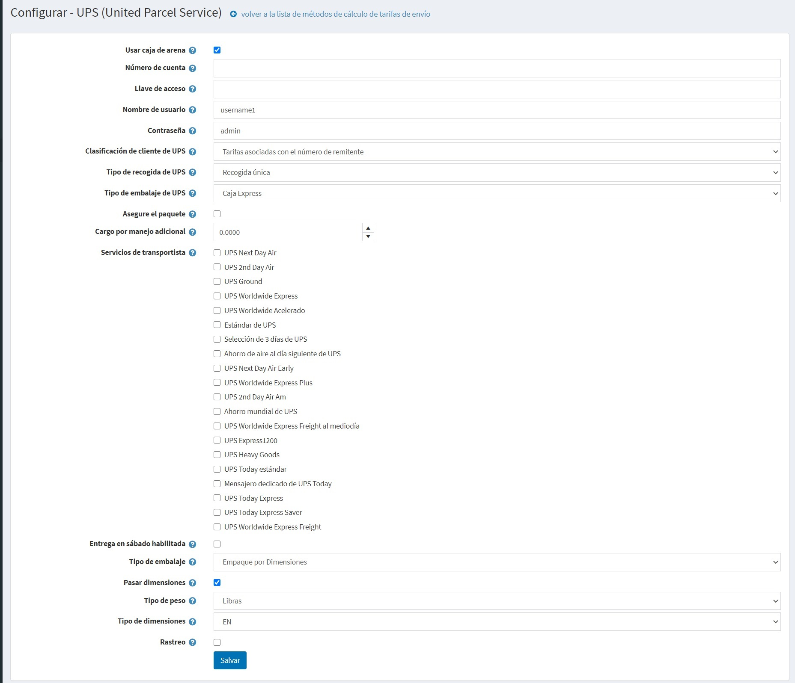

# UPS

Para acceder a su cuenta en UPS, utilice un nombre de usuario, una contraseña y un **número de licencia XML**, que se le proporcionará después del proceso de registro.

## Definir los cálculos de envío en tiempo real de UPS

1. Cree una cuenta de UPS en [https://www.ups.com/upsdeveloperkit?loc=en_US](https://www.ups.com/upsdeveloperkit?loc=en_US) para recibir lo siguiente:
    * Nombre de usuario / ID
    * Contraseña
    * Número de licencia de acceso XML

1. En el área de administración de nopCommerce, vaya a **Configuración → Envío → Proveedores de envío**.
 
1. Habilite este método de la siguiente manera:
    * En la fila UPS (United Postal Service), haga clic en el botón **Editar**.
    * En la columna Está **activo**, marque la marca de verificación.
    * Haga clic en **Actualizar**. La opción *falso* se convierte en *verdadero*.

1. Haga clic en **Configurar** junto a la opción UPS (United Parcel Service) en la lista.
    Aparecerá la ventana *Configure - UPS (United Parcel Service)*, de la siguiente manera:

1. Ingrese la siguiente información obtenida del proveedor de UPS:
    * Marque la casilla de verificación **Usar sandbox** para usar el entorno de prueba.
    * Ingrese el **Número de cuenta** del proveedor de UPS.
    * Ingrese la **Clave de acceso** obtenida del proveedor.
    * Ingrese su **Nombre de usuario** obtenido del proveedor.
    * Ingrese la **Contraseña** obtenida del proveedor
    * Seleccione la **Clasificación de cliente de UPS** requerida, de la siguiente manera:
        * Tarifas asociadas con el número de remitente
        * Tarifas diarias
        * Tarifas minoristas
        * Tarifas regionales
        * Tarifas de lista generales
        * Tarifas de lista estándar
    * Seleccione el **Tipo de recogida de UPS** requerido, de la siguiente manera:
        * Recogida diaria
        * Contador de clientes
        * Recogida única
        * On Call Air
        * Centro de letras
        * Centro de servicio aéreo
    * Seleccione el **Tipo de embalaje de UPS** requerido, de la siguiente manera:
        * Desconocido
        * Letra
        * Paquete proporcionado por el cliente
        * Tubo
        * P A K
        * Caja Express
        * Caja de 10 kg
        * Caja de 25 kg
        * Palet
        * Caja Express pequeña
        * Caja Express mediana
        * Caja Express grande
    * Marque la casilla de verificación **Asegurar paquete**, para indicar que el paquete estará asegurado.
    * Ingrese **Cargo por manejo adicional**. Es una tarifa adicional cobrar a sus clientes.
    * Seleccione los **Servicios de operador** que desea ofrecer a sus clientes.
    * Consulte para obtener tarifas para **Entrega en sábado habilitada**.
    * Seleccione el **Tipo de embalaje**, de la siguiente manera:
        * Empaque por dimensiones
        * Empaque por un artículo por paquete
        * Empaque por volumen
    * Marque la casilla de verificación **Pasar dimensiones** para pasar las dimensiones del paquete cuando solicite tarifas.
    * Seleccione **Tipo de peso**: libras o kilogramos.
    * Seleccione **Tipo de dimensiones**: pulgadas o centímetros.
    * Marque la casilla de verificación **Seguimiento** para registrar el seguimiento del sistema en el registro del sistema. Se registrará todo el XML de solicitud y respuesta (incluida la clave de acceso/nombre de usuario, contraseña). No deje esto habilitado en un entorno de producción.

    Clic en **Guardar**.