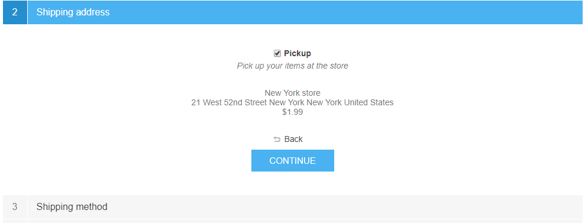

# Configuración de envío

Este capítulo describe cómo configurar los detalles de envío de una tienda. Además de la ubicación y los almacenes establecidos, hay otras cosas que comprenden una buena logística.

Para administrar la configuración de envío, vaya a **Configuración → Configuración → Configuración de envío**.

Defina su configuración de envío en el panel *Común* de la siguiente manera:

* Marque **Envío estimado habilitado (página del carrito)** para mostrar la información de envío estimado según la dirección de envío del cliente en la página del carrito de compras. Vea la captura de pantalla a continuación.
* Marque **Envío estimado habilitado (página del producto)** para mostrar la información del envío estimado según la dirección de envío del cliente en la página de detalles del producto. Vea la captura de pantalla a continuación.

* Seleccione **"Recoger en tienda" habilitado** para mostrar la opción de recoger en tienda durante el pago en el paso de la dirección de envío. Los usuarios verán la siguiente pantalla:

* Marque la casilla de verificación **Ignorar el cargo de envío adicional por recoger en la tienda** si es necesario.
* Elija **Mostrar puntos de recogida en el mapa** si desea mostrarlos en Google Maps. Los clientes no deben ingresar una dirección de envío y elegir un método de envío cuando se selecciona esta opción.

> [!NOTE]
>
> También puede especificar una tarifa para la opción 'Recoger en tienda'. Para hacer esto, vaya a **Configuración → Envío → Puntos de recogida** y configure el proveedor de puntos de recogida adecuado. Obtenga más información aquí: [Puntos de recogida](xref:en/Getting-started/configure-shipping/advanced-configuration/pickup-points).

* Marque **Envío gratuito a partir de 'x'**, para habilitar el envío gratuito para pedidos superiores a una determinada cantidad total. A continuación, se muestra el siguiente campo, que le permite definir el valor de 'x'.
* En el campo **Valor de 'x'**, ingrese el valor sobre el cual todos los pedidos con un total mayor que este calificarán para envío gratuito.
* **Calcule 'x' incluyendo impuestos**. Si no está marcada, el valor se calcula sin impuestos.
* Marque **Usar ubicación de almacén** para usarlo cuando solicite tarifas de envío. Esto es útil cuando realiza envíos desde varios almacenes.
* Marque **Considerar las dimensiones y el peso de los productos asociados** para considerar las dimensiones y el peso de los productos asociados en el envío; desmarque, por ejemplo, si el producto principal ya los incluye.

Defina su configuración de envío en el panel *Notificaciones* de la siguiente manera:

* Marque **Notificar al cliente sobre el envío desde múltiples ubicaciones** si es necesario. Esto es útil cuando realiza envíos desde varios almacenes.
* Marque **Mostrar eventos de envío (clientes)**, para que los clientes puedan ver los eventos de envío en su página de detalles de envío.

> [!NOTE]
>
> Nota: para habilitarse, esta función debe ser compatible con un método de cálculo de envío.

* Marque **Mostrar eventos de envío (propietarios de tiendas)**, para que los propietarios de tiendas puedan ver los eventos de envío en su página de detalles de envío.
> [!NOTE]
>
> Nota: para habilitarse, esta función también debe ser compatible con un método de cálculo de envío.

Luego defina la configuración de *pago*:
* Marque la casilla de verificación **Ocultar total de envío si no se requiere envío** si desea ocultar la etiqueta *Total de envío* si no se requiere envío.
* Marque la casilla de verificación **Enviar a la misma dirección** para mostrar la opción "enviar a la misma dirección" durante el proceso de pago (paso "dirección de facturación"). En este caso, se omitirá la "dirección de envío" con las opciones adecuadas (por ejemplo, recoger en la tienda).

> [!NOTE]
>
> Al usar esta configuración, asegúrese de que todos los países de facturación (**Configuración → Países**) admitan el envío (**Permite el envío** casilla de verificación marcada).

* Marque **Omitir página de método de envío** si solo hay un método de envío disponible. Esta página no se mostrará durante el proceso de pago.

Defina los *detalles del origen del envío*:

* Seleccione **País**.
* Seleccione **Estado/provincia**.
* Defina **Condado/región**.
* Ingrese la **Ciudad** requerida.
* Ingrese la **Dirección 1** requerida.
* Ingrese el **código postal** requerido.

Clic en **Guardar**.
