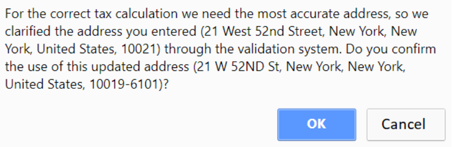

# Proveedor de impuestos Avalara

## Conectarse a AvaTax

Después de instalar la integración de AvaTax, debe configurar la integración.

> [!NOTE]
>
> Asegúrese de que el complemento esté instalado y marcado como "Habilitado" (**Configuración → Complementos locales**). Para habilitar el complemento, haga clic en **Editar** y marque la casilla de verificación  **Está habilitado**.

Para configurar el proveedor de impuestos de Avalara, vaya a **Configuración → Proveedores de impuestos**.

Haga clic en **Marcar como proveedor principal**.

Haga clic en **Configurar** junto a la opción del proveedor de impuestos de Avalara en la lista.

Siga las instrucciones en la parte superior de la página, la función de cada campo se anota cuando "?" se mantiene suspendido.

1. Configure sus credenciales de Avalara Tax:
    * **ID de cuenta**: proporcionado durante el proceso de activación de su cuenta AvaTax.
    * **Clave de licencia**: proporcionada durante el proceso de activación de su cuenta AvaTax.
    * **Compañía**: identificador del perfil de la compañía en la consola de administración de AvaTax.
    * **Usar sandbox** está habilitado para confirmar la transacción de prueba.
    * **Confirmar transacciones** está habilitado para confirmar transacciones inmediatamente después de guardarlas.
    * **Validar dirección** está habilitado para validar la dirección ingresada.
    * **La dirección de origen fiscal** se utiliza para las solicitudes de impuestos a los servicios de Avalara.
    * **Habilitar registro** habilita el registro de todas las solicitudes a los servicios de Avalara.
2. **Guardar** y haga clic en el botón **Probar conexión** para realizar la prueba de conexión.
3. Para realizar el *cálculo de impuestos de prueba*, complete el formulario de dirección en la parte inferior de la página (tenga en cuenta que el complemento de impuestos Avalara de nopCommerce compromete transacciones solo en direcciones de EE. UU.) Y haga clic en **Transacción de impuestos de prueba**.

## Asignar código Avalara AvaTax

Vaya a **Configuración → Categorías de impuestos**.

En la parte superior derecha de la página, verá el botón **Códigos fiscales de Avalara** con la marca. Al hacer clic en él, el menú desplegable mostrará el siguiente menú:

* **Exportar códigos de impuestos a Avalara**: exporta todos los códigos de su tienda a su backend de Avalara.
* **Importar códigos de impuestos del sistema Avalara**: importa todos los códigos de impuestos de Avalara de Avalara.
* **Eliminar códigos de impuestos del sistema Avalara**: elimina todos los códigos exportados desde Avalara.

## Asignar una categoría de Avalara exenta de impuestos a un cliente

1. Haga clic en **Clientes → Clientes → Editar cliente**
1. Busque el campo **Código de uso de entidad** resaltado y seleccione el campo, seleccione el código de tipo de cliente apropiado.

    
1. Haga clic en **Guardar**

> [!NOTE]
>
> No es necesario marcar la casilla **Exento de impuestos**: basta con asignar **Código de uso de entidad**.

## Asignar un código de impuestos del sistema AvaTax a un artículo

1. Vaya a **Catálogo → Productos**.
1. Seleccione un producto para abrir la pantalla de detalles del producto y haga clic en **Editar**.
1. En la pantalla de detalles del producto, en el panel **Precio**, asigne el código apropiado de la lista desplegable en el campo **Categoría de impuestos**.

    
1. **IMPORTANTE:** Asegúrese de que se ingrese **SKU**, para una mejor navegación en el backend de Avalara.
1. Haga clic en **Guardar**.
1. Para ver una lista de todos los códigos de impuestos del sistema AvaTax disponibles, visite [http://taxcode.avatax.avalara.com] (http://taxcode.avatax.avalara.com).

## Validar la dirección de un cliente

1. Asegúrese de que la casilla de verificación **Validar dirección** esté activada, en ese caso, la dirección se validará automáticamente.
1. El usuario verá la siguiente pantalla:

    