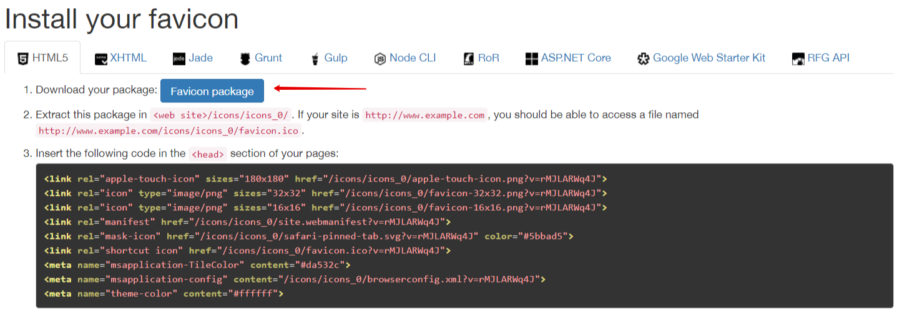

---
title: Adding a favicon
uid: en/getting-started/design-your-store/adding-a-favicon
author: git.RomanovM
contributors: git.rajupaladiya, git.DmitriyKulagin, git.mariannk
---

# Subiendo favicons

Desde la versión 4.20 puede cargar favicons automáticamente a través del área de administración.

> [!NOTE]
>
> Para el caso de varias tiendas, debe repetir este procedimiento de carga para cada tienda.

1. Para cargar favicons, vaya a **Configuración → Configuración → Configuración general.** Se muestra el panel *Favicon e íconos de aplicaciones*:

1. Haga clic en el botón verde **Cargar archivo de iconos**, se abrirá el cuadro de diálogo de selección de archivos: Aquí debe copiar la ruta a sus iconos ( varía según la tienda y el directorio virtual). Por ejemplo:`/icons/icons_0`.

1. Hay varias opciones sobre qué cargar, dependiendo de qué tan amigables deberían ser los favicons de su sitio para diferentes dispositivos:

   - La opción más completa es utilizar uno de los generadores de favicon. En este manual, mostraremos un ejemplo del uso de un [RealFaviconGenerator](https://realfavicongenerator.net/). Gracias a este servicio, la carga del paquete completo de favicon se realizará en unos pocos clics.

      * Vaya a la página principal de este generador donde se le invitará a elegir una imagen para el favicon
      

      * Después de seleccionar una imagen y hacer clic en **Continuar con esta imagen**, será redirigido a la página siguiente. Aquí puede ajustar la configuración de visualización de los favicons para dispositivos y aplicaciones específicos: iOS Web Clip, Android Chrome, Windows Metro, macOS Safari, etc. El servicio mostrará automáticamente ejemplos de visualización. Puede personalizarlos según sus necesidades o dejar los predeterminados.

      * En la parte inferior de la misma página puede encontrar el panel **Opciones del generador de favicon**.
      

         - En esta sección, debe establecer ciertos ajustes. En la pestaña **Ruta**, seleccione la opción `No puedo o no quiero colocar archivos de favicon en la raíz de mi sitio web. En su lugar, los colocaré aquí` y especificaré la ruta desde el paso 2.! [Favicon_path](_static/added-a-favicon/favicon_path.png)

         - En la pestaña **Versión/Actualizar**, seleccione la opción dependiendo de si su sitio ya está en producción. La descripción de la configuración le ayudará con esto. 

         - En la pestaña **Campos adicionales** es necesario marcar la opción para generar un archivo html en el paquete.                    

      * Ahora que todas las configuraciones están establecidas, haga clic en el botón para generar. 

      * Obtenga su paquete favicon. 

   - La opción más simple es usar solo el archivo **favicon.ico**, que se ha utilizado con éxito en muchos sitios durante mucho tiempo, hasta que aparecieron dispositivos con diferentes resoluciones de pantalla.

      * Busque un paquete de favicon de muestra que se encuentra en el directorio `wwwroot/icons/samples/` y cópielo.

      * En el nuevo paquete, elimine todos los archivos excepto **favicon.ico** y **html_code.html**.

      * Reemplaza en este paquete el archivo **favicon.ico** con tu nuevo favicon.

      * Edite el archivo **html_code.html**. Deje la única línea allí: `<link rel =" shortcut icon "href ="/icons/icons_0 /favicon.ico ">`, asumiendo que `/icons/icons_0` es la ruta del paso 2.

      * Guarde estos dos archivos en un paquete. Su paquete de favicon está listo.

   - Una opción intermedia es usar el paquete completo de favicon sin un generador.

      1. Busque un paquete de favicon de muestra que se encuentra en el directorio `wwwroot/icons/samples/` y cópielo.

      1. Reemplace las imágenes del nuevo paquete con las suyas propias teniendo en cuenta los tamaños originales.

      1. Edite el archivo **html_code.html**, reemplace todas las entradas de `/icons/icons_0` con la ruta que se guardó en el paso 2.

      1. Guarde este paquete. Su paquete de favicon está listo.

1. Regrese al área de administración con un paquete de favicon preparado para cargar. Seleccione el archivo deseado y haga clic en **Cargar archivo de iconos**. 

1. Asegúrese de que su paquete se haya cargado correctamente. 

1. Para ver el nuevo favicon en el sitio, debe borrar el caché en el área de administración y en el navegador y luego volver a cargar la página.

> [!TIP]
>
> Para crear un paquete de favicon, puede utilizar cualquier generador, servicios de terceros o hacerlo manualmente. El único requisito es la existencia del archivo **html_code.html** con el código html, que se colocará en el elemento `<head>` de las páginas del sitio.
