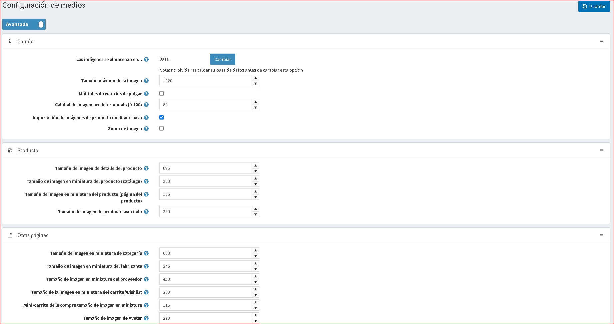

# Configuración de medios

Esta sección describe cómo configurar los detalles multimedia de su tienda. Esto incluye la definición de productos, variantes y tamaños de imagen de avatar y más.

Para definir la configuración del material, vaya a **Configuración → Configuración → Configuración del material**. Se muestra la ventana *Configuración de medios*:

En el panel *Común*, defina la configuración de la siguiente manera:
- Haga clic en el botón **Cambiar** arriba **Las imágenes se almacenan en** opción para elegir entre la base de datos o el sistema de archivos.

  > [!NOTE]
  >
  > Se recomienda hacer una copia de seguridad de la base de datos antes de hacer clic en el botón **Cambiar**.
- En el campo **Tamaño máximo de imagen**, ingrese el tamaño máximo de imagen (es decir, el lado más largo) permitido para la carga de imágenes (en píxeles).
- Marque **Varios directorios de miniaturas** para tener varios directorios de miniaturas. Es útil cuando su empresa de alojamiento tiene limitaciones en la cantidad de archivos por directorio.
- En **Calidad de imagen predeterminada (0 - 100)** ingrese la calidad de las imágenes cargadas. Una vez cambiado, debe eliminar manualmente todos los pulgares ya generados.
- Marque **Importar imágenes de productos usando hash** para usar HASHBYTES para comparar imágenes con productos cargados. Tenga en cuenta que esta funcionalidad no es compatible con algunas bases de datos.
- Marque **Zoom de imagen** para habilitar el zoom de imagen en la página de detalles del producto.

En el panel *Producto*, defina la configuración de la siguiente manera:
- En el campo **Tamaño de imagen de detalle del producto**, ingrese el tamaño predeterminado para las imágenes de detalle del producto en píxeles.
- En el campo **Tamaño de imagen en miniatura del producto (catálogo)**, ingrese el tamaño predeterminado para las imágenes en miniatura del producto que se muestran en la categoría o en las páginas del fabricante en píxeles.
- En el campo **Tamaño de imagen en miniatura del producto (página del producto)**, ingrese el tamaño predeterminado para las imágenes en miniatura del producto (en píxeles) que se muestran en la página de detalles del producto (se usa cuando tiene más de una imagen del producto).
- En el campo **Tamaño de imagen de producto asociado**, ingrese el tamaño predeterminado para las imágenes de producto asociado en píxeles. Los productos asociados forman parte de productos agrupados.

En el panel *Otras páginas*, defina la configuración de la siguiente manera:
- En el campo **Tamaño de imagen en miniatura de categoría**, ingrese el tamaño predeterminado para las imágenes en miniatura del producto en las páginas de categoría en píxeles.
- En el campo **Tamaño de la imagen en miniatura del fabricante**, ingrese el tamaño predeterminado para las imágenes en miniatura del producto en las páginas del fabricante en píxeles.
- En el campo **Tamaño de imagen en miniatura del proveedor**, ingrese el tamaño predeterminado para las imágenes en miniatura del producto en las páginas del proveedor en píxeles.
- En el campo **Tamaño de imagen en miniatura del carrito/lista de deseos**, ingrese el tamaño predeterminado para las imágenes en miniatura del producto en el carrito de compras y la lista de deseos en píxeles.
- En el campo de tamaño **Imagen en miniatura del mini carrito de la compra**, ingrese el tamaño predeterminado (en píxeles) de las imágenes en miniatura del producto que se muestran en el bloque del mini carrito de la compra.
- En el campo **Tamaño de imagen de avatar**, ingrese el tamaño predeterminado para las imágenes de avatar.

Esta página habilita la **configuración de múltiples tiendas**, lo que significa que se pueden definir las mismas configuraciones para todas las tiendas, o diferir de una tienda a otra. Si desea administrar la configuración de una determinada tienda, elija su nombre en la lista desplegable *Configuración de múltiples tiendas* y marque todas las casillas de verificación necesarias en el lado izquierdo para establecer un valor personalizado para ellas.

## Tutoriales

- [Gestión de la configuración de medios](https://www.youtube.com/watch?v=3JS4Zj4TBwQ)
