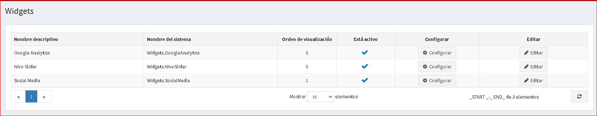
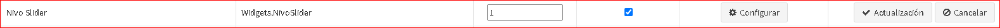
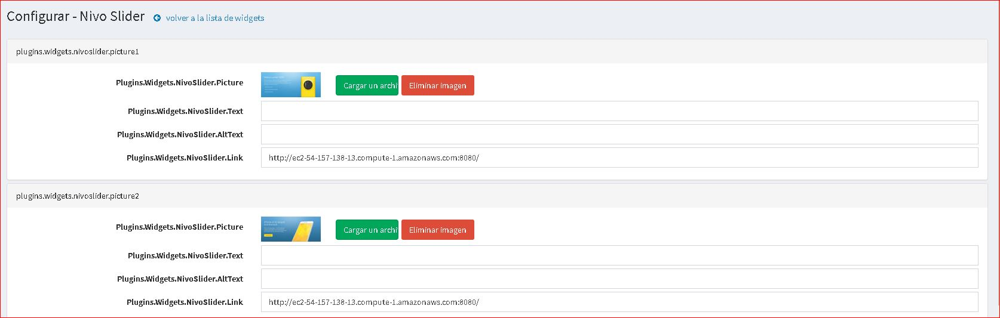
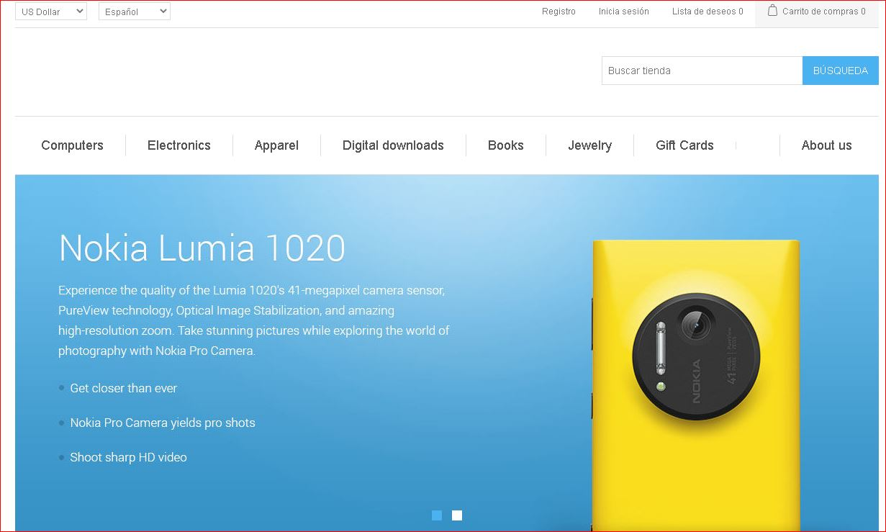

---
title: Nivo slider
uid: es/getting-started/design-your-store/nivo-slider
author: git.AndreiMaz
contributors: git.exileDev
---

# Complemento de control deslizante Nivo

El complemento de widget de control deslizante Nivo le permite mostrar un control deslizante en la página de inicio de su tienda.

## Configurar el complemento deslizante de Nivo

Vaya a **Configuración → Widgets**. Se muestra la ventana *Widgets*:

Haga clic en **Editar** junto al complemento deslizante de Nivo. La ventana se expande de la siguiente manera:

Marque la casilla de verificación **Está activo** para habilitar el complemento.

Haga clic en **Configurar**. Se muestra la ventana *Configurar - Control deslizante Nivo*, de la siguiente manera:

Realice lo siguiente para cada diapositiva que desee cargar:

* En el campo **Imagen**, haga clic en **Cargar un archivo** para cargar la imagen requerida. Haga clic en **Eliminar imagen** para eliminar la existente.
* En el campo **Comentario**, ingrese un comentario para la imagen o déjelo en blanco para que no se muestre ningún texto.
* En el campo **Texto alternativo de la imagen**, ingrese el texto alternativo que se agregará a la imagen.
* En el campo **URL**, ingrese la URL requerida o déjela en blanco si no desea que se pueda hacer clic en la imagen.

Clic en **Guardar**.

Ahora puede ir a la página de inicio de su tienda pública y al control deslizante de imagen actualizado:

