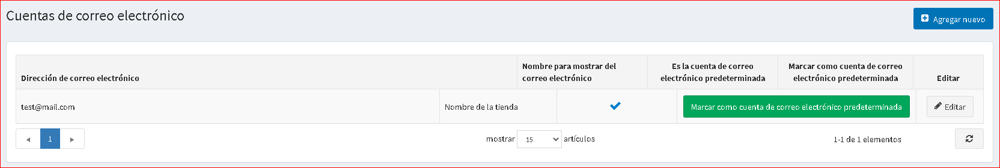
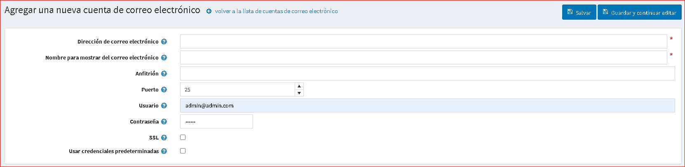
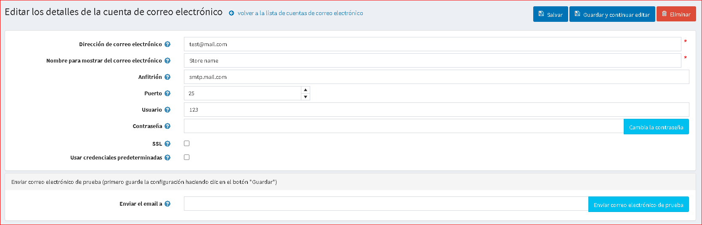

# Cuentas de correo electrónico

Este capítulo describe cómo configurar cuentas de correo electrónico asociadas con su tienda: un correo electrónico de contacto general, un correo electrónico de representante de ventas, un correo electrónico de atención al cliente y más.

Para administrar cuentas de correo electrónico, vaya a **Configuración → Cuentas de correo electrónico**. La ventana *Cuentas de correo electrónico* muestra las cuentas de correo electrónico del propietario de la tienda, como se muestra a continuación. Una vez configuradas las cuentas de correo electrónico, el propietario de la tienda puede seleccionar la cuenta de correo electrónico requerida en la página de detalles de la plantilla de mensaje, como se describe en [Plantillas de mensajes](xref:en/running-your-store/content-management/message-templates) capítulo.

## Agregar una nueva cuenta de correo electrónico

Para agregar una nueva cuenta de correo electrónico, haga clic en **Agregar nueva**. Se muestra la ventana *Agregar una nueva cuenta de correo electrónico*:

Defina la siguiente información de la cuenta de correo electrónico:

* En el campo **Dirección de correo electrónico** ingrese la dirección de correo electrónico del remitente para todos los correos electrónicos salientes de su tienda. Ejemplo, `sales @ yourstore.com`.
* En el campo **Nombre para mostrar del correo electrónico**, ingrese el nombre que se muestra para los correos electrónicos salientes de su tienda. Por ejemplo, "El departamento de ventas de su tienda".
* En el campo **Host**, ingrese el nombre de host de la dirección IP de su servidor de correo electrónico.
* En el campo **Puerto**, ingrese el puerto SMTP de su servidor de correo electrónico.
* En el campo **Usuario**, ingrese el nombre de usuario de su servidor de correo electrónico.
* En el campo **Contraseña**, ingrese la contraseña de su servidor de correo electrónico.
* Seleccione la casilla de verificación **SLL** para utilizar la capa de sockets de seguridad para cifrar la conexión SMTP.
* Seleccione la casilla de verificación **Usar credenciales predeterminadas** para usar las credenciales predeterminadas para la conexión.

Clic en **Guardar**. La ventana se expande de la siguiente manera:

En el campo **Enviar correo electrónico a**, ingrese la dirección de correo electrónico del correo electrónico de prueba y haga clic en **Enviar correo electrónico de prueba**.