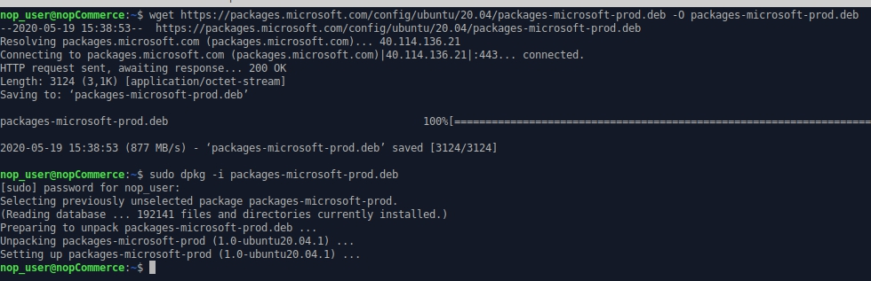
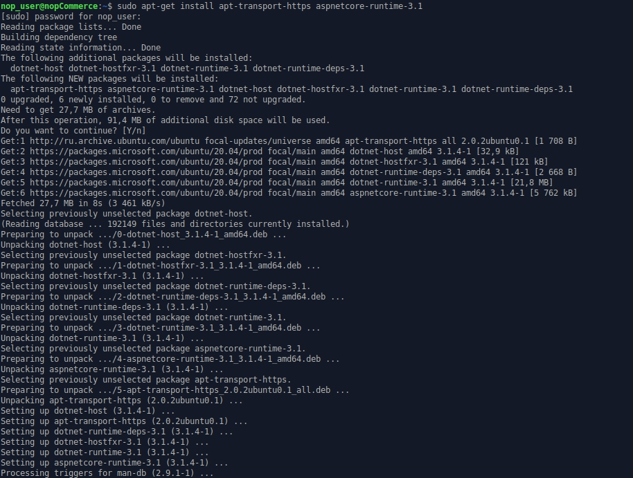
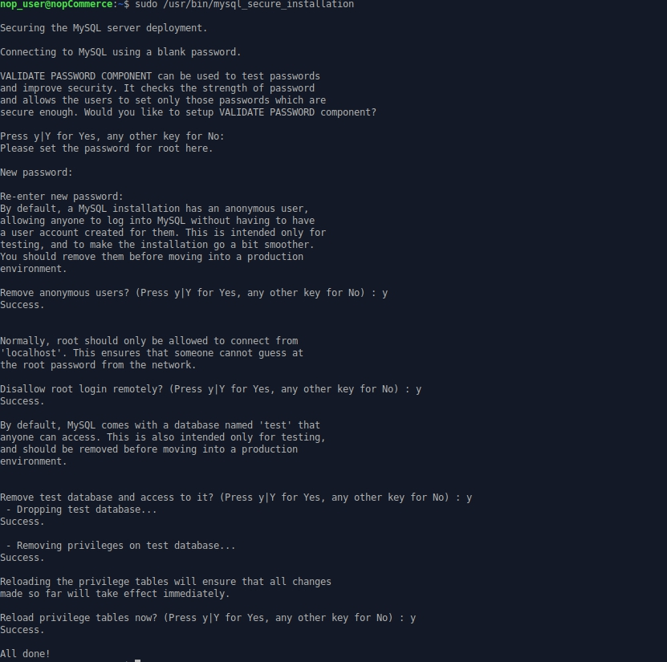
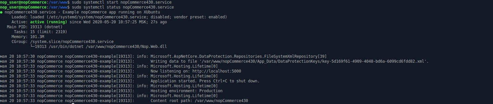

# Instalación en Linux

Este capítulo describe cómo instalar el software nopCommerce en el sistema Linux en el ejemplo de XUbuntu 20.04:

1. [Instalar y configurar el software](#install-and-configure-software)
1. [Obtener nopCommerce](#get-nopcommerce)
1. [Create and configure the nopCommerce Web service](#create-the-nopcommerce-service)
1. [Solución de problemas](#troubleshooting)

## Instalar y configurar software
1a
Antes de instalar .NET Core, necesitaremos registrar la clave de Microsoft e instalar las dependencias necesarias. Esto debe hacerse una vez por máquina.

### Registra la clave y el feed de Microsoft

Abra una terminal y ejecute los siguientes comandos:

`wget https://packages.microsoft.com/config/ubuntu/20.04/packages-microsoft-prod.deb -O packages-microsoft-prod.deb`

`sudo dpkg -i packages-microsoft-prod.deb`



### Instalar.NET Core Runtime

Actualice los productos disponibles para la instalación, luego instale el tiempo de ejecución de .NET:

`sudo apt-get update`

`sudo apt-get install apt-transport-https aspnetcore-runtime-3.1`



> [!NOTE]
>
> Si tiene algún error, consulte la información detallada en el https://docs.microsoft.com/en-us/dotnet/core/install/linux-package-manager-ubuntu-2004#troubleshoot-the-package-manager page.

Puede ver todos los tiempos de ejecución de .Net Core instalados con el siguiente comando:

`dotnet --list-runtimes`


### Instalar MySql Server

Instala el MySql server 8.0 version

`sudo apt-get install mysql-server`


Por defecto, la contraseña de root está vacía, configurémosla

`sudo /usr/bin/mysql_secure_installation`



> [!NOTE]
>
> Si tiene algún problema con la configuración de la contraseña de root en su servidor MySql, lea los siguientes artículos:
> https://dev.mysql.com/doc/refman/8.0/en/resetting-permissions.html and
https://stackoverflow.com/questions/41645309/mysql-error-access-denied-for-user-rootlocalhost.

### Instalar nginx

Instale el paquete nginx:

`sudo apt-get install nginx`


Ejecute el servicio nginx:

`sudo systemctl start nginx`

y comprobar su estado:

`sudo systemctl status nginx`


Para configurar nginx como un proxy inverso para reenviar solicitudes a su ASP.NET Core app, modificar /etc/nginx/sites-available/default. Ábralo en un editor de texto y reemplace el contenido con lo siguiente:

```
# Configuración de servidor predeterminada
#
server {
    listen 80 default_server;
    listen [::]:80 default_server;

    server_name   nopCommerce-430.com;

    location / {
    proxy_pass         http://localhost:5000;
    proxy_http_version 1.1;
    proxy_set_header   Upgrade $http_upgrade;
    proxy_set_header   Connection keep-alive;
    proxy_set_header   Host $host;
    proxy_cache_bypass $http_upgrade;
    proxy_set_header   X-Forwarded-For $proxy_add_x_forwarded_for;
    proxy_set_header   X-Forwarded-Proto $scheme;
    }

    # SSL configuration
    #
    # listen 443 ssl default_server;
    # listen [::]:443 ssl default_server;
    #
    # Note: Debe deshabilitar gzip para el tráfico SSL.
    # See: https://bugs.debian.org/773332
    #
    # Rlea ssl_ciphers para garantizar una configuración segura.
    # Ver: https://bugs.debian.org/765782
    #
    # Certificados autofirmados generados por el paquete ssl-cert
    # ¡No los uses en un servidor de producción!
    #
    # incluir fragmentos/snakeoil.conf;
}
```

## Obtenga nopCommerce

Crea un directorio

`mkdir /var/www/nopCommerce430`

Descarga y desempaqueta el nopCommerce:

`cd /var/www/nopCommerce430`

`sudo wget https://github.com/nopSolutions/nopCommerce/releases/download/release-4.30/nopCommerce_4.30_NoSource_linux_x64.zip`

`sudo apt-get install unzip`

`sudo unzip nopCommerce_4.30_NoSource_linux_x64.zip`

Cree un par de directorios para ejecutar nopCommerce:

`sudo mkdir bin`

`sudo mkdir logs`

Cambiar los permisos del archivo

`cd ..`

`sudo chgrp -R www-data nopCommerce430/`

`sudo chown -R www-data nopCommerce430/`

## Crea el servicio nopCommerce

Create the /etc/systemd/system/nopCommerce430.service file with the following contents:

```
[Unit]
Description=Example nopCommerce app running on XUbuntu

[Service]
WorkingDirectory=/var/www/nopCommerce430
ExecStart=/usr/bin/dotnet /var/www/nopCommerce430/Nop.Web.dll
Restart=always
# Restart service after 10 seconds if the dotnet service crashes:
RestartSec=10
KillSignal=SIGINT
SyslogIdentifier=nopCommerce430-example
User=www-data
Environment=ASPNETCORE_ENVIRONMENT=Production
Environment=DOTNET_PRINT_TELEMETRY_MESSAGE=false

[Install]
WantedBy=multi-user.target
```

Iniciar el servicio

`sudo systemctl start nopCommerce430.service`

Verifique el estado del servicio nopCommerce

`sudo systemctl status nopCommerce430.service`



Reinicie el servidor nginx

`sudo systemctl restart nginx`

**Ahora todo está listo, puedes proceder a instalar y configurar la tienda**

## Solución de problemas

### Gdip

*Si tiene un problema con la carga de imágenes en RichText Box (el inicializador de tipo para 'Gdip' arrojó una excepción) simplemente instale la biblioteca libgdiplus*:

*`sudo apt-get install libgdiplus`*

### SSL

*Si desea utilizar SSL en su sitio, no olvide configurarlo en `true` the `UseHttpXForwardedProto` entorno en el **appsettings.json** expediente*.
