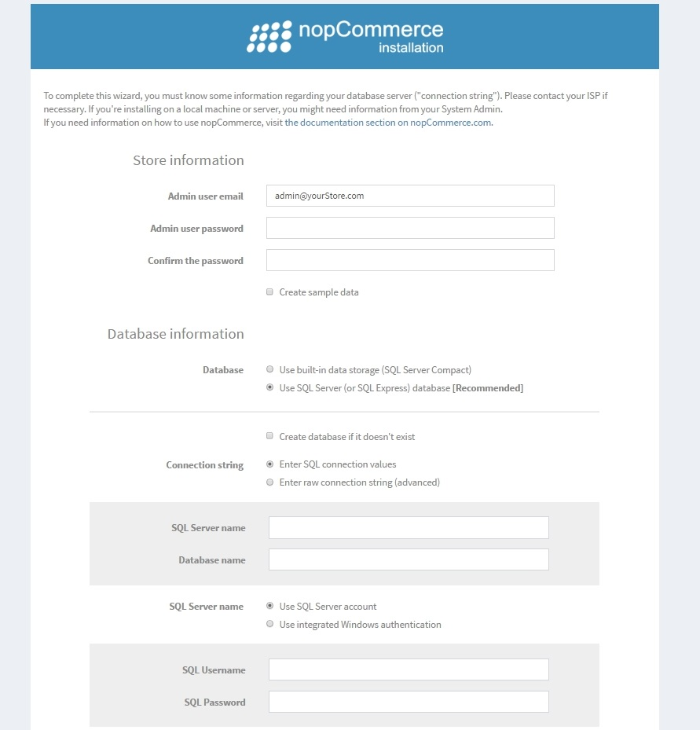

# Instalación en Windows

Este capítulo describe cómo descargar el software nopCommerce, cargarlo en su servidor e instalarlo. También puede ver el screencast sobre la instalación de nopCommerce en nuestro [canal de YouTube](https://www.youtube.com/watch?v=L7NGodeB9sQ).

Antes de comenzar la instalación, asegúrese de que su servidor web tenga los [requisitos mínimos para ejecutar nopCommerce](xref:es/installation-and-upgrade/technology-and-system-requirements).

> [!NOTE]
> Para obtener más información sobre las pautas de selección de alojamiento, visite [esta página](xref:es/installation-and-upgrade/installation-nopcommerce/choose-a-hosting-company).

## Descarga nopCommerce
Para instalar nopCommerce en Windows, primero debe descargarlo. Vaya a la [página de descarga](https://www.nopcommerce.com/download-nopcommerce) y elija la versión **Paquete sin código fuente** para Windows. Esta es una versión precompilada de nopCommerce que simplemente puede cargarse en su proveedor de alojamiento y usarse de inmediato.

## Sube los archivos nopCommerce
El siguiente paso es cargar los archivos nopCommerce en su servidor. Para hacer esto, necesita usar una conexión FTP que permita transferir archivos entre computadoras. Siga los siguientes pasos para configurar esto:
1. Elija y descargue una de las aplicaciones de cliente FTP que utilizará para transferir archivos.
1. Busque sus credenciales de FTP en el panel de control de su alojamiento.
1. En su aplicación de cliente FTP, configure la conexión entre su computadora y el servidor usando las credenciales FTP que encontró en el paso anterior.
1. Sube los archivos nopCommerce al servidor.

## Crea una base de datos
Antes de ejecutar nopCommerce, cree una nueva instancia de base de datos en su panel de control de alojamiento. Esta base de datos se utilizará para almacenar los datos de su sitio web.

> [!NOTE]
>
> Al crear la base de datos, elija MS SQL Server versión *2012* o *superior* si se solicita.

Usaremos el nombre, el nombre del servidor (o IP, URL), el nombre de usuario y la contraseña de su base de datos durante el proceso de instalación posterior. Estas credenciales son necesarias para la conexión a la base de datos.

## Crea un nuevo sitio web
Crea un nuevo sitio web en tu panel de control de hosting. Luego busque una URL que le permita acceder a este sitio.

## Instalar nopCommerce
Usando la url del paso anterior acceda al sitio web desde su navegador.
Una vez que abra el sitio por primera vez, será redirigido a la página de instalación, de la siguiente manera:

En el panel *Información de la tienda*, complete los siguientes detalles:
* **Correo electrónico del usuario administrador**: esta es la dirección de correo electrónico del primer administrador del sitio.
* **Contraseña de usuario administrador**: deberá proporcionar una contraseña para la cuenta de administrador.
* **Confirme la contraseña**: confirme la contraseña del usuario administrador.
* **Crear datos de muestra**: marque esta casilla de verificación si desea que se creen productos de muestra. Esto se recomienda para que pueda comenzar a trabajar con su sitio antes de agregar cualquiera de sus propios productos. Siempre puede eliminar estos elementos más tarde o anular la publicación para que dejen de aparecer en su sitio.

En el panel *Información de la base de datos* debe ingresar la siguiente información:
* **Base de datos**: aquí puede seleccionar Microsoft SQL Server o MySQL. Elija el primero si está instalando nopCommerce en Windows.
* **Cree una base de datos si no existe**: se recomienda que cree su base de datos y el usuario de la base de datos de antemano para garantizar una instalación exitosa. Simplemente cree una instancia de base de datos y agregue el usuario de la base de datos. El proceso de instalación creará todas las tablas, procedimientos almacenados, etc.
* **Ingrese una cadena de conexión sin procesar (avanzado)**: marque esta casilla de verificación si desea ingresar una **Cadena de conexión** en lugar de completar los campos de conexión.
* **Nombre del servidor**: esta es la IP, URL o nombre del servidor de su base de datos. Obtenga el nombre de su servidor desde el panel de control de alojamiento.
* **Nombre de la base de datos**: este es el nombre de la base de datos utilizada por nopCommerce. Si optó por crear su base de datos con anticipación, use el nombre que le dio a su base de datos aquí.
* **Use la autenticación de Windows integrada**: si está instalando en un proveedor de alojamiento, no necesita usar esta opción.
* **Nombre de usuario SQL**: ingrese su nombre de usuario de la base de datos.
* **SQL Password**: ingrese su contraseña de usuario de la base de datos.
* **Especificar clasificación personalizada**: esta es una configuración avanzada y debe dejarse sin marcar.

Haga clic en **Instalar** para iniciar el proceso de instalación. Cuando se completa el proceso de configuración, se muestra la página de inicio de su nuevo sitio.

> [!NOTE]
> El botón **Reiniciar la instalación** en la parte inferior de la página de instalación le permite reiniciar el proceso de instalación en caso de que algo salga mal.

> [!NOTE]
> Si desea restablecer completamente un sitio nopCommerce a su configuración predeterminada, puede eliminar el `dataSettings.json` file from the `App_Data` directory.
