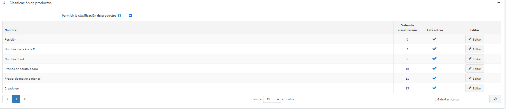

# Ajustes del catálogo

Los ajustes del catálogo incluyen la habilitación de opciones para la clasificación de productos, el cambio de modos de vista, la comparación de productos y más.

Para definir los ajustes del catálogo, vaya a **Configuración → Ajustes → Ajustes del catálogo**. La página de ajustes de catálogo está disponible en los modos *avanzado* y *básico* (en el modo avanzado por defecto).

Esta página permite la configuración de varias tiendas, lo que significa que se pueden definir los mismos ajustes para todas las tiendas o que pueden ser diferentes de una tienda a otra. Si desea administrar la configuración de una tienda determinada, elija su nombre en la lista desplegable de configuración de varias tiendas y marque todas las casillas de verificación necesarias en el lado izquierdo para establecer un valor personalizado para ellas. Para obtener más detalles, consulte [Multi-store](xref:en/getting-started/advanced-configuration/multi-store).

## Configurar la búsqueda
El panel superior de la página establece *Búsqueda*:

- Marque la casilla de verificación **Búsqueda habilitada** si desea que la función de búsqueda se habilite en la tienda pública.
- Marca la casilla de verificación **Búsqueda autocompletada activada**, para que aparezca la casilla de búsqueda autocompletada en la tienda pública, de la siguiente manera:

Cuando esta opción está activada, se muestran los siguientes campos adicionales:

- **Número de productos "autocompletados" a mostrar** establece el número de resultados que serán visibles en la lista desplegable de autocompletar del cuadro de búsqueda en la tienda pública.
- Marque la casilla de verificación **Mostrar un enlace a todos los resultados de la búsqueda en el cuadro de autocompletar** para mostrar el enlace a todos los resultados en el cuadro de búsqueda de autocompletar. Se muestra si el número de artículos encontrados es mayor que la cantidad mostrada en la casilla de autocompletar.
- Marque la casilla de verificación **Mostrar imágenes de productos en la casilla de autocompletar** para habilitar la visualización de imágenes de productos en la casilla de búsqueda de autocompletar.
- **Longitud mínima del término de búsqueda** es el número mínimo de caracteres necesarios para la búsqueda.
- Marque la **página de búsqueda. Casilla Permitir que los clientes seleccionen el tamaño de la página** si desea permitir que los clientes seleccionen el tamaño de la página de la lista predefinida de opciones.
- En la página **Búsqueda. Opciones de tamaño de página**, introduzca una lista separada por comas de las opciones de tamaño de página para los clientes o introduzca el número de productos que desea mostrar en la página de productos de búsqueda.

## Reseñas de productos
El segundo panel establece *Revisiones de productos*. Define lo siguiente:

- **Las revisiones de productos deben ser aprobadas**, para que las revisiones de productos sean aprobadas por un administrador de la tienda antes de ser publicadas.
- **Permitir a los usuarios anónimos escribir revisiones de productos**, para permitir a los usuarios anónimos escribir revisiones de productos. 
- **La revisión del producto sólo es posible después de la compra del producto**, para permitir la revisión del producto sólo por los clientes que ya lo han pedido.
- **Notificar sobre nuevas revisiones de productos**, para notificar al dueño de la tienda sobre nuevas revisiones públicas.
- **Notificar al cliente sobre la respuesta de la revisión del producto**, para notificar al cliente sobre la respuesta de la revisión del producto.
- **Revisiones por tienda**, permite mostrar sólo las revisiones de la tienda actual (en la página de detalles del producto). Desmarque esta casilla de verificación si quiere que sus clientes vean las opiniones sobre el producto escritas en todas sus tiendas.
- **Muestra la pestaña de comentarios de productos en la página "Mi cuenta "**, para permitir que los clientes vean todos sus comentarios en la página "Mi cuenta".
- **Tamaño de la página de reseñas de productos** es la cantidad de reseñas por página.
- Ordenar por ascendente**, para ordenar las reseñas de productos por fecha de creación como ascendente.

## Tipos de reseñas
El siguiente bloque establece *Tipos de revisión*. Puedes configurar una lista de tipos de revisión si crees que una revisión básica no es suficiente.

Haga clic en **Agregar nuevo botón** para crear un nuevo tipo de revisión.

Define lo siguiente:

- Introduzca su tipo de revisión **Nombre**.
- Introduzca el tipo de revisión **Descripción**.
- Defina el **Orden de visualización**.
- Cuando **Requerido** los clientes tienen que elegir un valor de revisión apropiado antes de poder continuar.
- **Visible para todos los clientes** establece la visibilidad del tipo de revisión para todos los clientes.

Haga clic en el botón **Guardar** para añadir un nuevo tipo de revisión.

Ahora en la tienda pública los clientes podrán llenar calificaciones adicionales en la página de revisión de productos.

También en esta página puede ver la retroalimentación izquierda de todos los clientes (si este ajuste está activo). En la página de la cuenta personal del cliente también hay una oportunidad de ver todos los comentarios dejados en los productos.

## Performance
El siguiente panel establece el *Rendimiento*. Tener los siguientes ajustes activados puede mejorar significativamente el rendimiento de la tienda:

- **Ignorar reglas de ACL (en todo el sitio)** desactiva las[ACL rules](xref:en/running-your-store/customer-management/access-control-list) configured for entities configuradas para las entidades.
- **Ignorar límite por tienda (sitewide)** permite ignorar las reglas de límite por tienda configuradas para las entidades. Se recomienda habilitar esta configuración si sólo tiene una tienda o no tiene ninguna limitación específica para la tienda. Más información sobre multi-tienda en[Multi-store](xref:en/getting-started/advanced-configuration/multi-store) section.**Ignorar los descuentos (en todo el sitio)**.
- **Ignorar productos destacados (todo el sitio)**.
- **Precios de productos de caché**. No debe habilitarlo si utiliza algunos descuentos complejos, reglas de requisito de descuento o códigos de cupón.

## Compartir
Las opciones de intercambio del panel *Compartir* permiten establecer una oportunidad para que los compradores compartan los productos a través de sus redes de medios sociales. Las opciones aparecerán como pequeños iconos en las páginas de productos. Para configurar las opciones de compartición:

- Marque la casilla **Mostrar un botón de compartir** para mostrar un botón de compartir en la página de detalles del producto. Cuando se selecciona este campo, se muestra el campo **Código del botón de compartir**.
- El campo **Código del botón de compartir** muestra el código del botón de las páginas.

> [!TIP]
> 
> Por defecto, se utiliza el servicio AddThis ([http://www.addthis.com/](http://www.addthis.com/)).

Así es como se ven los enlaces compartidos:

- Marque la casilla de verificación **'Email a friend' enabled** para que los clientes puedan usar la opción "Email a friend".
- **Permitir a los usuarios anónimos enviar un correo electrónico a un amigo** si es necesario.

## Comparar productos
La opción Comparar productos permite a los clientes comparar diferentes ofertas en función de sus características y precio para poder tomar las mejores decisiones de compra. Configura el bloque *Comparar productos*, de la siguiente manera:

- Marque la casilla **'Comparar productos' habilitado**, para que los clientes puedan comparar las opciones de productos en su tienda pública. El botón *Añadir a la lista de comparación* aparecerá en las páginas de los productos.
- Marque la casilla de verificación **Incluir una breve descripción en los productos de comparación**, para que aparezcan breves descripciones de los productos en la página de comparación de productos.
- Marque la casilla **Incluir descripción completa en los productos comparados**, para mostrar las descripciones completas de los productos en la página de comparación de productos.

## Secciones adicionales
El panel de *Secciones adicionales* le permite configurar las siguientes opciones:

- Marque la casilla de verificación **Quitar los productos necesarios** para eliminar automáticamente el producto necesario del carrito cuando se elimine el producto principal.
- **Mostrar los más vendidos en la página de inicio** le permite mostrar los más vendidos en la página de inicio.
	- Si la casilla de verificación anterior está marcada, podrá introducir el **Número de mejores ventas en la página de inicio**.
- Marque la casilla **'Productos también comprados' habilitada**, para permitir a los clientes ver una lista de productos también comprados por otros que hayan comprado lo anterior.
	- Cuando la opción anterior está activada, aparece el campo **Número de productos también comprados a mostrar**, en el que el propietario de la tienda puede establecer el número de productos a mostrar.
- Marque la casilla **'Productos vistos recientemente' habilitada**, para que los clientes puedan ver los productos vistos recientemente en su tienda.
	- En el campo **Número de 'Productos vistos recientemente'**, introduzca el número de productos vistos recientemente que se mostrarán cuando la casilla de verificación anterior esté marcada.
- Marque la casilla de verificación **Página de "Nuevos productos" activada** si desea que la página de "Nuevos productos" esté activada en la tienda.
	- En el campo **Número de productos de la página de 'Nuevos productos'**, introduce el número de productos añadidos recientemente que se mostrarán cuando la *página de 'Nuevos productos' activada* esté marcada.
- Marque la casilla de verificación **Mostrar la fecha de disponibilidad de un pedido previo** si es necesario.

## Campos de productos
En el panel de *Campos de producto* puede configurar las siguientes opciones:
- Para **Mostrar SKU en la página de detalles del producto**.
- Para **Mostrar SKU en las páginas del catálogo**.
- Para **Mostrar GTIN** en la tienda pública.
- Para **Mostrar el número de pieza del fabricante** en la tienda pública.

## Página del producto
En el panel de la *página de productos* puedes configurar las siguientes opciones:
- Para **Mostrar el icono de "envío gratuito "** para los productos con esta opción activada.
- Para **Permitir la visualización de la página de detalles de productos no publicados**. En este caso, el SEO no se verá afectado, y los rastreadores de búsqueda indexarán la página, aunque un producto sea temporalmente inédito e invisible para los clientes. Tenga en cuenta que el propietario de una tienda siempre tiene acceso a los productos no publicados.
- Marque la casilla de verificación **Mensaje de productos inéditos descontinuados** para mostrar el mensaje "un producto ha sido descontinuado" cuando los clientes intenten acceder a las páginas de detalles de los productos inéditos.

## Páginas del catálogo
El panel de *Páginas de catálogo* le permite configurar:
- **Permitir el cambio de modo de visualización** en las páginas de categorías y fabricantes.
- El **Modo de vista por defecto** a *Grid* o *Lista*.
- **Incluir productos de subcategorías** al ver la página de detalles de una categoría.
- A **Mostrar el número de productos distintos junto a cada categoría** en el área de navegación de la categoría ubicada en la columna izquierda de la tienda pública.
- **Categoría miga de pan habilitada**. Selecciona para habilitar la ruta de la categoría (miga de pan). Esta es la barra en la parte superior de la pantalla que indica en qué categorías y subcategorías se ha visto el producto en las páginas de productos. Cada subelemento de la barra es un hipervínculo independiente.
- **Número de fabricantes a mostrar** en el bloque de navegación del fabricante.

## Etiquetas
En el panel de *Tags* puedes definir:
- **Número de etiquetas de productos (nube)** - el número de etiquetas que aparecen en la nube de etiquetas.
- Para **Permitir que los clientes seleccionen el tamaño de la página de etiquetas de productos** en la página de etiquetas de productos a partir de una lista predefinida de opciones definidas por el propietario de la tienda. Cuando se desactiva, los clientes no podrán seleccionar un tamaño de página y el dueño de la tienda lo introduce.
- Si la opción anterior está marcada, el campo **Opciones de tamaño de página de 'Productos por etiqueta'** se hace visible. Puedes introducir valores que pueden ser seleccionados por los usuarios de la tienda. Los números deben estar separados por comas. El primer valor será el predeterminado.

## Impuestos
Ciertas opciones de información de impuestos/embarque específicas de Alemania están disponibles en el panel de *Impuestos*:
- **Muestra la información de impuestos/envío (pie de página)**.
- **Mostrar información de impuestos/envío (página de detalles del producto)**.
- **Visualizar información de impuestos/envío (cajas de productos)**.
- **Visualizar información de impuestos/envío (carrito de compras)**.
- **Visualizar información de impuestos/envío (lista de deseos)**.
- **Visualizar información de impuestos/envío (página de detalles del pedido)**.

## Exportación/importación
En el panel de *Exportación/importación* puede definir:
* Marque la casilla de verificación **Exportar/importar productos con atributos** si necesita que los atributos del producto se exporten/importen cada vez que exporta/importa el producto.
* Marque la casilla de verificación **Exportar/importar productos con atributos de especificación** si los productos deben exportarse/importarse con atributos de especificación.
* Marque la casilla de verificación **Exportar/importar productos con miga de pan de categoría** si los productos deben exportarse/importarse con un nombre de categoría completo que incluya los nombres de todos sus progenitores.
* Marque la casilla de verificación **Categorías de exportación/importación utilizando el nombre de la categoría** si las categorías deben exportarse/importarse utilizando el nombre de la categoría.
* Marque la casilla de verificación **Exportación/importación de productos. Marque la casilla de verificación Permitir la descarga de imágenes** si las imágenes pueden descargarse del servidor remoto al exportar productos.
* Marque la casilla **Exportar/importar productos. Permitir dividir el archivo** casilla de verificación si desea importar productos de archivos individuales del tamaño óptimo, que se crearon automáticamente a partir del archivo principal. Esta función le ayudará a importar una gran cantidad de datos con un retraso menor.
* Marque la casilla de verificación **Exportar/importar entidades relacionadas usando el nombre** si las entidades relacionadas deben ser exportadas/importadas usando el nombre.
* Marque la casilla de verificación **Exportar/importar productos con la propiedad "limitado a las tiendas "** si los productos deben exportarse/importarse con la propiedad "limitado a las tiendas".

## Clasificación de productos
En el panel de *clasificación de productos* puedes definir:
* Marque la casilla de verificación **Permitir la clasificación de productos**, para habilitar una opción de clasificación de productos en las páginas de categorías y fabricantes. Puede activar/desactivar la clasificación por *Posición*, *Nombre*, *Precio* y *Fecha de creación*.

Puedes editar la propiedad **Orden de visualización** y **Es activo** de cada opción haciendo clic en el botón **Editar**.