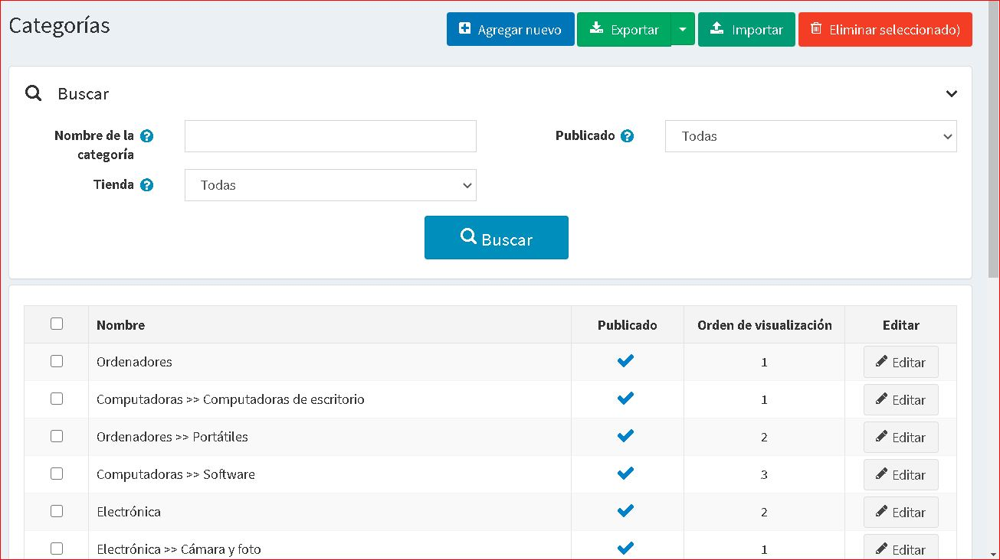
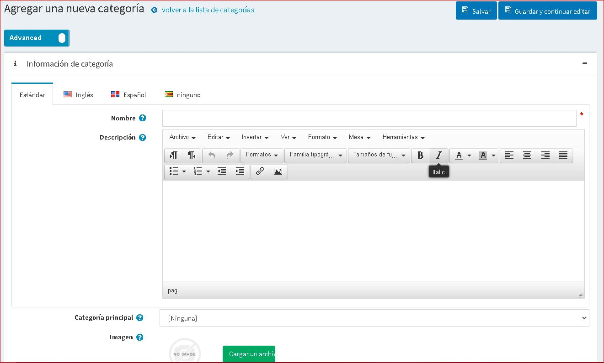
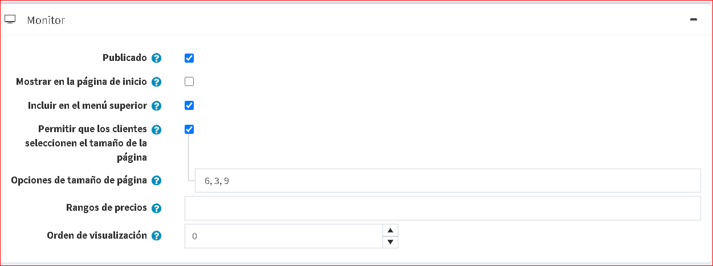
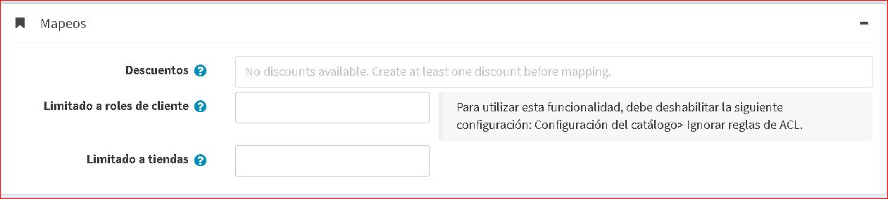

# Categorías

Antes de añadir nuevos productos, el gerente de la tienda debe crear categorías, a las cuales los productos serán asignados más tarde. Para gestionar las categorías, vaya a **Catálogo → Categorías**.

Busca una categoría en el panel *Búsqueda* introduciendo el **Nombre de la categoría** o una parte del nombre, por la propiedad **Publicado** o entre todas las categorías de una determinada **Tienda** (si se habilita más de una tienda).

> [!NOTE]
> 
> Para eliminar las categorías de la lista, seleccione los elementos a eliminar y haga clic en el botón **Borrar (seleccionado)**.
> Se pueden exportar las categorías a un archivo externo para hacer una copia de seguridad, haciendo clic en el botón **Exportar**. Después de hacer clic en el botón **Exportar** verá el menú desplegable que le permite **Exportar a XML** o **Exportar a Excel**.

## Añadir una nueva categoría

Para añadir una nueva categoría, haga clic en el botón **Añadir nuevo** en la parte superior de la página. Aparecerá la ventana *Añadir una nueva categoría*.

Esta página está disponible en dos modos: **avanzado** y **básico**. Cambie al modo básico que muestra los únicos campos principales o utilice el modo avanzado que muestra todos los campos disponibles.

### Información de la categoría
En el panel *Información de la categoría*, defina la siguiente información de la categoría:

- **Nombre** - este es el nombre de la categoría que aparece en el catálogo.
- **Descripción** - una descripción de la categoría. Utilice el editor para el diseño y las fuentes.
- Si esta categoría será una subcategoría, seleccione una **Categoría de padres** de la lista desplegable. La nueva categoría se colocará bajo esta categoría en la tienda pública.
- **Imagen** - una imagen que representa la categoría. Sube la imagen desde tu dispositivo.

### Pantalla

En el panel de *Mostrar*, defina la siguiente información de la categoría:

- Seleccione la casilla de verificación **Publicado**, para que la categoría sea visible en la tienda pública.
- Seleccione la casilla de verificación **Mostrar en la página de inicio**, para que la categoría sea visible en la página de inicio.
- Seleccione la casilla de verificación **Incluir en el menú superior**, para incluir la categoría en el menú superior de la página de inicio.
- Seleccione la casilla de verificación **Permitir a los clientes seleccionar el tamaño de la página**, para permitir que los clientes seleccionen un tamaño de página, es decir, el número de productos que se muestran en la página de detalles de la categoría. El tamaño de la página puede ser seleccionado por los clientes en la lista de tamaños de página introducida por el propietario de la tienda en el campo **Opciones de tamaño de página**.
	- En la casilla anterior está marcada la opción **Opciones de tamaño de página**. Introduzca una lista separada por comas de las opciones de tamaño de página (por ejemplo, 10, 5, 15, 20). La primera opción es el tamaño de página predeterminado si no se selecciona ninguna.
- La opción **Tamaño de la página** se muestra si la casilla **Permitir que los clientes seleccionen el tamaño de la página** no está marcada. Establece el tamaño de la página para los productos de esta categoría, por ejemplo, '4' productos por página. 
  > [!TIP!]
  > 
  > Por ejemplo, cuando añades siete productos a una categoría y estableces el tamaño de su página en tres. Tres productos por página se mostrarán en esta página de detalles de la categoría en la tienda pública, y la cantidad total de páginas será de tres.

- **Rangos de precios** - permiten definir rangos de precios por los cuales los clientes pueden filtrar los productos. Los rangos se establecen en la moneda que se define en la página [Monedas](xref:es/getting-started/configure-payments/advanced-configuration/currencies). Separe los rangos con un punto y coma, por ejemplo, 0-999; 1000-1200; 1201 - (1201 significa 1201 y más).
- **Orden de visualización** - el número de orden para mostrar la categoría. Este número de visualización se utiliza para clasificar las categorías en la tienda pública (ascendente). La categoría con el orden de exhibición 1 se colocará en la parte superior de la lista.
- El archivo **Plantilla de la categoría** es visible si tiene alguna plantilla de categoría personalizada instalada en la página **Plantillas del sistema →**. Esta plantilla define cómo se mostrará esta categoría (y sus productos).

### Mapeos

En el panel de *Mapas*, defina la siguiente información de la categoría:

- **Descuentos** - seleccione los descuentos asociados a esta categoría. Puede crear descuentos en la página **Promociones → Descuentos**. Lee más sobre los descuentos en el capítulo [Monedas](xref:es/getting-started/configure-payments/advanced-configuration/currencies).

    > [!NOTE]
    >
    > Tengan en cuenta que sólo los descuentos con el tipo *asignado a categorías* son visibles aquí. Después de que los descuentos se asignan a la categoría, se aplican a todos los productos de esta categoría.

    > [!NOTE]
    >
    > Si desea utilizar los descuentos asegúrese de que el ajuste **Ignorar descuentos (en todo el sitio)** está desactivado en el panel **Configuración → Ajustes → Ajustes del catálogo → Rendimiento**.

- En el campo **Limitado a los roles de los clientes** elija los roles de los clientes que podrán ver la categoría en el catálogo. Deje este campo vacío si no se requiere esta opción y la categoría puede ser vista por todos. 
    > [!NOTE]
    >
    > Para poder utilizar esta función, debe desactivar la siguiente configuración: **Configuración → Configuración del catálogo 

- [Añadir productos](xref:es/running-your-store/catalog/products/add-products)
- [SEO](xref:es/running-your-store/search-engine-optimization)