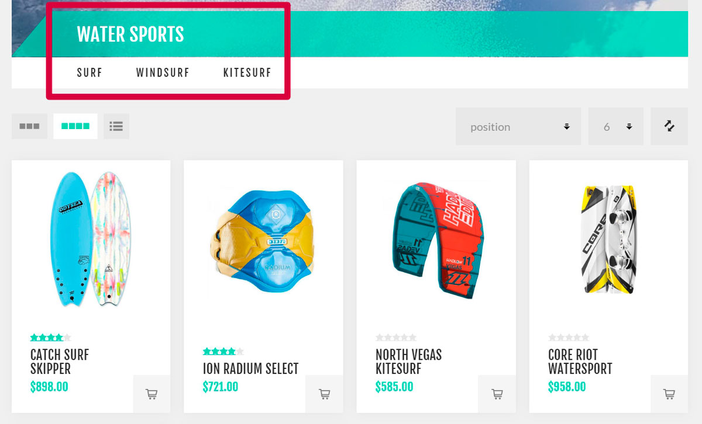
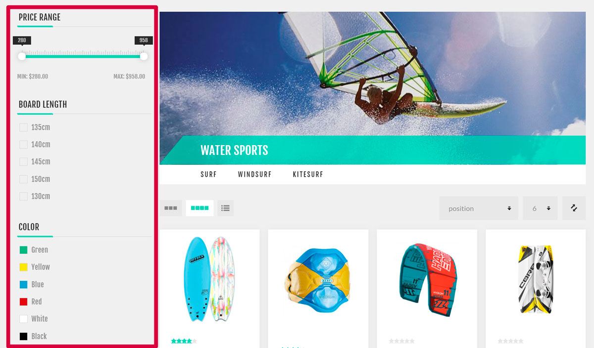

---
title: Catalog
uid: es/running-your-store/catalog/index
author: git.AndreiMaz
contributors: git.exileDev, git.dunaenko, git.IvanIvanIvanov, git.mariannk
---

# Catálogo

Los productos son la base de una tienda en línea, y la gestión de productos es una parte muy importante de su estrategia de gestión de la tienda. La información de los productos ayuda a los clientes a decidir si quieren comprar un artículo o no. Por lo tanto, asegúrese de tener un contenido de calidad de los productos en la tienda, ya que esto genera confianza en sus clientes de que están obteniendo exactamente lo que necesitan y esperan.

Los componentes más importantes de la gestión de productos en nopCommerce son la adición de productos, los fabricantes, la creación de categorías de productos para facilitar la navegación, la adición de buenas descripciones de productos e imágenes atractivas, la lista de todas las variantes posibles de productos, la definición de etiquetas de productos para que la búsqueda de un producto sea rápida y eficaz.

## Un catálogo sobre el ejemplo de una tienda en vivo
En los siguientes ejemplos usaremos nuestra tienda de demostración basada en el "Tema Nop Venture" de Nop-Templates. Por favor, encuentre más información sobre este tema de terceros [aquí](https://www.nopcommerce.com/nop-venture-theme-14-plugins-nop-templatescom).
Para ver la tienda de demostración completa visite el [sitio de demostración](https://frontend.nopcommerce.com/?choosetheme=2). 

Hay algunos consejos que te ayudarán a crear un catálogo bien diseñado para tus clientes.

### Categorías

- Cuando añada categorías a su tienda, asegúrese de que describan claramente los productos (o subcategorías) que contienen. Como en el siguiente ejemplo, la categoría Tableros contiene sólo tableros:
	
	*Crear categorías usando el botón **Agregar nuevo** en la página **Catálogo → Categorías***.

- Use subcategorías cuando necesite separar una categoría general de las específicas. Esto facilita el proceso de búsqueda para sus clientes. Como en el ejemplo a continuación, la categoría de Deportes Acuáticos contiene el Surf, Windsurf y Kitesurf
subcategorías:
	
	*Añade **Categoría de padres** en la página de edición de la categoría para hacerla subcategoría.*

- Añade las categorías más populares al menú superior que está visible en cada página para atraer más clientes:
	Categorías (estático/índice/categorías.jpg)
	*Para hacer esto usa la casilla de verificación **Incluir en el menú superior** en la página de edición de la categoría.*

- Añade las categorías más interesantes a la página de inicio. Estas categorías serán lo primero que vea un cliente cuando visite su tienda:
	
	*Para hacer esto usa la casilla de verificación **Mostrar en la página de inicio** en la página de edición de la categoría.*

- Permita que sus clientes busquen en las categorías usando filtros:
	
	*The filter functionality uses [atributos de especificación](xref:es/runninging-your-store/catalog/products/specification-attributes).*

- Permite a sus clientes clasificar los productos y cambiar el modo de visualización: 
	
	*Para obtener más información sobre la clasificación, visite la sección [Configuración del catálogo - Clasificación de productos](xref:es/running-your-store/catalog/catalog-settings#product-sorting). Utilice los campos **Permitir a los clientes seleccionar el tamaño de la página** y **Opciones de tamaño de la página** de la página de edición de la categoría para configurar el modo de visualización.*

Para aprender a crear una categoría visite el capítulo [Categorías](xref:es/running-your-store/catalog/categories).

## Ver también

* [Categories](xref:es/running-your-store/catalog/categories)
* [Manufacturers](xref:es/running-your-store/catalog/manufacturers)
* [Attributes](xref:es/running-your-store/catalog/products/product-attributes)
* [Products](xref:es/running-your-store/catalog/products/index)
* [Catalog settings](xref:es/running-your-store/catalog/catalog-settings)
