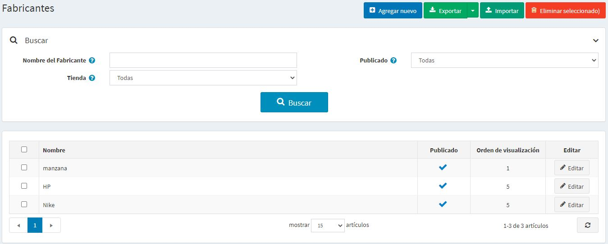
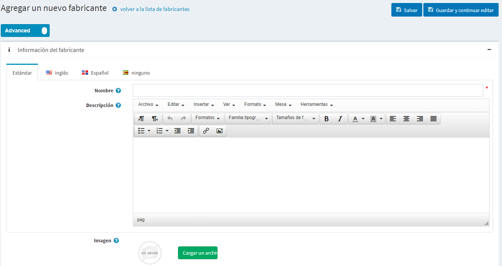
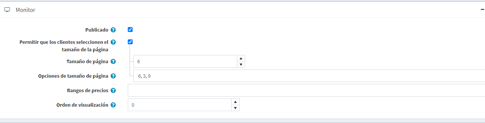
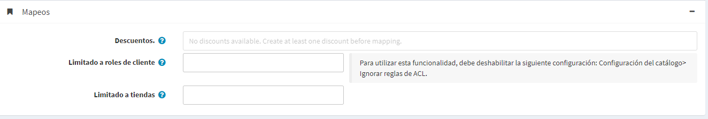

# Fabricantes

Para gestionar los fabricantes ir a **Catálogo → Fabricantes**.

Busque un fabricante en el panel *Búsqueda* introduciendo el **Nombre del fabricante** o una parte del nombre, por la propiedad **Publicada** o entre todos los fabricantes de una determinada **Tienda** (si se habilita más de una tienda).

> [!NOTE]
> 
> Para eliminar los fabricantes de la lista, seleccione los artículos a eliminar y haga clic en el botón **Borrar (seleccionado)**.
> Puede exportar los fabricantes a un archivo externo como copia de seguridad, haciendo clic en el botón **Exportar**. Después de hacer clic en el botón **Exportar** verá el menú desplegable que le permite **Exportar a XML** o **Exportar a Excel**.

## Añadir un nuevo fabricante

Para añadir un nuevo fabricante, haga clic en el botón **Añadir nuevo** en la parte superior de la página. Aparecerá la ventana *Añadir un nuevo fabricante*.

Esta página está disponible en dos modos: **avanzado** y **básico**. Cambie al modo básico que muestra los únicos campos principales o utilice el modo avanzado que muestra todos los campos disponibles.

### Información del fabricante
En el panel de *Información del fabricante*, defina los siguientes detalles:

- **Nombre** - este es el nombre del fabricante que aparece en el catálogo.
- **Descripción** - una descripción del fabricante. Utilice el editor para el diseño y las fuentes.
- **Imagen** - una imagen que represente al fabricante. Cargue la imagen desde su dispositivo.

### Pantalla

En el panel de *Mostrar*, defina los siguientes detalles:

- Seleccione la casilla de verificación **Publicado**, para permitir que el fabricante sea visible en la tienda pública.
- Seleccione la casilla de verificación **Permitir a los clientes seleccionar el tamaño de la página**, para permitir que los clientes seleccionen un tamaño de página, es decir, el número de productos que se muestran en la página de detalles del fabricante. El tamaño de la página puede ser seleccionado por los clientes en la lista de tamaños de página introducida por el propietario de la tienda en el campo **Opciones de tamaño de página**.
	- En la casilla de verificación anterior está marcada la opción **Opciones de tamaño de página**. Introduzca una lista separada por comas de las opciones de tamaño de página (por ejemplo, 10, 5, 15, 20). La primera opción es el tamaño de página predeterminado si no se selecciona ninguna.
- La opción **Tamaño de la página** se muestra si la casilla **Permitir que los clientes seleccionen el tamaño de la página** no está marcada. Establece el tamaño de la página para los productos de este fabricante, por ejemplo, '4' productos por página. 
	> [!TIP]
	> 
	> Por ejemplo, cuando añades siete productos a un fabricante y estableces su tamaño de página en tres. Tres productos por página se mostrarán en esta página de detalles del fabricante en la tienda pública, y la cantidad total de páginas será de tres.

- **Rangos de precios** - permiten definir rangos de precios por los cuales los clientes pueden filtrar los fabricantes. Introduzca un rango de precios en la moneda que definió en la ventana Monedas. Separe los rangos con un punto y coma, por ejemplo, 0-999; 1000-1200; 1201 - (1201 significa 1201 y más).
- **Visualizar orden** - el número de orden para visualizar el fabricante. Este número de visualización se utiliza para clasificar los fabricantes en la tienda pública (ascendente). El fabricante con la orden de exhibición 1 se colocará en la parte superior de la lista.
- El archivo **Plantilla de fabricante** es visible si tiene alguna plantilla de fabricante personalizada instalada en la página **Plantillas del sistema →**. Esta plantilla define cómo se mostrará este fabricante (y sus productos).

### Mapeos

En el panel de *Mappings*, defina los siguientes detalles:

- **Descuentos** - seleccione los descuentos asociados a este fabricante. Puede crear descuentos en la página **Promociones → Descuentos**. Lea más acerca de los descuentos en el capítulo [Discounts](xref:es/running-your-store/promotional-tools/discounts)

    > [!NOTE]
    >
    > Tengan en cuenta que sólo los descuentos con el tipo *asignado a los fabricantes* son visibles aquí. Después de que los descuentos se asignan al fabricante, se aplican a todos los productos de este fabricante.

    > [!NOTE]
    >
    > Si desea utilizar los descuentos asegúrese de que el ajuste **Ignorar descuentos (en todo el sitio)** está desactivado en el panel **Configuración → Ajustes → Ajustes del catálogo → Rendimiento**.

- En el campo **Limitado a los roles de los clientes** elija los roles de los clientes que podrán ver al fabricante en el catálogo. Deje este campo vacío si no se requiere esta opción y el fabricante puede ser visto por todos. 
    > [!NOTE]
    >
    > Para poder utilizar esta función, debe desactivar la siguiente configuración: **Configuración → Configuración del catálogo → Ignorar las reglas de ACL (sitewide)**. Lea más sobre la lista de control de acceso [aquí](xref:es/running-your-store/customer-management/access-control-list).

- Elija las tiendas en el campo **Limitado a las tiendas** si el fabricante se vende en tiendas específicas. Deje el campo vacío en caso de que esta funcionalidad no sea necesaria.
  > [!NOTE]
  >
	> Para poder usar esta función, tienes que desactivar la siguiente configuración: **Catálogo s

- [añadir productos](xref:es/running-your-store/catalog/products/add-products)
- [SEO](xref:es/running-your-store/search-engine-optimization)

## Tutoriales

- [Gestión de fabricantes en nopCommerce](https://www.youtube.com/watch?v=NnWD9-zi8s4&feature=youtu.be)
