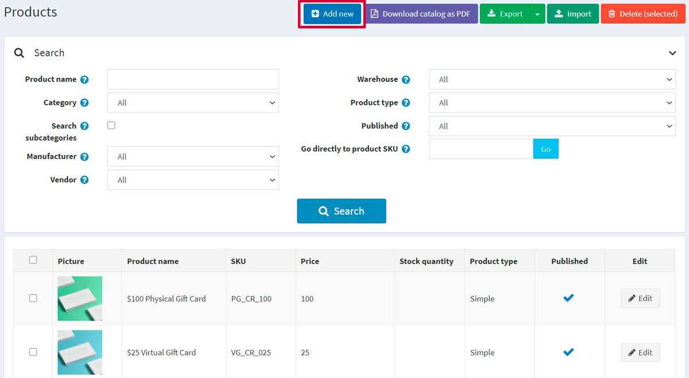
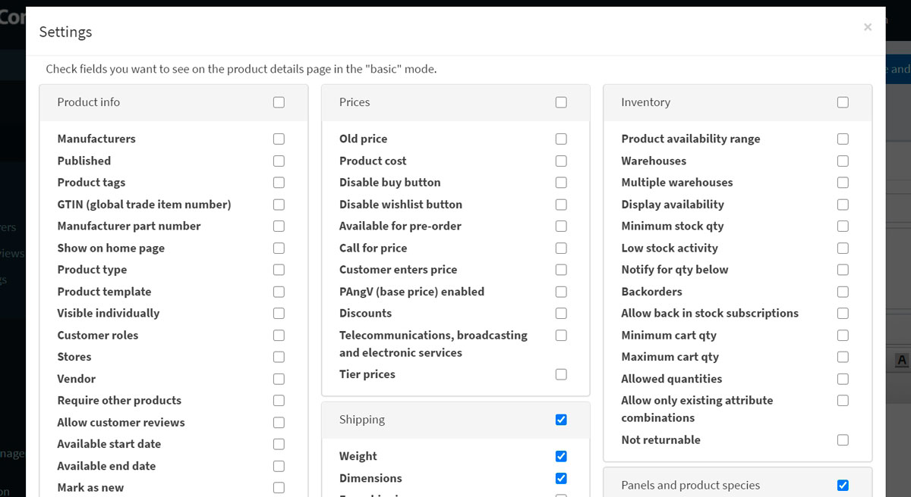
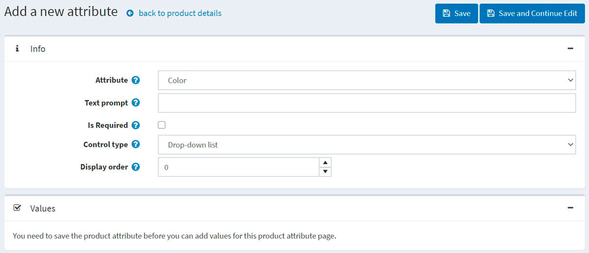

# Añadir productos

Configurar los productos de la mejor manera posible es muy importante para una tienda. Asegúrese de no perder ningún detalle, como mostrar diferentes opciones de tamaño y color, dar una descripción completa del producto, añadir imágenes atractivas, etc.

Para añadir un nuevo producto, vaya a **Catálogo → Productos**. Haz clic en el botón **Añadir nuevo** en la esquina superior derecha.

Traducción realizada con la versión gratuita del traductor www.DeepL.com/Translator

> [!NOTE]
> 
> Puede importar productos desde un archivo externo haciendo clic en el botón **Importar**. Una vez que tenga una lista de productos, puede exportarla a un archivo externo para realizar una copia de seguridad, haciendo clic en el botón **Exportar**. Después de hacer clic en el botón **Exportar** verá el menú desplegable que le permite **Exportar a XML (todos los encontrados)** o **Exportar a XML (seleccionado)** y **Exportar a Excel (todos los encontrados)** o **Exportar a Excel (seleccionado)**. Además, es posible **Descargar el catálogo como PDF** para imprimir los productos seleccionados en un archivo PDF. Para eliminar productos de la lista, seleccione los elementos que desea eliminar y haga clic en el botón **Borrar (seleccionado)**.

La página **Añadir un nuevo producto* está disponible en dos modos: **avanzado** y **básico** (en modo avanzado por defecto). Puede cambiar al modo básico que muestra los únicos campos obligatorios.

También puede configurar el modo *básico* para elegir qué campos exactamente quiere que sean obligatorios. Para ello, haga clic en el botón **Configuración** situado al lado del swith. Aparecerá la ventana emergente *Configuración*, como se indica a continuación:

Tick the needed fields and click **Save**. Note that the page will be refreshed in this case.

## Información del producto

Comience por rellenar la información general en el panel *Información del producto*:

- Introduzca el **nombre del producto**.
- Introduzca la **descripción corta** del producto que se mostrará en el catálogo.
- Introduzca la **descripción completa** del producto que se mostrará en la página de detalles del producto. Aquí puede añadir texto, viñetas, enlaces o imágenes adicionales. Asegúrese de escribir una descripción detallada, ya que afecta a la toma de decisiones de sus compradores.
- Introduzca el **SKU** del producto. Esta es la unidad de mantenimiento de stock del producto, utilizada internamente para el seguimiento del producto. Este es su ID único interno utilizado para el seguimiento de este producto.

Traducción realizada con la versión gratuita del traductor www.DeepL.com/Translator
- **Categories**. You can assign a product to as many categories as you want. You can manage [product categories](xref:es/running-your-store/catalog/categories) in **Catalog → Categories**.

- **Fabricantes**. Puede asignar un producto a tantos fabricantes como desee. Puede gestionar [manufacturers](xref:es/running-your-store/catalog/manufacturers) in **Catalog → Manufacturers**.

- Marque **Publicado**, para que el producto sea visible en su tienda.
- Introduzca las **etiquetas del producto**, las palabras clave para la identificación del producto. Introduzca las etiquetas separándolas por comas. Cuantos más productos estén asociados a una etiqueta concreta, más grande será su aspecto en la nube de *Etiquetas populares*, que se muestra en la barra lateral de la página del catálogo. Read more how to manage product tags in the [Product tags](xref:es/running-your-store/catalog/products/product-tags) section.
  
  

- Introduzca el **GTIN (número de artículo comercial global)**. Estos identificadores incluyen UPC (en Norteamérica), EAN (en Europa), JAN (en Japón) e ISBN (para libros).
- Introduzca el **número de pieza del fabricante**. Es un número de pieza proporcionado por el fabricante para el producto.
- Marque la casilla **Mostrar en la página de inicio** para mostrar este producto en la página de inicio de su tienda. Recomendado para sus productos más populares. Si esta casilla está marcada, el propietario de la tienda también puede especificar el **Orden de visualización** del producto. El 1 representa la parte superior de la lista.
- Configure el **tipo de producto** como *Simple* o *Agrupado*. Lea más sobre los tipos de producto en el capítulo [Productos agrupados (variantes)](xref:es/running-your-store/catalog/products/grouped-products-variants).
- El campo **Plantilla de producto** es visible si tiene alguna plantilla de producto personalizada instalada en la página **Sistema → Plantillas**.
- Marque **Visible individualmente** si desea que el producto aparezca en el catálogo o en los resultados de la búsqueda; de lo contrario, el producto estará oculto en el catálogo y sólo será accesible desde una página de detalles de productos agrupados.
- Elija **Roles de los clientes** que podrán ver el producto en el catálogo. Deje este campo vacío si esta opción no es necesaria y el producto puede ser visto por todos. 
    > [!NOTE]
    >
    > Para utilizar esta funcionalidad, debe desactivar la siguiente configuración: **Configuración → Configuración del catálogo → Ignorar reglas ACL (sitewide)**. Más información sobre la lista de control de acceso [here](xref:es/running-your-store/customer-management/access-control-list).
- Elija las tiendas en el campo **Limitado a tiendas** si el producto se vende en tiendas específicas. Deje el campo vacío en caso de que esta funcionalidad no sea necesaria.
  > [!NOTE]
  >
	> Para poder utilizar esta funcionalidad, debe desactivar la siguiente configuración: **Configuración del catálogo → Ignorar reglas de "límite por tienda" (en todo el sitio)**. Más información sobre la funcionalidad multitienda [here](xref:es/getting-started/advanced-configuration/multi-store).

- **Vendedor**. Puede gestionar [vendedores](xref:es/running-your-store/vendor-management) en **Customers → Vendors**. en **Clientes → Vendedores**.
- Defina si el producto **Requiere otros productos**. En este caso seleccione los **Identificadores de productos requeridos** introduciéndolos separados por coma, asegúrese de que no hay referencias circulares, por ejemplo, A requiere B, B requiere A. Elija **Añadir automáticamente estos productos al carrito** si es necesario.
- Marque **Permitir comentarios de los clientes**, para permitir que los clientes revisen este producto.
- Definir **Fecha de inicio disponible** y/o **Fecha de finalización disponible** de la disponibilidad del producto.
- Marque **Marcar como nuevo**, para marcar el producto como recientemente añadido. De este modo, podrá gestionar la lista de productos que se muestran en la página "Nuevos productos". También puede especificar un periodo durante el cual este producto se marcará como nuevo utilizando los campos **Mark as new. Fecha de inicio** y **Marca como nuevo. Fecha de finalización**.
- En el campo **Comentario del administrador** introduzca un comentario a título informativo. Este comentario es sólo para uso interno, no es visible para los clientes.

## Pricio

En el panel *Precios* defina:

- **Price**, in a predefined currency.
    > [!NOTE]
    >
    > Puede cambiar la moneda de la tienda en **Configuración → Monedas**. Más información sobre las divisas [aquí](xref:es/getting-started/configure-payments/advanced-configuration/currencies).

- Precio antiguo**. Si es mayor que cero, se hace visible en la tienda pública y se muestra junto al nuevo precio a efectos de comparación.
- Coste del producto**, la suma de todos los costes asociados a la producción del producto o servicio. No se muestra a los clientes.
- Desactivar el botón de compra**. Esto puede ser útil para los productos "bajo pedido".
- Para **Desactivar el botón de la lista de deseos**.
- **Disponible para pre-pedido** si el producto aún no está en la tienda, pero quiere que los clientes puedan pedirlo. El botón *Prepedido* se mostrará para reemplazar el botón estándar *Añadir al carrito* en la tienda pública. Cuando se selecciona esta opción, se muestra el campo **Fecha de inicio de la disponibilidad del pedido**. Introduzca la fecha de inicio de disponibilidad del producto en UTC. El botón *Prepedido* cambiará a *Añadir a la cesta* cuando se alcance esta fecha.
- **Llamar al precio**, para mostrar *Llamar al precio* o *Llamar al presupuesto* en lugar del precio en la página de detalles del producto en la tienda pública. Esto puede ayudarle a establecer un contacto con sus clientes y proporcionarles información adicional sobre el producto en el que están interesados.
- **El cliente introduce el precio**, para indicar que el cliente debe introducir el precio. Cuando se selecciona, se muestran los siguientes campos:
  - En el campo **Importe mínimo**, introduzca el importe mínimo del precio.
  - En el campo **Importe máximo**, introduzca el importe máximo del precio.
- **PAngV (precio base) activado**, si el producto tiene un precio base. Esto es necesario según la ley alemana (PAngV). Por ejemplo, si vende 500ml de cerveza por 1,50 euros, tiene que mostrar el precio base: 3,00 euros por 1L. Cuando se selecciona, se muestran los siguientes campos:
  - **Cantidad en el producto** - cantidad del producto que se vende.
  - **Unidad de producto** - medida de un valor previamente introducido.
  - **Importe de referencia** - importe base.
  - **Unidad de referencia** - medida de un valor introducido previamente.
- **Discounts**. Aprenda a configurar los descuentos [here](xref:es/running-your-store/promotional-tools/discounts).
    > [!NOTE]
    >
    > Si desea utilizar descuentos, asegúrese de que el ajuste **Ignorar descuentos (en todo el sitio)** esté desactivado en el panel **Configuración → Ajustes → Ajustes del catálogo → Rendimiento**.

- Si el producto está exento de impuestos, marcando **Exento de impuestos**. De lo contrario, en la lista desplegable **Categoría fiscal**, seleccione la clasificación fiscal necesaria para este producto. Las categorías fiscales pueden ser configuradas por el propietario de la tienda en **Configuración → Impuestos → Categorías fiscales**.
- El producto como **Telecomunicaciones, radiodifusión y servicios electrónicos**, para aplicar las normas fiscales especiales utilizadas en la Unión Europea.
- Set up [tier prices](xref:es/running-your-store/promotional-tools/tier-prices) si es necesario.

## Envío

Defina los detalles de envío específicos del producto en el panel *Envío*.:

- Marque **Envío habilitado** si el producto puede ser enviado. La sección se expande para obtener más detalles.
- Establezca los parámetros del producto que se utilizarán para el cálculo del envío: **Peso, Longitud, Anchura, Altura**. 
    > [!NOTE]
    >
    > Puede cambiar las medidas predefinidas en **Configuración → Envío → Medidas**.

- **Envío gratuito** si el producto se envía de forma gratuita.
- **Enviar por separado** si el producto debe enviarse por separado de otros productos. Si el pedido incluye varios artículos del producto, todos ellos se enviarán por separado.
- **Gastos de envío adicionales**.
- **Fecha de entrega** que se mostrará en la tienda pública.
    > [!NOTE]
    >
    > Puede gestionar las opciones de fecha de entrega en **Configuración → Envío → Fechas de entrega.**.

> [!NOTE]
> 
> Hay **Estimación de envío habilitada (página de producto)** ajuste que puede ser activado en **Configuración → Ajustes → Ajustes de envío.**. 
> Esta configuración permite mostrar la información de envío estimada basada en la dirección de envío del cliente en una ventana emergente en la página de detalles del producto.

## Inventario

Define the inventory setup for the product as described [here](xref:es/running-your-store/order-management/inventory-management).

## Pictures

En el panel *Imágenes* puede añadir las imágenes del producto.

- En el área *Añadir una nueva imagen*, haz clic en **Cargar un archivo** para seleccionar una nueva imagen que quieras subir a tu página de producto.
- En el campo **Alt**, introduzca un valor para el atributo "alt" del elemento HTML "img". Si está vacío, se utilizará una regla por defecto (por ejemplo, el nombre del producto).
- En el campo **Title**, introduzca un valor para el atributo "title" del elemento HTML "img". Si está vacío, se utilizará una regla por defecto (por ejemplo, el nombre del producto).
- Defina el **Orden de visualización** de la imagen en una página de producto. El 1 representa la parte superior de la lista.

Haga clic en **Añadir imagen del producto** para guardar la imagen.

> [!TIP]
> 
> [Tutorial de YouTube: Importación de imágenes de productos en masa](https://www.youtube.com/watch?v=9BUqR_OGiq4)

## Atributos del producto 

En el panel *Atributos del producto* puede añadir atributos del producto. Más información sobre los atributos de los productos y cómo crearlos [here](xref:es/running-your-store/catalog/products/product-attributes). 

### Añadir un nuevo atributo

Una vez que tenga una lista de los atributos creados, haga clic en **Añadir un nuevo atributo** en la pestaña *Atributos*. Aparecerá la ventana *Añadir un nuevo atributo*, como se indica a continuación:

Configure un nuevo atributo:

- En la lista desplegable **Atributo** seleccione un atributo.
- Rellene el campo **Pregunta de texto**, si desea que se muestre algún texto delante de este atributo en la tienda pública.
- Marque **Es obligatorio** para establecer este atributo como obligatorio para los clientes.
- Defina el **tipo de control** para este atributo (por ejemplo, lista desplegable, lista de botones de radio, etc.).
    > [!NOTE]
    > 
    > Para el tipo de control "Seleccionador de fechas", es posible establecer un número de años a mostrar utilizando el parámetro **catalogsettings.countdisplayedyearsdatepicker** en la página *Todos los ajustes (avanzados)*. Por ejemplo, si establece cero, sólo se mostrará el año actual. Si establece 5, se mostrarán el año actual y los 5 años siguientes. Lea cómo configurar esto en la página [Todos los ajustes](xref:es/getting-started/advanced-configuration/all-settings) page. 

- Define el **Orden de visualización** del atributo en una página de producto. El 1 representa la parte superior de la lista.

Haga clic en **Guardar y continuar la edición**.
El panel **Valores** muestra ahora los valores predefinidos para este atributo. Haga clic en **Editar** en la fila de valores si es necesario.

### Editar el valor de un atributo

Edite los detalles del valor del atributo, como sigue:

- Seleccione el **Tipo de valor del atributo**. Hay dos tipos de valores de atributos, *Simple* y *Asociado a producto*. Elija el tipo *asociado al producto* si quiere que este valor de atributo sea otro producto de su catálogo y que también haga un seguimiento de su stock. Aquí puede utilizar la funcionalidad de *productos agrupados* que permite a los clientes comprar diferentes combinaciones o conjuntos de productos como un único producto y los compradores tienen la oportunidad de establecer la cantidad requerida de los atributos utilizando el campo **El cliente introduce la cantidad** que se describe a continuación.

Si la configuración anterior se establece en *Asociado al producto* se mostrarán los siguientes campos:
- **Producto asociado** permite elegir el producto que se asociará a este atributo. Utilice el botón **Asociar un producto** para elegir un producto.

> [!NOTE]
>
> Asegúrese de que no hay ninguna advertencia después de elegir el producto asociado. Por ejemplo:
> 

- Marque el campo **El cliente introduce la cantidad** para que el cliente pueda introducir la cantidad del atributo (que representa el producto asociado).
- Si el campo anterior no está marcado, puede especificar la **cantidad del producto**. El valor mínimo permitido es 1.
- Introduzca el **Nombre** del atributo.
- Especifique el **color RGB** que se utilizará con el control del atributo Cuadros de color.
- En el campo **Ajuste del precio** introduzca el precio que se aplica al elegir el valor de este atributo. Por ejemplo '10' para añadir 10 dólares. O 10% si **Ajuste de precio. Usar porcentaje** está marcado.
- Marque la casilla **Ajuste de precio. Usar porcentaje** que determina si se aplica un porcentaje al producto. Si no se activa, se utiliza un valor fijo.
- Utilice el campo **Ajuste de peso** para especificar el ajuste de peso que se aplica al elegir el valor de este atributo.
- Especifique el campo **Coste**. El coste del valor del atributo es el coste de todos los diferentes componentes que conforman este valor. Puede ser el precio de compra si los componentes se compran a proveedores externos, o el coste combinado de los materiales y los procesos de fabricación si el componente es de fabricación propia.
- Marque el campo **Es preseleccionado** si este valor de atributo debe ser preseleccionado para el cliente.
- Introduzca el **Orden de presentación** del valor del atributo. El 1 representa el primer elemento de la lista de valores de atributos.
- Elija una **Imagen** asociada a este valor de atributo. Esta imagen reemplazará la imagen principal del producto cuando se haga clic en este valor de atributo del producto (seleccionado).

Click **Save**.

### Condiciones del atributo

Si es necesario, defina condiciones para este atributo en el panel *Condición*. Los atributos condicionales aparecen si se selecciona un atributo anterior, como tener una opción para personalizar la ropa con un nombre y sólo proporcionar el cuadro de entrada de texto si el botón de opción "Personalizar" está marcado.

- Marque la casilla **Habilitar condición** para activar la condición.
- Seleccione el **Atributo** y su valor. Cuando se selecciona el valor, la condición se cumple. Se mostrará el atributo para el que ha añadido esta condición.

### Combinaciones de atributos

En la pestaña *Combinaciones de atributos*, defina diferentes combinaciones de atributos y la siguiente información para cada una de ellas:

Haga clic en el botón **Añadir combinación** para seleccionar una nueva combinación e introducir sus datos:

Para cada combinación definir:

- Los atributos que contiene la combinación.
- La **cantidad de stock** actual de esta combinación.
- **Permitir fuera de stock**, si quiere que sus clientes puedan comprar productos con ciertos atributos, cuando estén fuera de stock.
- **SKU**.
- **Número de pieza del fabricante**.
- **GTIN**.
- Precio anulado**, si el precio de los productos con ciertos atributos es diferente del precio normal del producto. Por ejemplo, puede dar un descuento de esta manera. Dejar vacío para ignorar el campo.
  > [!NOTE]
  >
  > Todos los demás descuentos aplicados serán ignorados cuando se especifique este campo.
- En el campo **Notificar al administrador por cantidad** introduzca la cantidad por la que se notificará al administrador.
- Elija una **Imagen** asociada a esta combinación de atributos. Esta imagen sustituirá a la imagen principal del producto cuando se seleccione esta combinación de atributos.

Haga clic en **Guardar**.

> [!NOTE]
>
> Tenga en cuenta que algunos tipos de control de atributos que admiten entradas personalizadas del usuario (por ejemplo, carga de archivos, cuadros de texto, selector de fecha) son inútiles con las combinaciones de atributos.

Para generar todas las combinaciones posibles utilice el botón **Generar todas las combinaciones posibles**. O utilice el botón **Generar varias combinaciones** para elegir manualmente algunos valores de atributos para generar las combinaciones necesarias.

## Atributos de especificación

Los atributos de especificación son las características del producto, es decir, el tamaño de la pantalla, el número de puertos USB visibles en la página de detalles del producto. Los atributos de especificación pueden utilizarse para filtrar productos en la página de detalles de la categoría. Más información sobre los atributos de especificación [here](xref:es/running-your-store/catalog/products/specification-attributes).

> [!NOTE]
>
> A diferencia de los atributos de los productos, los atributos de las especificaciones se utilizan únicamente con fines informativos.

In the *Specification attributes* panel, add specification attributes.

>[!NOTE]
>
> Puede añadir un atributo para su producto utilizando la lista de atributos existente, o si necesita crear uno nuevo vaya a **Catálogo → Atributos → Atributos de especificación**.

 Para añadir un nuevo atributo, haga clic en el botón **Añadir atributo** y rellene la sección *Añadir un nuevo atributo de especificación del producto*:

**Añadir un nuevo atributo de especificación**(_static/add-product-for-beginners/add_a_new_specification_attribute2.png)

- Seleccione el **tipo de atributo** de una lista desplegable.
- Elegir el **Atributo** de la lista de los atributos precreados.
- Elegir la **opción de atributo**.
- Permitir el filtrado** por esta opción en una página de categoría, si es necesario.
- Marque **Mostrar en la página del producto**, para que el atributo sea visible en una página de producto.
- Establezca el atributo **Orden de visualización**. 1 representa la parte superior de la lista.

Click **Save**.

## Clase de producto

Define si el producto es un

- [Tarjeta regalo](xref:es/running-your-store/promotional-tools/gift-cards)
- [Producto descargable](xref:es/running-your-store/catalog/products/downloadable-products)
- [Producto descargable](xref:es/running-your-store/catalog/products/rental-products)
- [Producto recurrente](xref:es/running-your-store/catalog/products/recurring-products)

## SEO

Defina los siguientes parámetros SEO para la página del producto:

- **Nombre de la página amigable para los motores de búsqueda** - un nombre de la página utilizado por los motores de búsqueda. Si no introduce nada, la URL de la página del producto se formará utilizando el nombre del producto. Si introduce custom-seo-page-name, entonces se utilizará la siguiente URL personalizada: `http://www.yourStore.com/custom-seo-page-name`.
- **Meta title** - un título para la página web.
- **Palabras clave meta** - una lista breve y concisa de los temas más importantes (palabras y frases clave) relacionados con el producto. Estas palabras se añadirán a la cabecera de la página del producto.
- **Descripción meta** - una breve descripción del producto que se añadirá a la cabecera de la página del producto.

Más información sobre SEO [here](xref:es/running-your-store/search-engine-optimization).

## Productos relacionados y ventas cruzadas

Configure los productos relacionados y las ventas cruzadas como se describe [here](xref:es/running-your-store/promotional-tools/cross-sells-and-related-products).

## Comprado con pedidos

Para ver una lista de los pedidos en los que se compró el producto, vaya al panel *Comprado con pedidos*. Aquí puede comprobar el estado de un pedido y ver los detalles del mismo.

## Historial de la cantidad de existencias

En esta pestaña puede ver todos los cambios de cantidad de producto, los pedidos con el producto.

## Configuración de la página del producto

Las siguientes secciones describen la configuración de la página del producto: [Product fields](xref:es/running-your-store/catalog/catalog-settings#product-fields), [Product page](xref:es/running-your-store/catalog/catalog-settings#product-page) and [Share](xref:es/running-your-store/catalog/catalog-settings#share).

## Ver también

- [Categorías de productos](xref:es/running-your-store/catalog/categories)
- [Fabricantes de productos](xref:es/running-your-store/catalog/manufacturers)
- [Gestión de pedidos](xref:es/running-your-store/order-management/index)
- [Webinar. Primeros pasos en nopCommerce](https://www.youtube.com/watch?v=B_CfgJH0ylM&list=PLnL_aDfmRHwsJn1rnKaXdIcJg4pKJeeXs)

## Tutoriales

- [Video tutorial: Añadir un nuevo producto](https://www.youtube.com/watch?v=wVgTgdQVWPQ&index=2&list=PLnL_aDfmRHwsbhj621A-RFb1KnzeFxYz4)
