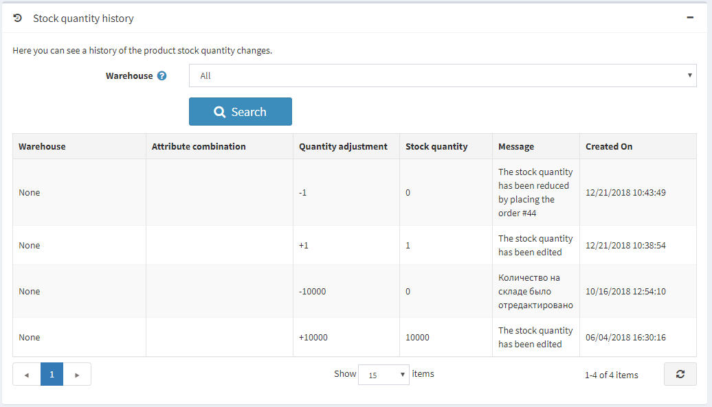

# Añadir productos

Configurar los productos de la mejor manera posible es muy importante para una tienda. Asegúrese de no perder ningún detalle, como mostrar diferentes opciones de tamaño y color, dar una descripción completa del producto, añadir imágenes atractivas, etc.

Para añadir un nuevo producto, vaya a **Catálogo → Productos**. Haz clic en el botón **Añadir nuevo** en la esquina superior derecha.

Traducción realizada con la versión gratuita del traductor www.DeepL.com/Translator

> [!NOTE]
> 
> Puede importar productos desde un archivo externo haciendo clic en el botón **Importar**. Una vez que tenga una lista de productos, puede exportarla a un archivo externo para realizar una copia de seguridad, haciendo clic en el botón **Exportar**. Después de hacer clic en el botón **Exportar** verá el menú desplegable que le permite **Exportar a XML (todos los encontrados)** o **Exportar a XML (seleccionado)** y **Exportar a Excel (todos los encontrados)** o **Exportar a Excel (seleccionado)**. Además, es posible **Descargar el catálogo como PDF** para imprimir los productos seleccionados en un archivo PDF. Para eliminar productos de la lista, seleccione los elementos que desea eliminar y haga clic en el botón **Borrar (seleccionado)**.

La página **Añadir un nuevo producto* está disponible en dos modos: **avanzado** y **básico** (en modo avanzado por defecto). Puede cambiar al modo básico que muestra los únicos campos obligatorios.

También puede configurar el modo *básico* para elegir qué campos exactamente quiere que sean obligatorios. Para ello, haga clic en el botón **Configuración** situado al lado del swith. Aparecerá la ventana emergente *Configuración*, como se indica a continuación:

Tick the needed fields and click **Save**. Note that the page will be refreshed in this case.

## Información del producto

Comience por rellenar la información general en el panel *Información del producto*:

- Introduzca el **nombre del producto**.
- Introduzca la **descripción corta** del producto que se mostrará en el catálogo.
- Introduzca la **descripción completa** del producto que se mostrará en la página de detalles del producto. Aquí puede añadir texto, viñetas, enlaces o imágenes adicionales. Asegúrese de escribir una descripción detallada, ya que afecta a la toma de decisiones de sus compradores.
- Introduzca el **SKU** del producto. Esta es la unidad de mantenimiento de stock del producto, utilizada internamente para el seguimiento del producto. Este es su ID único interno utilizado para el seguimiento de este producto.

Traducción realizada con la versión gratuita del traductor www.DeepL.com/Translator
- **Categories**. You can assign a product to as many categories as you want. You can manage [product categories](xref:es/running-your-store/catalog/categories) in **Catalog → Categories**.

- **Fabricantes**. Puede asignar un producto a tantos fabricantes como desee. Puede gestionar [manufacturers](xref:es/running-your-store/catalog/manufacturers) in **Catalog → Manufacturers**.

- Marque **Publicado**, para que el producto sea visible en su tienda.
- Introduzca las **etiquetas del producto**, las palabras clave para la identificación del producto. Introduzca las etiquetas separándolas por comas. Cuantos más productos estén asociados a una etiqueta concreta, más grande será su aspecto en la nube de *Etiquetas populares*, que se muestra en la barra lateral de la página del catálogo. Read more how to manage product tags in the [Product tags](xref:es/running-your-store/catalog/products/product-tags) section.
  
  

- Introduzca el **GTIN (número de artículo comercial global)**. Estos identificadores incluyen UPC (en Norteamérica), EAN (en Europa), JAN (en Japón) e ISBN (para libros).
- Introduzca el **número de pieza del fabricante**. Es un número de pieza proporcionado por el fabricante para el producto.
- Marque la casilla **Mostrar en la página de inicio** para mostrar este producto en la página de inicio de su tienda. Recomendado para sus productos más populares. Si esta casilla está marcada, el propietario de la tienda también puede especificar el **Orden de visualización** del producto. El 1 representa la parte superior de la lista.
- Configure el **tipo de producto** como *Simple* o *Agrupado*. Lea más sobre los tipos de producto en el capítulo [Productos agrupados (variantes)](xref:es/running-your-store/catalog/products/grouped-products-variants).
- El campo **Plantilla de producto** es visible si tiene alguna plantilla de producto personalizada instalada en la página **Sistema → Plantillas**.
- Marque **Visible individualmente** si desea que el producto aparezca en el catálogo o en los resultados de la búsqueda; de lo contrario, el producto estará oculto en el catálogo y sólo será accesible desde una página de detalles de productos agrupados.
- Elija **Roles de los clientes** que podrán ver el producto en el catálogo. Deje este campo vacío si esta opción no es necesaria y el producto puede ser visto por todos. 
    > [!NOTE]
    >
    > Para utilizar esta funcionalidad, debe desactivar la siguiente configuración: **Configuración → Configuración del catálogo → Ignorar reglas ACL (sitewide)**. Más información sobre la lista de control de acceso [here](xref:es/running-your-store/customer-management/access-control-list).
- Elija las tiendas en el campo **Limitado a tiendas** si el producto se vende en tiendas específicas. Deje el campo vacío en caso de que esta funcionalidad no sea necesaria.
  > [!NOTE]
  >
	> Para poder utilizar esta funcionalidad, debe desactivar la siguiente configuración: **Configuración del catálogo → Ignorar reglas de "límite por tienda" (en todo el sitio)**. Más información sobre la funcionalidad multitienda [here](xref:es/getting-started/advanced-configuration/multi-store).

- **Vendedor**. Puede gestionar [vendedores](xref:es/running-your-store/vendor-management) in **Customers → Vendors**. en **Clientes → Vendedores**.
- Defina si el producto **Requiere otros productos**. En este caso seleccione los **Identificadores de productos requeridos** introduciéndolos separados por coma, asegúrese de que no hay referencias circulares, por ejemplo, A requiere B, B requiere A. Elija **Añadir automáticamente estos productos al carrito** si es necesario.
- Marque **Permitir comentarios de los clientes**, para permitir que los clientes revisen este producto.
- Definir **Fecha de inicio disponible** y/o **Fecha de finalización disponible** de la disponibilidad del producto.
- Marque **Marcar como nuevo**, para marcar el producto como recientemente añadido. De este modo, podrá gestionar la lista de productos que se muestran en la página "Nuevos productos". También puede especificar un periodo durante el cual este producto se marcará como nuevo utilizando los campos **Mark as new. Fecha de inicio** y **Marca como nuevo. Fecha de finalización**.
- En el campo **Comentario del administrador** introduzca un comentario a título informativo. Este comentario es sólo para uso interno, no es visible para los clientes.

## Pricio

En el panel *Precios* defina:

- **Price**, in a predefined currency.
    > [!NOTE]
    >
    > You can change the store currency in **Configuration → Currencies**. Read more about currencies [here](xref:es/getting-started/configure-payments/advanced-configuration/currencies).

- **Old price**. If it is larger than zero it becomes visible in the public store and is displayed beside the new price for comparison purposes.
- **Product cost**, the sum of all costs associated with the production of the product or service. This is not displayed to customers.
- To **Disable buy button**. This can be useful for products "upon request".
- To **Disable wishlist button**.
- **Available for pre-order** if the product is not in the store yet, but you want the customers to be able to order it. The *Pre-order* button will be displayed to replace the standard *Add to cart* button in the public store. When this option is selected, the **Pre-order availability start date** field is displayed. Enter the availability start date of the product in UTC. The *Pre-order* button will be changed to *Add to cart* when this date is reached.
- **Call for price**, to show *Call for pricing* or *Call for quote* instead of the price on the product details page in the public store. This can help you to establish a contact with your customers and provide with additional information about the product they are interested in.
- **Customer enters price**, to indicate that a customer must enter the price. When selected, the following fields are displayed:
  - In the **Minimum amount** field, enter the minimum amount for the price.
  - In the **Maximum amount** field, enter the maximum amount for the price.
- **PAngV (base price) enabled**, if the product has a base price. This is required according to the German law (PAngV). For example, if you sell 500ml of beer for 1,50 euro, you have to show the base price: 3.00 euro per 1L. When selected, the following fields are displayed:
  - **Amount in product** - amount of the product that is being sold.
  - **Unit of product** - measure of a previously entered value.
  - **Reference amount** - the base amount.
  - **Reference unit** - measure of a previously entered value.
- **Discounts**. Learn how to set up discounts [here](xref:es/running-your-store/promotional-tools/discounts).
    > [!NOTE]
    >
    > If you want to use discounts make sure the **Ignore discounts (sitewide)** setting is disabled in the **Configuration → Settings → Catalog settings → Performance** panel.

- Whether the product is exempted from tax, by ticking **Tax exempt**. Otherwise, from the **Tax category** dropdown list, select the required tax classification for this product. Tax categories can be configured by the store owner in  the **Configuration → Tax → Tax categories**.
- The product as **Telecommunications, broadcasting, and electronic services**, to apply special tax rules used in the European Union.
- Set up [tier prices](xref:es/running-your-store/promotional-tools/tier-prices) if required.

## Shipping

Define product-specific shipping details in the *Shipping* panel:

- Tick **Shipping enabled** if the product can be shipped. The section then expands for more details.
- Set the product parameters which will be used for the shipping calculation: **Weight, Length, Width, Height**. 
    > [!NOTE]
    >
    > You can change predefined measures in **Configuration → Shipping → Measures**.

- **Free shipping** if the product is shipped for free.
- **Ship separately** if the product should be shipped separately from other products. If the order includes several items of the product, all of them will be shipped separately.
- **Additional shipping charge**.
- **Delivery date** which will be displayed in the public store.
    > [!NOTE]
    >
    > You can manage delivery date options in **Configuration → Shipping → Delivery dates**.

> [!NOTE]
> 
> There is **Estimate shipping enabled (product page)** setting which can be enabled on **Configuration → Settings → Shipping ajustes**. 
> Esta configuración permite mostrar la información de envío estimada basada en la dirección de envío del cliente en una ventana emergente en la página de detalles del producto.

## Inventory

Definir la configuración del inventario para el producto como se describe [here](xref:es/running-your-store/order-management/inventory-management).

## Pictures

En el panel *Imágenes* puede añadir las imágenes del producto.

- En el área *Añadir una nueva imagen*, haz clic en **Cargar un archivo** para seleccionar una nueva imagen que quieras subir a tu página de producto.
- En el campo **Alt**, introduzca un valor para el atributo "alt" del elemento HTML "img". Si está vacío, se utilizará una regla por defecto (por ejemplo, el nombre del producto).
- En el campo **Title**, introduzca un valor para el atributo "title" del elemento HTML "img". Si está vacío, se utilizará una regla por defecto (por ejemplo, el nombre del producto).
- Defina el **Orden de visualización** de la imagen en una página de producto. El 1 representa la parte superior de la lista.

Haga clic en **Añadir imagen del producto** para guardar la imagen.

> [!TIP]
> 
> [YouTube tutorial: Importing mass product images](https://www.youtube.com/watch?v=9BUqR_OGiq4)

## Product attributes 

In the *Product attributes* panel you can add product attributes. Learn more about product attributes and how to create them [here](xref:es/running-your-store/catalog/products/product-attributes). 

### Add a new attribute

Once you have a list of the attributes created, click **Add a new attribute** on the *Attributes* tab. The *Add a new attribute* window is displayed, as follows:

Set up a new attribute:

- From the **Attribute** dropdown list select an attribute.
- Fill the **Text prompt** field, if you want some text to be shown in front of this attribute in the public store.
- Tick **Is required** to set this attribute as required for customers.
- Define the **Control type** for this attribute (e.g. dropdown list, radio button list, etc.).
    > [!NOTE]
    > 
    > For the "Date picker" control type, it is possible to set a number of years to be displayed by using **catalogsettings.countdisplayedyearsdatepicker** parameter on the *All settings (advanced)* page. For example, if you set zero then only current year will be displayed. If you set 5 then current year and the next 5 years will be displayed. Read how to set this up on the [All settings](xref:es/getting-started/advanced-configuration/all-settings) page. 

- Define the **Display order** of the attribute on a product page. 1 represents the top of the list.

Click **Save and continue edit**.
The **Values** panel now displays the predefined values for this attribute. Click **Edit** in the value row if required.

### Edit an attribute value

Edit the attribute value details, as follows:

- Select the **Attribute value type**. There are two attribute value types, *Simple* and *Associated to product*. Choose the *associated to product* type if you want this attribute value to be another product from your catalog and track its stock as well. Here you can use *bundled products functionality* allowing customers to buy different combinations or sets of products as a single product and shoppers have an opportunity to set the required quantity of the attributes using the **Customer enters quantity** field described below.

If the previous setting set to *Associated to product* the following fields will be displayed:
- **Associated product** allows you to choose the product which will be assotiated to this attribute. Use the **Associate a product** button to choose a product.

> [!NOTE]
>
> Make sure there is no any warning after you chose the associated product. Such as:
> 

- Tick the **Customer enters quantity** field to allow a customer to enter the quantity of the attribute (which represents the associated product).
- If the previous field in unticked you can specify the **Product quantity**. Minimum allowed value is 1.
- Enter the **Name** of the attribute.
- Specify the **RGB color** to be used with the color squares attribute control.
- In the **Price adjustment** field enter the price applied when choosing this attribute value. For example '10' to add 10 dollars. Or 10% if **Price adjustment. Use percentage** is ticked.
- Tick the **Price adjustment. Use percentage** which determines whether to apply a percentage to the product. If not enabled, a fixed value is used.
- Use the **Weight adjustment** field to specify the weight adjustment applied when choosing this attribute value.
- Specify the **Cost** field. The attribute value cost is the cost of all the different components which make up this value. This may be either the purchase price if the components are bought from outside suppliers, or the combined cost of materials and manufacturing processes if the component is made in-house.
- Tick the **Is pre-selected** field if this attribute value should be pre-selected for the customer.
- Enter the **Display order** of the attribute value. 1 represents the first item in attribute value list.
- Choose a **Picture** associated to this attribute value. This picture will replace the main product image when this product attribute value is clicked (selected).

Click **Save**.

### Attribute conditions

If required, define conditions for this attribute in the *Condition* panel. Conditional attributes appear if a previous attribute is selected, such as having an option for personalizing clothing with a name and only providing the text input box if the "Personalize" radio button is checked.

- Tick the **Enable condition** checkbox to enable the condition.
- Select the **Attribute** and it's value. When the value is selected the condition is fulfilled. The attribute you added this condition for will be displayed.

### Attribute combinations

On the *Attribute combinations* tab, define different attribute combinations and the following information for each of them:

Click the **Add combination** button to select a new combination and enter it's details:

For each combination define:

- The attributes which the combination contains.
- The current **Stock quantity** of this combination.
- **Allow out of stock**, if you want your customers to be able to purchase product with certain attributes, when out of stock.
- **SKU**.
- **Manufacturer part number**.
- **GTIN**.
- **Overridden price**, if the price for products with certain attributes is different from the product regular price. For example, you can give a discount this way. Leave empty to ignore field.
  > [!NOTE]
  >
  > All other applied discounts will be ignored when this field is specified.
- In the **Notify admin for quantity below** enter the quantity under which the admin will be notified.
- Choose a **Picture** associated to this attribute combination. This picture will replace the main product image when this product attribute combination is selected.

Click **Save**.

> [!NOTE]
>
> Note that some attribute control types that support custom user input (e.g. file upload, textboxes, date picker) are useless with attribute combinations.

To generate all possible combinations use the **Generate all possible combinations** button. Or use the **Generate several combinations** button to manually choose some attribute values to generate necessary combinations.

## Specification attributes

Specification attributes are product features i.e, screen size, number of USB-ports visible on product details page. Specification attributes can be used for filtering products on the category details page. Read more about specification attributes [here](xref:es/running-your-store/catalog/products/specification-attributes).

> [!NOTE]
>
> Unlike product attributes, specification attributes are used for information purposes only.

In the *Specification attributes* panel, add specification attributes.

>[!NOTE]
>
> You can add an attribute for your product using the existing list of attributes, or if you need to create a new one go to **Catalog → Attributes → Specification attributes**.

 To add a new attribute, click the **Add attribute** button and fill the *Add a new product specification attribute* section:

- Select the **Attribute type** from a drop down list.
- Choose the **Attribute** from the list of the pre-created attributes.
- Choose the **Attribute option**.
- **Allow filtering** by this option on a category page, if required.
- Tick **Show on product page**, to make the attribute visible on a product page.
- Set the attribute **Display order**. 1 represents the top of the list.

Click **Save**.

## Product class

Define whether the product is a

- [Gift card](xref:es/running-your-store/promotional-tools/gift-cards)
- [Downloadable product](xref:es/running-your-store/catalog/products/downloadable-products)
- [Rental](xref:es/running-your-store/catalog/products/rental-products)
- [Recurring product](xref:es/running-your-store/catalog/products/recurring-products)

## SEO

Define the following SEO parameters for the product page:

- **Search engine friendly page name** - a name of the page used by search engines. If you enter nothing then the product page URL is formed using the product name. If you enter custom-seo-page-name, then the following custom the URL will be used: `http://www.yourStore.com/custom-seo-page-name`.
- **Meta title** - a title for the web page.
- **Meta keywords** - a brief and concise list of the most important themes (keywords and key phrases) related to the product. These words will be added to the product page header.
- **Meta description** - a brief description of the product that will be added to the product page header.

Read more about SEO [here](xref:es/running-your-store/search-engine-optimization).

## Related products and cross-sells

Set up related products and cross-sells as described [here](xref:es/running-your-store/promotional-tools/cross-sells-and-related-products).

## Purchased with orders

To view a list of orders in which the product was purchased, go to the *Purchased with orders* panel. Here you can check an order's status and view the order in details.

## Stock quantity history

On this tab you can view all the product quantity changes, orders with the product.

## Setting up product page

The following sections describes product page settings: [Product fields](xref:es/running-your-store/catalog/catalog-settings#product-fields), [Product page](xref:es/running-your-store/catalog/catalog-settings#product-page) and [Share](xref:es/running-your-store/catalog/catalog-settings#share).

## See also

- [Product categories](xref:es/running-your-store/catalog/categories)
- [Product manufacturers](xref:es/running-your-store/catalog/manufacturers)
- [Order management](xref:es/running-your-store/order-management/index)
- [Webinar. First steps in nopCommerce](https://www.youtube.com/watch?v=B_CfgJH0ylM&list=PLnL_aDfmRHwsJn1rnKaXdIcJg4pKJeeXs)

## Tutorials

- [Video tutorial: Adding a new product](https://www.youtube.com/watch?v=wVgTgdQVWPQ&index=2&list=PLnL_aDfmRHwsbhj621A-RFb1KnzeFxYz4)
