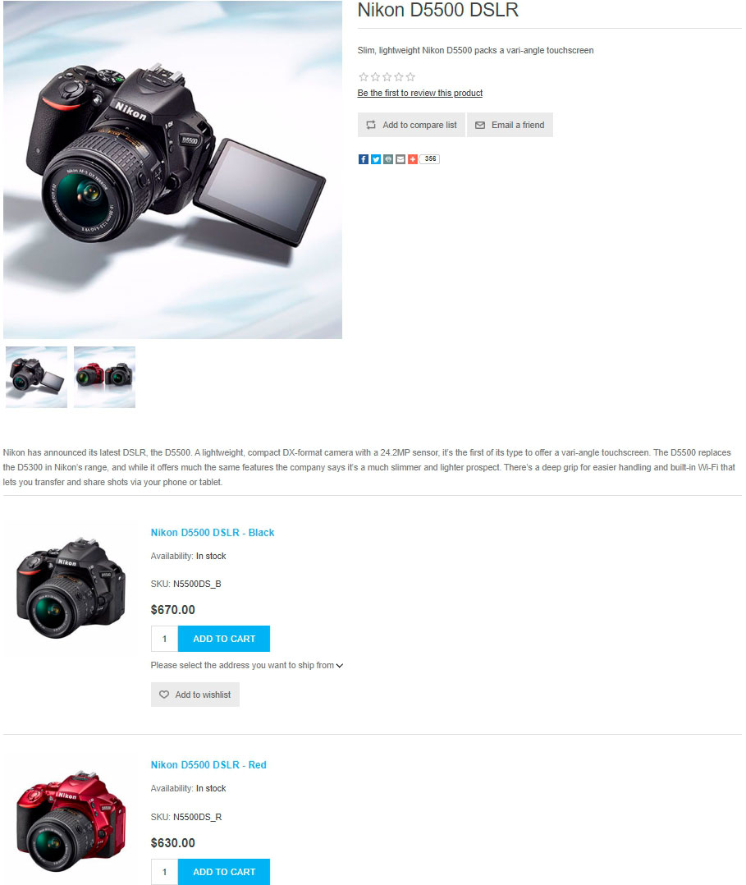
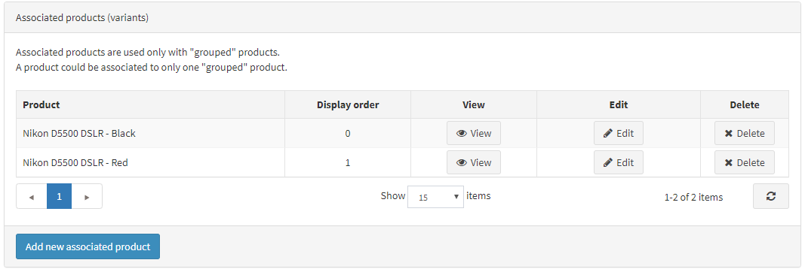

# Productos agrupados (variantes)

Los productos agrupados, o productos con variantes, son una herramienta conveniente para vender un producto que tiene diferentes artículos complementarios o diferentes conjuntos de atributos. Las diferentes combinaciones de dicho producto pueden venderse como productos separados, y el precio puede variar.

En nopCommerce, los productos agrupados se ven como una sola página de detalles del producto que muestra todas las opciones posibles. Es una herramienta conveniente y amigable con el SEO para vender productos complejos.

> [!TIP]
>
> Por ejemplo, un producto base, como un cuerpo de cámara, puede agruparse con diferentes conjuntos de lentes. Otro caso de uso de un producto agrupado es la venta de un tipo de producto con diferentes conjuntos de atributos. Por ejemplo, chocolate con diferentes sabores. En este caso, un cliente puede ver fácilmente el producto principal y todas sus opciones en la misma página.

## Añadir un nuevo producto agrupado

Para crear un producto agrupado, vaya a **Catálogo → Productos**. Hay que seguir varios pasos:

  > [!TIP]
  >
  > Aprenda a rellenar los campos del producto [here](xref:es/running-your-store/catalog/products/add-products).

1. Cree varios productos con un tipo de producto *simple*. Son las variantes del producto principal. Defina si quiere que sean visibles por separado en el catálogo y en los resultados de búsqueda, o que se muestren sólo en una página de producto del producto principal utilizando la casilla **Visible individualmente**.
1. Cree un **producto agrupado (producto con variantes)** y asigne estos productos simples que creó en el paso anterior en el panel de **productos asociados (variantes)**:

    

> [!NOTE]
> 
> - En la tienda pública, un cliente ve un botón separado de **Añadir a la cesta** para cada producto asociado en la página de detalles del producto *agrupado*.
> - Un producto *simple* puede estar asociado a un solo producto *agrupado*.
> - Los productos *agrupados* **no se pueden pedir directamente**. Sin embargo, los productos *simples* asociados a ellos sí lo son. Por ejemplo, un cliente no puede pedir directamente el producto Tarjeta de sonido Creative. El cliente debe pedir una versión OEM o Retail de la tarjeta de sonido Creative en su lugar. En este caso, el producto *agrupado* es una tarjeta de sonido Creative, y hay dos productos *simples* asociados para este producto *agrupado*: OEM y Retail, cada uno con precios potencialmente diferentes.

## Tutoriales

- [Entender los productos agrupados en nopCommerce](https://www.youtube.com/watch?v=B1UdxXf_jmE)
- [Creación de productos agrupados en nopCommerce](https://www.youtube.com/watch?v=sf9jP6KFcko)
